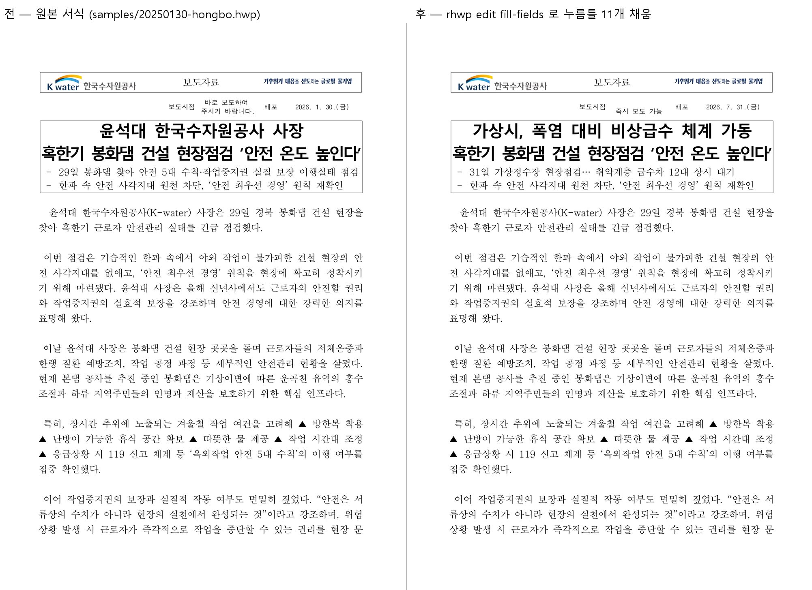
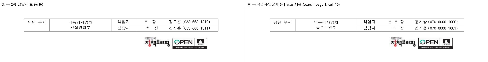

# 실제 CLI·MCP 작동 사례 — 보도자료 서식 채우기와 그 과정에서 드러난 검증 구멍

> 대상: `samples/20250130-hongbo.hwp` (실물 보도자료 서식, 4쪽, 누름틀 12개).
> 앞선 사례: [복학원서](../edit_demo_bokhak/README.md) — 표 격자 좌표로 채우기.
> 이번 사례는 **누름틀(필드) 축**과 **MCP 매니페스트 구동**을 다루고,
> 그 검증 과정에서 `ir-diff` 의 표 셀 사각지대(#3469)를 찾아 함께 고쳤다.

## 실제 사람 작업

보도자료는 기관이 매일 쓰는 서식이다. 제목·부제목·보도시점·배포일시와 책임자/담당자
연락처를 채워 배포한다. 이 데모는 그 작업을 **CLI 만으로** 끝까지 재현하고, 같은 일을
**MCP 도구 정의만 보고** 다시 수행해 두 경로가 같은 결과를 내는지 확인한다.

## 원본 대비 최종 결과



- 누름틀 **11개**(보도일시·배포일시·제목명·부제목명·책임자 3종·담당부서·담당자 3종)를 채웠다.
- **`기관명` 은 일부러 채우지 않았다.** 그 셀에는 기관 로고 이미지가 이미 들어 있어,
  텍스트를 넣으면 로고와 겹친다(아래 "관찰" 참조). 실제 사용자도 이 칸은 로고로 둔다.
- 로고·표 테두리·본문 기사 문단은 그대로 보존된다.
- 모든 값은 가상 데이터이며 실제 배포 문서가 아니다.

2쪽 하단 담당자 표도 함께 바뀐다:



## 재현 — CLI 경로

`rhwp` 와 `jq` 가 PATH 에 있는 POSIX shell 에서 실행한다. 원본은 건드리지 않는다.

```bash
set -e
cp samples/20250130-hongbo.hwp hongbo-work.hwp

# 1) 이 서식이 무엇을 요구하는지 읽는다
rhwp fields hongbo-work.hwp --json | jq -r '.fields[] | "\(.name)\t\(.value)"'

# 2) 채울 값을 파일로 준비한다 (셸 인용 지옥 회피)
cat > row.json <<'JSON'
{
  "보도일시": "즉시 보도 가능",
  "배포일시": "2026. 7. 31.(금)",
  "제목명": "가상시, 폭염 대비 비상급수 체계 가동",
  "부제목명": "31일 가상정수장 현장점검… 취약계층 급수차 12대 상시 대기",
  "책임자대외직명": "본 부 장",
  "책임자명": "홍가상",
  "책임자전화번호": "(070-0000-1000)",
  "담당부서": "급수운영부",
  "담당자대외직명": "과  장",
  "담당자명": "김가온",
  "담당자전화번호": "(070-0000-1001)"
}
JSON

# 3) 먼저 --dry-run 으로 무엇이 바뀔지 확인한다 (파일을 만들지 않는다)
rhwp edit fill-fields hongbo-work.hwp --data @row.json -o hongbo-filled.hwp --dry-run --json \
  | jq -c '{dryRun, filledCount, notFound}'
# {"dryRun":true,"filledCount":11,"notFound":[]}

# 4) 실제로 채운다
rhwp edit fill-fields hongbo-work.hwp --data @row.json -o hongbo-filled.hwp --json \
  | jq -c '{filledCount, notFound}'

# 5) 산출물을 **다시 읽어** 값이 실제로 들어갔는지 대조한다 (보고만 믿지 않는다)
rhwp fields hongbo-filled.hwp --json | jq -r '.fields[] | "\(.name)\t\(.value)"'

# 6) 어디에 반영됐는지 주소로 확인한다
rhwp search hongbo-filled.hwp "김가온" --json | jq -c '.matches[] | {page, cell}'
# {"page":1,"cell":{"cell":10,"control":0,"paragraph":0}}

# 7) 원본 대비 차이를 검증 게이트로 확인한다 (차이가 있으면 exit 3)
rhwp ir-diff hongbo-work.hwp hongbo-filled.hwp --json | jq -c '{identical, diffCount}'
```

## 재현 — MCP 경로

같은 작업을 **매니페스트 선언만 보고** 수행한다. MCP 클라이언트가 하는 일은
`cli.args` 의 `{키}` 자리표시자를 입력값으로 치환해 실행하는 것뿐이다.

```bash
rhwp capabilities --mcp | jq -c '.tools[]
  | select(.name | IN("hwp_fields","hwp_fill_fields","hwp_search"))
  | {name, cli: .cli.args, required: .inputSchema.required}'
```

```json
{"name":"hwp_search","cli":["search","{path}","{query}","--json"],"required":["path","query"]}
{"name":"hwp_fields","cli":["fields","{path}","--json"],"required":["path"]}
{"name":"hwp_fill_fields","cli":["edit","fill-fields","{path}","--data","{data}","--json"],"required":["path","data"]}
```

이 셋만으로 조사 → 채우기 → 위치 확인이 성립한다(실측):

| 호출 | 결과 |
|---|---|
| `hwp_fields{path}` | `fieldCount=12` |
| `hwp_fill_fields{path,data}` | `filledCount=2`, `notFound=[]`, `output` 경로 반환 |
| `hwp_search{path,query}` | `matchCount=1`, `page=1` |

즉 **CLI 경로와 MCP 경로가 같은 결과**를 낸다 — MCP 도구는 CLI 계약의 얇은 래퍼이고,
그래서 한쪽을 고치면 다른 쪽이 따라온다.

## 이 사례가 찾아낸 결함 2건

### 1. `ir-diff` 가 표 셀 안의 변경을 못 본다 (#3469)

위 7단계에서 `ir-diff` 가 **`identical:true`** 를 보고했다. 값을 11개나 바꿨는데도.

```console
$ rhwp export-text before.hwp --json | jq -r '.pages[0].text' | head -c 40
  \n보도자료\n\n\n보도시점\n바로 보도하여 …
$ rhwp export-text after.hwp  --json | jq -r '.pages[0].text' | head -c 40
  \n보도자료\n\n\n보도시점\n즉시 보도 가능 …   # 본문은 명백히 다른데
$ rhwp ir-diff before.hwp after.hwp --json | jq -c '{identical,diffCount}'
{"identical":true,"diffCount":0}                  # ← 차이 0
```

원인은 `diff_table()` 이 표 **속성**만 비교하고 셀 문단을 재귀하지 않은 것이다.
글상자는 #1807 이 같은 구멍(#1795 "소거망 구멍")을 이미 막았는데 표는 열려 있었다.

`ir-diff` 는 단독 진단 도구가 아니라 `convert --verify`/`export-hwpx --verify` 의
판정 근거다. 한국 문서는 표가 본체이므로, 이 구멍은 **변환이 표 안의 모든 텍스트를
손상시켜도 게이트가 통과**하게 만든다. 이 PR 에서 셀 문단 재귀를 추가해 닫았다.

### 2. `-o` 생략 시 산출물이 입력 폴더가 아닌 현재 디렉터리에 생긴다

MCP 경로 검증 중 `hwp_fill_fields` 를 `output` 없이 호출하니, 산출물이 입력 문서 옆이
아니라 **프로세스의 현재 작업 디렉터리**에 떨어졌다(저장소 루트가 더럽혀졌다).
임의 경로의 문서를 다루는 에이전트에게는 예측 불가능한 동작이라, 입력 파일 옆에
만들도록 고치고 회귀 테스트로 고정했다.

## 관찰 — 로고가 있는 셀은 채우지 않는다

`기관명` 필드는 로고 이미지가 들어 있는 셀 안에 있다. 여기에 긴 텍스트를 넣으면
로고와 겹쳐 렌더된다. 이는 rhwp 의 결함이 아니라 서식의 성격이다 —
`fields --json` 의 `location.nested` 로 어느 셀인지 미리 알 수 있으므로,
에이전트는 그 셀에 그림이 있는지 `export-tables` 로 확인하고 건너뛸 수 있다.

## 검증 요약

- 계약 테스트 red→green: 표 셀 텍스트 변경 감지(exit 3), 동일 문서 무회귀,
  기본 출력 경로가 입력 옆에 생성
- `ir_diff_summary_mode`·`ir_diff_json_contract`·`cli_exit_codes`·
  `issue_1638_convert_verify_gate`·`edit_fill_fields_contract` 무회귀
- 실측: git-tracked 실문서 **40건 자기비교에서 오탐 0건** — 셀 재귀가 거짓 차이를
  만들지 않는다
