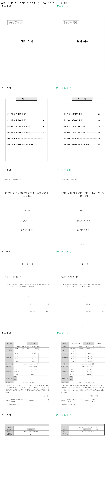

# 실물 정부 서식(54쪽) CLI 편집 — 6쪽 전/후 대조와 전 쪽 격리 검증

> 대상: **중소벤처기업부 공개 배포 사업계획서 서식** — 저장소 샘플이 아니라
> **사용자가 실제로 내려받는 경로 그대로** 정부 사이트에서 받아 검증했다.
> 앞선 사례: [복학원서](../edit_demo_bokhak/README.md), [보도자료](../edit_demo_hongbo/README.md),
> [규제영향분석서](../edit_demo_regulatory/README.md), [칸 넘침 검사](../edit_demo_fit_check/README.md).

## 대상 문서

| 항목 | 값 |
|---|---|
| 출처 | `https://www.mss.go.kr/common/board/Download.do?bcIdx=1031520&cbIdx=310&…` (중소벤처기업부) |
| 형식 | HWP 5.0.4.0, 압축·비암호화·비배포용 |
| 크기 | 97,280 bytes |
| 쪽수 | **54쪽** (2구역) |
| 표 | **77개** |

원본 `.hwp` 는 저장소에 넣지 않는다(라이선스·용량). 위 출처와 실측 지표로 재현할 수 있다.

## 왜 여러 쪽을 봐야 하는가

한 쪽만 보면 **편집이 다른 쪽을 망가뜨렸는지 알 수 없다.** 표 편집은 행 높이를 바꾸고,
행 높이는 쪽 넘김을 바꾸고, 쪽 넘김은 그 뒤 모든 쪽의 배치를 바꾼다. 54쪽 문서에서 1쪽만
확인하고 "정상"이라 판단하면 53쪽의 손상을 놓친다.

## 전/후 6쪽 대조



- **1~4쪽**(별지 서식·목차·표지·제출문): 손대지 않았고 그대로다.
- **5쪽**(사업계획서 표지 표): 접수번호·지역명·운영기관이 채워졌다.
- **6쪽**(요약서): 사업명·운영기관·총괄책임자가 채워졌다.

## 전 54쪽 격리 검증 (픽셀 대조)

눈으로 6쪽을 보는 것으로는 부족하다. **54쪽 전부를 렌더해 픽셀 단위로 비교**했다.

```
total 54 pages: unchanged=52, changed=2
changed pages: 5, 6
```

- **손대지 않은 52쪽은 픽셀 차이 0** — 편집이 의도한 칸에만 닿았다.
- 변경된 2쪽은 실제로 값을 넣은 쪽이다(5쪽 3,057px, 6쪽 3,951px 차이).
- **쪽 수가 54 → 54 로 유지**됐다. 행 높이 변화가 쪽 넘김을 밀지 않았다는 뜻이다.

이것이 "사람이 채운 것처럼 보이는가"의 객관적 근거다.

## 넘침 검사가 실전에서 작동한 사례

`4)운영기관` 칸에 `가상산업진흥원`(7자)을 넣으려 하자 `--dry-run` 이 미리 막았다:

```console
$ rhwp edit set-cell work.hwp --table 2 --row 2 --col 1 --text "가상산업진흥원" \
    -o t.hwp --dry-run --json | jq -c '{new:.newText, overflow:(.overflow|length)}'
{"new":"가상산업진흥원","overflow":1}       # ← 좁은 칸을 넘친다
```

값을 `가상진흥원`(5자)으로 줄이니 `overflow:0` 이 됐고, 그 값으로 채웠다.
**파일을 만들기 전에** 알았으므로 깨진 산출물이 나오지 않았다(#3480).

## 재현

```bash
set -e
# 1) 정부 사이트에서 서식을 받는다 (PowerShell 예)
#    Invoke-WebRequest -Uri "https://www.mss.go.kr/common/board/Download.do?bcIdx=1031520&cbIdx=310&…" -OutFile form.hwp

# 2) 구조를 파악한다
rhwp info form.hwp | grep -E "페이지 수|구역 수"
rhwp export-tables form.hwp --json | jq -c '{tableCount}'

# 3) 채우기 전에 넘침을 확인한다 (파일을 만들지 않는다)
rhwp edit set-cell form.hwp --table 2 --row 2 --col 1 --text "가상산업진흥원" \
  -o /dev/null --dry-run --json | jq -c '.overflow'

# 4) 값을 확정해 채운다 (같은 파일에 누적 적용)
cp form.hwp filled.hwp
rhwp edit set-cell filled.hwp --table 2 --row 0 --col 1 --text "2026-가상-0001"  -o filled.hwp --json
rhwp edit set-cell filled.hwp --table 2 --row 0 --col 9 --text "가상광역시"        -o filled.hwp --json
rhwp edit set-cell filled.hwp --table 2 --row 2 --col 1 --text "가상진흥원"        -o filled.hwp --json
rhwp edit set-cell filled.hwp --table 3 --row 1 --col 1 --text "가상시 중소기업 밀집지역 위기대응 시스템 구축" -o filled.hwp --json
rhwp edit set-cell filled.hwp --table 3 --row 2 --col 1 --text "가상진흥원"        -o filled.hwp --json
rhwp edit set-cell filled.hwp --table 3 --row 2 --col 3 --text "홍가상"            -o filled.hwp --json

# 5) 재독으로 값이 실제로 들어갔는지 대조한다
rhwp export-tables filled.hwp --json \
  | jq -r '.tables[]|select(.index==2 or .index==3)|[.cells[]|select(.text!="")|.text]|join(" | ")'

# 6) 전 쪽을 렌더해 손대지 않은 쪽이 그대로인지 픽셀로 확인한다
rhwp export-svg form.hwp   -o svg_before
rhwp export-svg filled.hwp -o svg_after
#    (SVG→PNG 변환 후 페이지별 ImageChops.difference 로 대조)
```

## 관찰 — 실무자가 알아야 할 것

- **값은 서식이 정한 칸 크기에 맞춰야 한다.** 기관명이 길면 줄여 쓰는 것이 실제 관행이고,
  `--dry-run` 의 `overflow` 가 그 판단을 미리 준다.
- **누적 적용이 안전하다.** 같은 파일에 `-o` 를 반복 지정해도 앞선 편집이 유지된다
  (위 재현 4단계에서 6번 연속 적용 후 전부 반영 확인).
- **쪽 수 불변이 중요한 신호다.** 제출 서식은 쪽 배치가 심사 기준이 되기도 한다.
  편집 후 `info` 의 페이지 수가 달라졌다면 그 자체로 점검 대상이다.

## 남은 한계

- 이 서식의 누름틀은 1개뿐이라 `fields` 축은 거의 쓰이지 않는다 — 값 입력이 대부분
  **표 셀**이다. 그래서 `set-cell` 격자 좌표가 주된 경로였다.
- `ir-diff` 로 편집 전후를 검증하려면 [#3471](https://github.com/edwardkim/rhwp/pull/3471)
  (표 셀 재귀)이 필요하다. 이 서식의 변경도 전부 표 셀 안이다.
