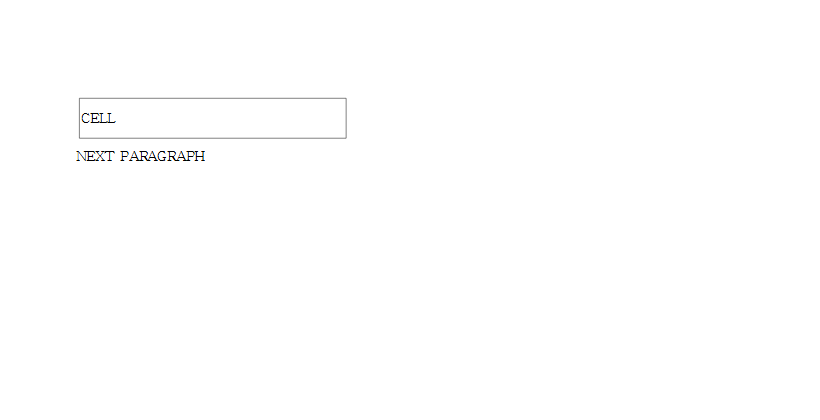

# HWPX 본문 런 텍스트가 CDATA 로 저장되면 통째로 소실된다

## 현상

`<hp:t>` 의 본문이 `<![CDATA[...]]>` 로 인코딩된 HWPX 를 읽으면 **그 문단의 텍스트가 전부
사라진다.** 렌더에서도, `export-text` 에서도 빈 결과가 나온다.

`hp:equation`(#2916) · `hp:dutmal`(#2951) · `hp:compose`(#2974) 에서 이미 고쳐진 것과 같은
결함이지만, 이번 경로는 **일반 본문 런**이라 영향 범위가 셋을 합친 것보다 넓다.
양식 개체(`<hp:edit>` 의 `<hp:text>`)에도 같은 구멍이 남아 있었다.

## 원인

`src/parser/hwpx/section.rs` 의 `read_text_content_with_tabs()` 가 `Event::Text` 와
`Event::GeneralRef` 만 처리하고 `Event::CData` 분기가 없어, CDATA 섹션이 `_ => {}` 로
버려진다. `parse_form_object()` 의 `<hp:text>` 내부 루프도 같다.

## 재현

- 파일: [`cdata_run_text.hwpx`](cdata_run_text.hwpx)
  — `samples/tac-host-spacing.hwpx` 의 본문 런 2개(`CELL`, `NEXT PARAGRAPH`)를 CDATA 로 감싼 것
- 명령:

```
rhwp export-svg mydocs/report/hwpx_cdata_text_loss/cdata_run_text.hwpx -o out/
rhwp export-text mydocs/report/hwpx_cdata_text_loss/cdata_run_text.hwpx -o out/
```

## 비교

| 수정 전 | 수정 후 |
|---|---|
|  |  |

`export-text` 결과도 같은 방향으로 갈린다.

```
수정 전: (개행 1개 — 텍스트 0자)
수정 후: CELL
        NEXT PARAGRAPH
```

## 수정

두 곳에 `Event::CData` 분기를 추가한다. 디코딩은 기존 세 건(#2916/#2951/#2974)과 같은
`String::from_utf8_lossy` 관용구를 그대로 쓴다.

회귀 테스트: `run_text_preserve_cdata`, `form_edit_text_preserve_cdata`
(`src/parser/hwpx/section.rs` 의 `mod tests`).
