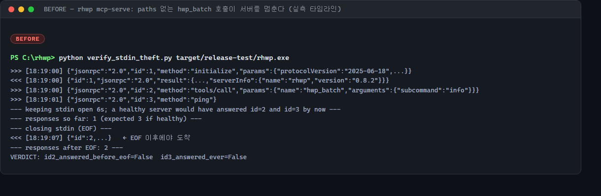
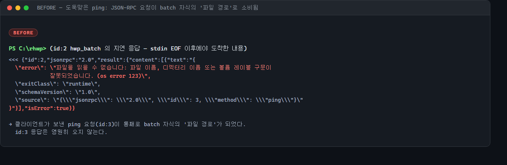
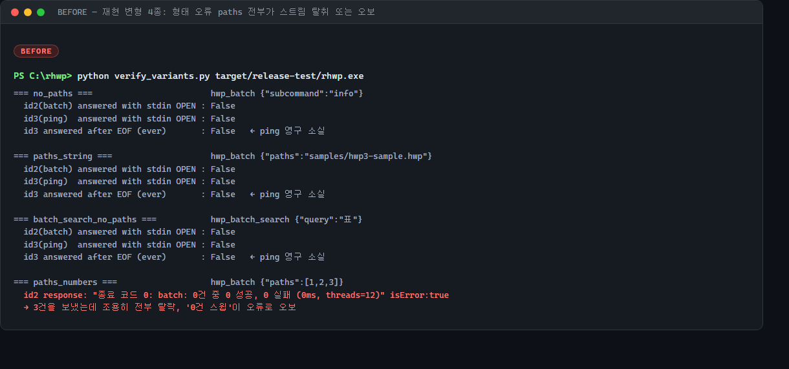
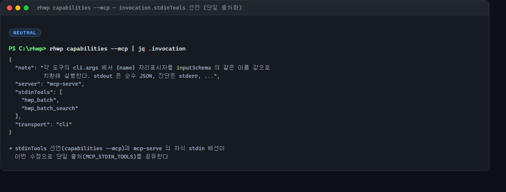
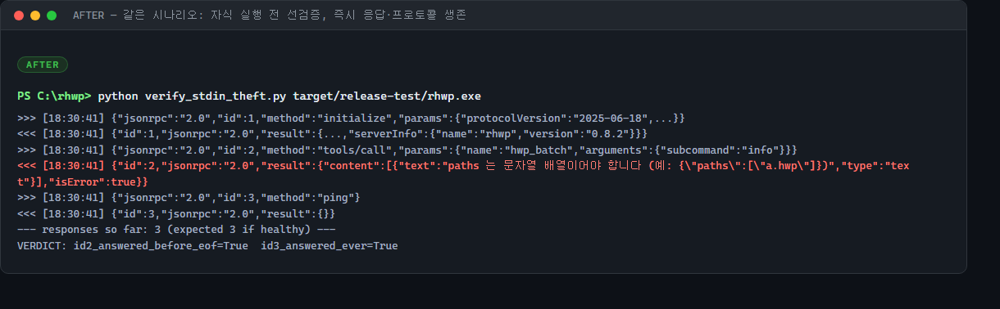
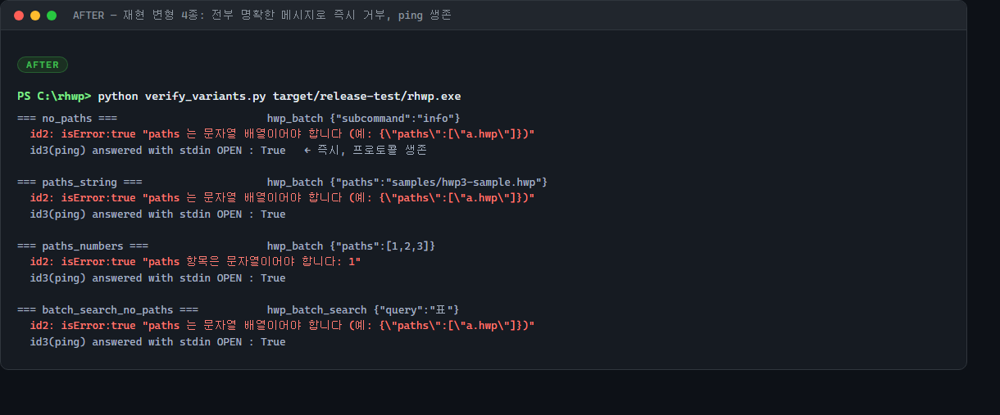
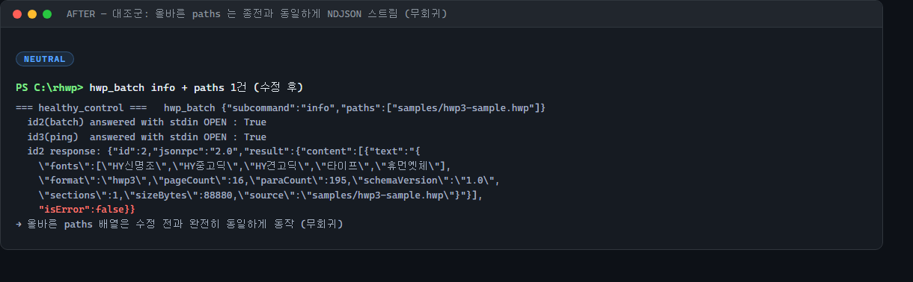
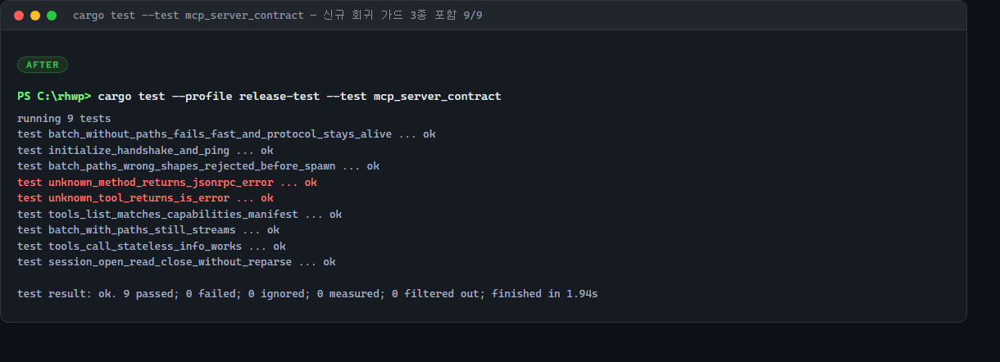

# MCP stdin 도구의 프로토콜 스트림 탈취 — `hwp_batch` 자식이 서버의 JSON-RPC stdin 을 상속해 요청을 '파일 경로'로 소비한다

`rhwp mcp-serve`(#3140)의 stdin 도구(`hwp_batch`/`hwp_batch_search`) 배선 결함 보고·수정
기록이다. `paths` 인자가 없거나 형태가 틀린 채 도구를 부르면, 서버가 띄운 자식 CLI 가
**서버 자신의 stdin — 즉 MCP 프로토콜 스트림 그 자체 — 를 상속**한다. 그 순간부터
클라이언트가 보내는 모든 JSON-RPC 프레임은 자식 `batch` 프로세스가 "문서 경로"로
읽어가고, 서버는 클라이언트가 stdin 을 닫아야만 깨어난다. 실측으로 **요청 영구 소실**과
**무기한 행**을 모두 확인했고, 자식을 띄우기 전 선검증 + 자식 stdin 상시 차단(null)으로
수정했다.

## 0. 요약

| 항목 | 내용 |
|---|---|
| 표면 | `rhwp mcp-serve` → `tools/call` → 무상태 stdin 도구 (`hwp_batch`, `hwp_batch_search`) |
| 결함 | 자식 프로세스 stdin 미배선 시 **부모(서버)의 stdin 상속** — MCP 프로토콜 스트림 탈취 |
| 증상 1 | 서버 무기한 행 — 클라이언트가 stdin 을 닫기 전까지 `tools/call` 응답이 오지 않음 |
| 증상 2 | 후속 JSON-RPC 요청 **영구 소실** — 자식이 요청 라인을 '파일 경로'로 소비 (`os error 123` 실측) |
| 증상 3 | `paths:[1,2,3]` 처럼 항목이 전부 비문자열이면 조용히 걸러져 "0건 스윕"이 오류로 오보 |
| 트리거 | `paths` 부재 / 문자열(비배열) / 비문자열 항목 배열 — 전부 스키마만으로는 막을 수 없는 실호출 형태 |
| 수정 | stdin 도구는 자식 실행 **전** `paths` 선검증(즉시 도구 오류), 그 외 자식은 stdin `null` 고정 |
| 가드 | 계약 테스트 3종 신설 (행-방지 타임아웃 하네스 포함), 9/9 통과 |
| 단일 출처 | `MCP_STDIN_TOOLS` 상수 신설 — `capabilities --mcp` 의 `invocation.stdinTools` 선언과 서버 배선이 공유 |

## 1. 발견 경위 — 같은 표면을 세 렌즈로 겹쳐 본 감사

이 결함은 `src/mcp_serve.rs`(986줄)와 `src/main.rs` 의 MCP 표면을 **동일 범위로 세 번
독립 감사**(프로토콜 계약 / 세션 상태 무결성 / 선언↔배선 드리프트)하는 과정에서
드리프트 렌즈가 잡아냈다. 겹쳐 보기의 값어치는 이 건에서 뚜렷했다:

- 드리프트 렌즈는 "배선이 선언과 다르다"에서 출발해 `run_cli_tool` 의 stdin 조건부
  파이프를 의심했고,
- 프로토콜 렌즈는 같은 코드를 "stdout 순수성" 관점에서 통과시켰지만 `paths:[]` 의
  빈-스윕 오보를 별도로 짚었으며,
- 실기 재현 단계에서 두 관찰이 합쳐져 **탈취(상속)와 오보(빈 파이프)가 서로 다른
  두 결함 경로**임이 갈라졌다 — `paths:[1,2,3]` 은 stdin 이 파이프되므로 탈취는 없지만
  0건 스윕 오보가 나고, `paths` 부재/비배열은 파이프 자체가 없어 탈취가 난다.

정적 추정이 실측으로 한 번 교정된 지점이기도 하다: 최초 보고는 "비문자열 배열도
파이프가 안 잡힌다"고 봤으나, `filter_map` 은 `Some(빈 문자열)` 을 만들므로 실제로는
파이프가 잡히고 **다른 결함(오보)** 으로 빠진다. 아래 재현 매트릭스(§4)가 실측 기준이다.

## 2. 결함 해부 — 코드 경로 다섯 단계

수정 전 `src/mcp_serve.rs` `run_cli_tool` 의 관련 부분:

```rust
let mut cmd = std::process::Command::new(exe);
cmd.args(&cli_args)
    .stdout(std::process::Stdio::piped())
    .stderr(std::process::Stdio::piped());          // ← stdin 설정이 없다

// stdin 도구(hwp_batch 계열): paths 배열을 한 줄에 하나씩 흘려 넣는다.
let stdin_paths: Option<String> = args.get("paths").and_then(|p| p.as_array()).map(|arr| {
    arr.iter().filter_map(|v| v.as_str()).collect::<Vec<_>>().join("\n")
});
if stdin_paths.is_some() {
    cmd.stdin(std::process::Stdio::piped());        // ← paths 가 배열일 때만 파이프
}
```

1. **조건부 stdin 배선.** `paths` 가 "배열"일 때만 자식 stdin 이 파이프된다. `paths` 가
   없거나 문자열이면 `as_array()` 가 `None` → `cmd.stdin()` 호출 자체가 없다.
2. **Rust 의 기본값은 상속.** `std::process::Command` 는 stdin 을 지정하지 않으면
   `Stdio::inherit()` 다. 부모는 `rhwp mcp-serve` — 그 stdin 은 **MCP 클라이언트가
   JSON-RPC 를 쓰는 파이프**다.
3. **자식은 stdin 을 EOF 까지 읽는 프로그램이다.** `hwp_batch` 가 배선하는 CLI
   `batch` 서브커맨드는 설계상 "경로 목록을 stdin 으로" 받는다(`run_batch` 는 stdin 을
   줄 단위로 EOF 까지 소비). 즉 자식은 클라이언트가 이후에 보내는 모든 프레임을
   경로로 해석한다.
4. **부모는 동기 대기 중이다.** 서버 루프는 `child.wait_with_output()` 에서 블록되고,
   그동안 자기 stdin 을 읽지 않는다. 자식·부모 어느 쪽도 프로토콜을 진행할 수 없는
   상태 — 클라이언트 입장에서는 **서버가 죽은 것과 구분되지 않는 행**이다.
5. **해제 조건이 최악이다.** 자식이 EOF 를 보는 유일한 길은 클라이언트가 자기
   stdin(=서버 stdin=자식 stdin)을 닫는 것. 장수 세션을 전제로 하는 MCP 호스트는
   연결을 닫지 않으므로, 실사용에서는 **타임아웃 강제 종료**로만 풀린다. 닫아서
   풀리더라도 그 사이 보낸 요청들은 자식이 이미 소비했으므로 응답이 영원히 없다.

### 왜 스키마 선언은 방패가 못 되나

`hwp_batch` 의 `inputSchema` 는 `paths` 를 `required` 로 선언한다. 그러나 서버는
inputSchema 를 **검증하지 않는다** — 선언은 클라이언트를 위한 안내일 뿐이고, 실제
배선(`substitute_args` + stdin 파이프)은 선언과 독립적으로 동작한다. LLM 에이전트
호스트는 스키마를 지키려고 노력하지만 보장하지 않으며(모델이 인자를 빠뜨리는 일은
일상적이다), 악의 없는 단순 실수 한 번이 서버 전체를 세운다.

## 3. 실측 — BEFORE 타임라인

재현 하네스는 stdio 파이프로 서버를 띄우고 `initialize → hwp_batch(paths 없음) → ping`
을 보낸 뒤 **stdin 을 6초간 연 채로** 응답을 관찰한다(부록 §9 전문).



- `id:2`(hwp_batch) 응답이 stdin 이 열려 있는 동안 **오지 않는다**.
- `id:3`(ping) 도 오지 않는다.
- stdin 을 닫자(EOF) 그제야 `id:2` 가 도착한다 — 응답 2개, `id:3` 은 끝내 없다.

`id:2` 의 지연 도착한 봉투가 결정적 증거다:



`batch` 자식의 오류 레코드 `source` 필드에 **클라이언트가 보낸 ping 요청 전문이
'파일 경로'로 박혀 있다** — `"{\"jsonrpc\": \"2.0\", \"id\": 3, \"method\": \"ping\"}"` 을
열려다 `os error 123`(Windows: 잘못된 파일 이름 구문)이 난 것이다. 프로토콜 프레임이
문서 경로로 소비되었다는 사실이 자식의 산출물에 그대로 남았다.

## 4. 실측 — 재현 변형 매트릭스

같은 하네스로 형태 오류 4종 + 정상 대조군을 돌렸다.



| 호출 형태 | stdin 파이프 | 실측 결과 (BEFORE) | 결함 분류 |
|---|---|---|---|
| `{"subcommand":"info"}` — paths 부재 | 없음(상속) | 행 + ping 영구 소실 | **탈취** |
| `{"paths":"a.hwp"}` — 문자열 | 없음(상속) | 행 + ping 영구 소실 | **탈취** |
| `hwp_batch_search {"query":"표"}` — paths 부재 | 없음(상속) | 행 + ping 영구 소실 | **탈취** |
| `{"paths":[1,2,3]}` — 비문자열 항목 | 파이프(빈 내용) | "종료 코드 0: 0건 중 0 성공, 0 실패" isError | **오보** |
| `{"paths":["samples/hwp3-sample.hwp"]}` | 파이프 | 정상 NDJSON 봉투 | 정상 |

비문자열 배열이 탈취가 아니라 **오보**로 빠지는 것이 §1 에서 말한 실측 교정 지점이다:
`filter_map(as_str)` 이 3개 항목을 조용히 전부 걸러 `Some("")` 을 만들고, 자식은 빈
stdin 을 받아 0건을 스윕한 뒤 정상 종료(exit 0)하지만, stdout 이 비어 있어
"stdout 비면 실패" 규약(#2707 해석)에 걸려 **성공도 실패도 아닌 왜곡된 오류**가 된다.
호출자 관점에서는 "3건을 보냈는데 왜 0건 스윕이 실패했다는 오류가 오지?" — 원인
추적이 불가능한 메시지다.

## 5. 파급 — 왜 이것이 MCP 서버의 최악 등급 결함인가

- **단일 요청이 서버 전역을 세운다.** MCP stdio 서버는 클라이언트당 1프로세스,
  직렬 처리다. 도구 하나의 인자 실수가 그 클라이언트의 **모든 후속 도구 호출**을
  블록한다. 세션 핸들(`hwp_open` 으로 연 문서)도 함께 접근 불능이 된다.
- **호스트 타임아웃과 겹치면 연쇄 재시작.** Claude Desktop/Claude Code 계열 호스트는
  응답 없는 서버를 재시작한다 — 열려 있던 세션 핸들 전부 소실, 진행 중이던
  채움·저장 파이프라인 증발.
- **소실은 조용하다.** 탈취된 프레임은 오류 응답조차 없다. 에이전트 루프는 "도구가
  느리다"로만 보이고, 재시도는 같은 함정에 다시 빠진다.
- **트리거가 낮다.** "batch 도구인데 paths 를 빠뜨렸다"는, 스키마를 아는 모델도
  일상적으로 저지르는 실수다. 적대적 입력이 아니라 **평범한 오타 한 번**이면 된다.

## 6. 수정 설계 — 대안 비교와 채택 근거

| 대안 | 내용 | 판정 |
|---|---|---|
| A. 자식 stdin 을 `Stdio::null()` 로만 고정 | 상속은 사라지나, paths 없는 batch 는 빈 스윕 → "종료 코드 0: …" 오보(§4)로 합류 | 탈취는 막지만 오보를 **양산** |
| B. inputSchema 전면 검증 도입 | 서버에 JSON Schema 검증기 필요 — 의존성 무추가 원칙(#3140 모듈 헤더) 위반, 표면 과잉 | 과대 수술 |
| **C. stdin 도구만 선검증 + null 고정 (채택)** | stdin 도구는 자식 실행 **전** `paths` 를 문자열 배열로 강제(아니면 즉시 도구 오류), 그 외 자식은 stdin `null` | 결함 두 갈래를 모두 원천 차단, 표면 최소 |

채택안의 요지 (`src/mcp_serve.rs` `run_cli_tool`):

```rust
let stdin_paths: Option<String> =
    if crate::MCP_STDIN_TOOLS.contains(&def["name"].as_str().unwrap_or_default()) {
        let Some(arr) = args.get("paths").and_then(|p| p.as_array()) else {
            return tool_error("paths 는 문자열 배열이어야 합니다 (예: {\"paths\":[\"a.hwp\"]})".into());
        };
        // 비문자열을 조용히 걸러내면 "3건을 보냈는데 0건 스윕"이 성공처럼 보인다
        // — 형태 오류는 실행 전에 그대로 알려준다.
        …항목 전수 문자열 검사, 빈 배열 거부…
        Some(paths.join("\n"))
    } else {
        None
    };
…
// 자식 stdin 은 paths 를 흘릴 때만 파이프, 그 외에는 항상 닫는다(null) —
// 어떤 자식도 서버의 프로토콜 stdin 을 상속해서는 안 된다.
match stdin_paths {
    Some(_) => cmd.stdin(std::process::Stdio::piped()),
    None => cmd.stdin(std::process::Stdio::null()),
};
```

설계 세부 판단:

- **빈 배열(`paths:[]`)도 선거부한다.** 빈 스윕을 "성공·빈 결과"로 만들자는 대안도
  있었으나, 그 경로는 "stdout 비면 실패" 규약(#2707 해석)을 건드려야 해 이 수정의
  범위를 넘는다. 지금은 "대상 경로를 1개 이상" 이라는 즉답이 에이전트에게 더 유용하다.
- **비문자열 항목은 걸러내지 않고 거부한다.** 조용한 `filter_map` 이 §4 의 오보를
  만든 장본인이다. `paths 항목은 문자열이어야 합니다: 1` 처럼 문제 값을 그대로
  보여준다.
- **`MCP_STDIN_TOOLS` 상수를 신설해 단일 출처로 삼았다.** 종전에는 stdin 도구 목록이
  `capabilities --mcp` 의 `invocation.stdinTools` 선언(인라인 배열)에만 있었고, 서버
  배선은 "paths 가 배열이면"이라는 **간접 조건**으로만 연결돼 있었다 — 이 간극이
  결함의 뿌리다. 이제 선언과 배선이 같은 상수를 읽는다.



- **비-stdin 도구의 자식도 `null` 로 고정한다.** 지금의 CLI 자식들은 stdin 을 읽지
  않아 관찰 가능한 문제는 없지만, "어떤 자식도 프로토콜 stdin 을 상속하지 않는다"를
  불변식으로 만들어 두면 미래의 stdin 읽는 도구가 같은 함정을 재생산할 수 없다.

## 7. 실측 — AFTER

동일 하네스, 동일 시나리오.



- `id:2` 가 **즉시** `isError:true` + 명확한 메시지로 돌아온다 (stdin 열린 상태).
- `id:3`(ping) 도 즉시 응답 — 프로토콜 생존.



| 호출 형태 | 실측 결과 (AFTER) |
|---|---|
| paths 부재 | 즉시 `paths 는 문자열 배열이어야 합니다 (예: {"paths":["a.hwp"]})` |
| 문자열 paths | 즉시 같은 메시지 |
| `[1,2,3]` | 즉시 `paths 항목은 문자열이어야 합니다: 1` |
| `hwp_batch_search` paths 부재 | 즉시 같은 메시지 |
| 정상 paths | **변화 없음** — 아래 대조군 |



정상 경로(`paths` 1건, hwp3 16쪽 샘플)는 수정 전과 동일한 NDJSON 봉투를 낸다.

## 8. 회귀 가드 — 계약 테스트 3종

`tests/mcp_server_contract.rs` 에 추가했다.

1. **`batch_without_paths_fails_fast_and_protocol_stays_alive`** — 핵심 가드.
   stdin 을 **연 채로** paths 없는 batch 를 부르고, 즉시 오류 응답 + 후속 ping 생존을
   요구한다. 회귀 시 기존 `Server::request` 하네스는 영원히 블록되므로(테스트 자체가
   행), 이 테스트만은 읽기 전용 스레드 + `recv_timeout(20s)` 로 하네스를 직접 구성해
   **회귀가 '행'이 아니라 '실패'로 보고되게** 했다. 타임아웃 메시지도 원인을 짚는다:
   "자식이 서버의 프로토콜 stdin 을 상속해 스트림을 소비하고 있을 가능성이 큽니다".
2. **`batch_paths_wrong_shapes_rejected_before_spawn`** — 형태 오류 3종(비배열·
   비문자열 항목·빈 배열)이 자식 실행 전에 `paths` 를 짚는 메시지로 거부되고, 직후
   ping 이 정상임을 요구한다.
3. **`batch_with_paths_still_streams`** — 대조군. 올바른 paths 가 종전대로 NDJSON
   레코드(pageCount 포함)를 내는지 고정한다.



## 9. 검증 매트릭스

| 게이트 | 결과 |
|---|---|
| `cargo test --profile release-test --test mcp_server_contract` | 9/9 통과 (신규 3종 포함, fmt 적용 후 최종 트리에서 재확인) |
| `cargo clippy --profile release-test --bin rhwp` | 경고 0 |
| `cargo fmt --check` | 통과 |
| 실기 BEFORE 재현 (수정 전 바이너리) | 탈취 3형태 + 오보 1형태 + 정상 대조군, §3-4 |
| 실기 AFTER 재현 (수정 후 바이너리) | 5형태 전부 기대 동작, §7 |

## 10. 한계와 후속

- 이 수정은 stdin 탈취와 그 인접 오보만 다룬다. 같은 3중 감사에서 나온 **별개의**
  확정 결함들 — 선언만 있고 배선이 없는 인자들(`dryRun`/`output`/`page`/`mode`/
  `threads`), `hwp_split_document` 의 0/1 기준 불일치, 세션 편집 후 재페이지네이션
  부재, 세션 `set_cell` 의 개행 가드 부재 등 — 은 범위를 섞지 않기 위해 별도
  이슈·PR 로 잇는다.
- `paths:[]` 를 "성공·빈 스트림"으로 볼 것인가는 #2707 의 "stdout 비면 실패" 해석과
  함께 재논의할 사안이다(§6). 현재는 선거부가 에이전트 친화적이라고 판단했다.
- 드리프트 가드 테스트(`capabilities_mcp_covers_every_json_command`)는 명령 이름
  수준만 본다 — "모든 inputSchema 속성은 cli.args/optionalArgs 어딘가에 자리표시자가
  있어야 한다" 수준의 속성 검사로 확장하면 이 계열 결함이 컴파일 타임에 잡힌다.
  후속 PR 에서 다룬다.

## 부록 A. 재현 하네스 (요지)

```python
# verify_stdin_theft.py — stdio 로 mcp-serve 를 띄우고 타임라인을 기록한다
proc = subprocess.Popen([exe, "mcp-serve"], stdin=PIPE, stdout=PIPE, stderr=PIPE, text=True)
send(initialize); send(hwp_batch_without_paths); send(ping)
time.sleep(6)              # stdin 을 연 채 관찰 — 건강한 서버라면 이미 3응답
proc.stdin.close()         # EOF — 자식이 그제야 풀린다
# VERDICT: id2_answered_before_eof / id3_answered_ever
```

전체 스크립트와 변형 매트릭스 하네스는 PR 본문에 첨부된 실행 로그와 동일하다.

## 부록 B. 수정 파일

| 파일 | 변경 |
|---|---|
| `src/mcp_serve.rs` | `run_cli_tool` — stdin 도구 선검증, 자식 stdin `piped`/`null` 이분법 고정 |
| `src/main.rs` | `MCP_STDIN_TOOLS` 상수 신설, `invocation.stdinTools` 가 이를 참조 |
| `tests/mcp_server_contract.rs` | 회귀 가드 3종 추가 |
