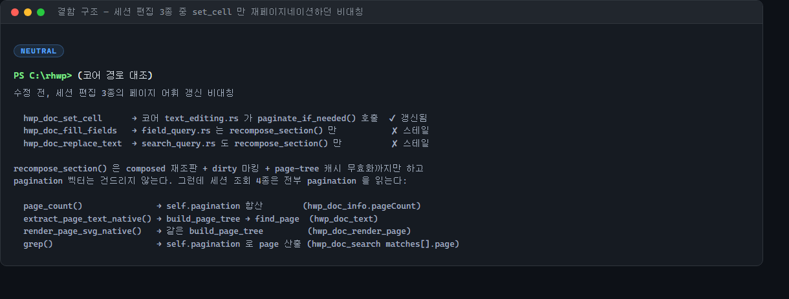
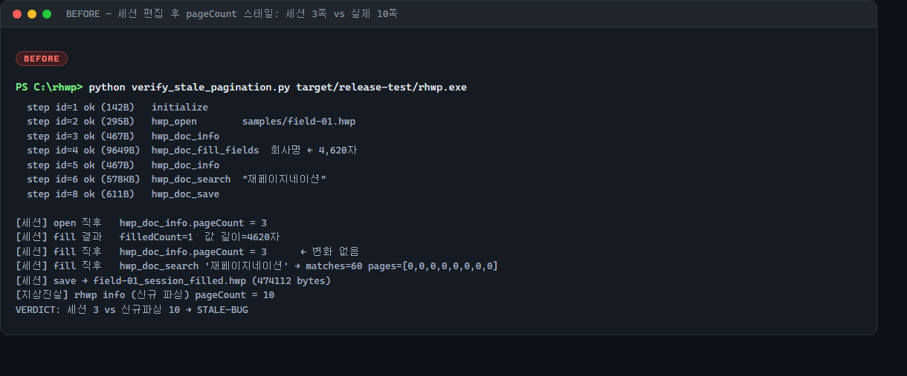
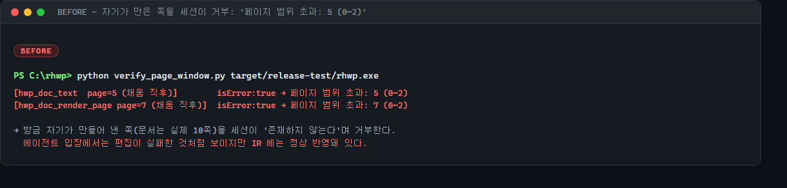
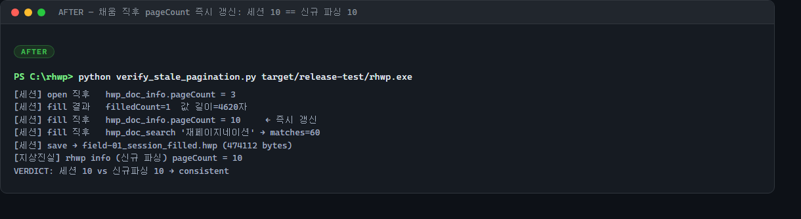
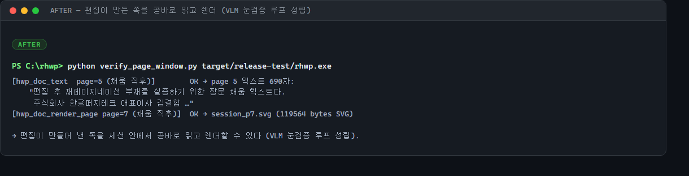
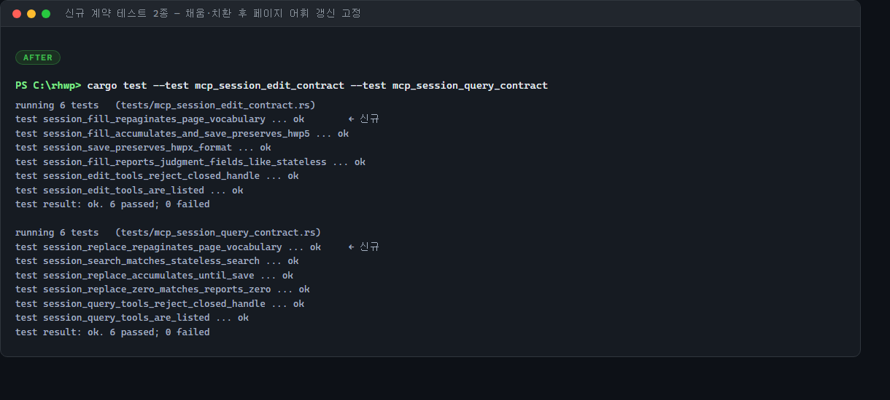
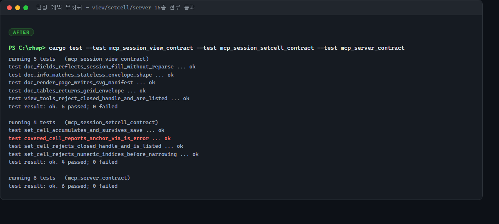

# 세션 편집 직후 페이지 어휘가 갱신되지 않는다 — 채움·치환 뒤 pageCount·페이지 텍스트·렌더·검색 주소가 모두 편집 전 레이아웃

`rhwp mcp-serve` 세션 편집(#3598 `hwp_doc_fill_fields` / #3601 `hwp_doc_replace_text`)
직후, 같은 핸들의 조회 4종이 **편집 전 페이지네이션**을 서빙한다. 실측: 4,620자를 채워
문서가 3쪽 → 10쪽으로 늘었는데 세션 `hwp_doc_info.pageCount` 는 계속 3, 방금 만들어진
5쪽·7쪽은 `페이지 범위 초과: (0~2)` 로 거부된다. 같은 세션의 `hwp_doc_set_cell` 은 코어
경로가 이미 재페이지네이션하므로, 편집 3종 중 2종만 스테일인 **비대칭**이었다.

## 0. 요약

| 항목 | 내용 |
|---|---|
| 표면 | `rhwp mcp-serve` 세션 도구 — `hwp_doc_fill_fields`, `hwp_doc_replace_text` |
| 결함 | 편집 후 `recompose_section` 만 하고 재페이지네이션하지 않음 → pagination 벡터가 편집 전 상태로 고정 |
| 오염 범위 | `hwp_doc_info.pageCount` / `hwp_doc_text` / `hwp_doc_render_page` / `hwp_doc_search` 의 `matches[].page` |
| 실측 격차 | 세션 3쪽 vs 저장본 신규 파싱 10쪽 (**7쪽**) |
| 2차 증상 | 편집이 만들어 낸 쪽을 세션이 "범위 초과"로 거부 — 편집 실패처럼 보이지만 IR 에는 반영돼 있음 |
| 비대칭 | `hwp_doc_set_cell` 은 코어가 `paginate_if_needed()` 호출 → 이미 정상 |
| 수정 | `repaginate_if_needed()` 공개 표면 + fill/replace 직후 도구 호출당 1회 호출 |
| 가드 | 계약 테스트 2종 — 세션 pageCount 가 저장본 신규 파싱과 일치, 늘어난 쪽이 text/search 로 보임 |

## 1. 왜 이것이 "조용한" 결함인가

세션 도구의 존재 이유는 재파싱 회피(#3140)다. 그래서 에이전트는 한 핸들 위에서
**편집 → 확인 → 재편집**을 반복한다. 이 결함은 그 확인 단계를 통째로 거짓말로 만든다.

- `hwp_doc_info` 의 도구 설명은 **"편집 후 페이지 수 변화를 추적할 때 쓴다"** 고 명시한다
  (`src/mcp_serve.rs`). 정확히 그 용도에서 값이 갱신되지 않는다.
- `hwp_doc_render_page` 는 **"편집 직후 눈검증(VLM) 루프가 세션 안에서 닫힌다"** 고
  약속한다. 늘어난 쪽을 렌더할 수 없으니 루프가 닫히지 않는다.
- `hwp_doc_search` 는 주소 어휘(`matches[].page`)가 무상태 `search` 와 동형이라고
  선언한다. 편집 후에는 같은 문서의 같은 문자열이 두 경로에서 다른 쪽 번호를 받는다.

오류가 나지 않는다는 점이 핵심이다. 봉투는 `isError:false` 에 그럴듯한 숫자를 담아
돌려주고, 에이전트는 그 숫자로 다음 판단을 한다. **틀린 값이 성공처럼 보이는** 부류의
결함이라, 실패 신호를 보고 재시도하는 방어가 작동하지 않는다.

## 2. 결함 구조 — 편집 3종의 비대칭



코어에서 편집이 남기는 상태는 두 갈래다.

- `recompose_section(idx)` — 구역 재조판(`composed` 갱신) + dirty 마킹 + page-tree 캐시
  무효화. **pagination 벡터는 건드리지 않는다.**
- `paginate()` / `paginate_if_needed()` — dirty 구역을 실제로 다시 쪽으로 나눠
  pagination 벡터를 갱신한다.

편집 3종이 여기서 갈렸다.

| 세션 도구 | 코어 경로 | 재페이지네이션 |
|---|---|---|
| `hwp_doc_set_cell` | `text_editing.rs` 의 셀 편집 진입점이 `paginate_if_needed()` 호출 | ✔ |
| `hwp_doc_fill_fields` | `field_query.rs::set_field_value_by_name_at` → `recompose_section` 까지 | ✘ |
| `hwp_doc_replace_text` | `search_query.rs::replace_all_native` → `recompose_section` 까지 | ✘ |

한편 세션 조회 4종은 **전부 pagination 벡터를 읽는다**:

- `page_count()` — `self.pagination` 합산 → `hwp_doc_info.pageCount`
- `extract_page_text_native()` — `build_page_tree` → `find_page` → `hwp_doc_text`
- `render_page_svg_native()` — 같은 `build_page_tree` → `hwp_doc_render_page`
- `grep()` — `self.pagination` 로 매치의 쪽 번호 산출 → `hwp_doc_search`

`grep` 모듈 헤더는 "`from_bytes` 가 로드 시 `paginate()` 를 끝내므로 순수 조회다" 라는
전제를 명시한다. 무상태 CLI 에서는 참이지만, **세션에서는 첫 편집 순간 깨진다** — 결함의
뿌리는 "무상태 전제를 상태 유지 표면이 물려받았다"는 데 있다.

무상태 CLI 가 멀쩡한 이유도 같은 구조다. `edit fill-fields` 는 편집 직후 직렬화하고
프로세스가 끝난다 — pagination 을 다시 읽을 일이 없다. 세션이 도입되면서 "편집 후에도
같은 인스턴스에서 페이지를 읽는" 새 수명이 생겼는데, 그 수명에 맞는 갱신 지점이
`set_cell` 경로에만 있었다.

## 3. 실측 — BEFORE

프로브: `hwp_open` → `hwp_doc_info` → `hwp_doc_fill_fields`(회사명에 4,620자) →
`hwp_doc_info` → `hwp_doc_search` → `hwp_doc_save`, 마지막에 저장본을 `rhwp info --json`
으로 **새로 파싱**해 지상 진실과 대조한다.



- 채움 전 3쪽, 채움 후 3쪽 — **변화 없음**.
- 저장본 신규 파싱: **10쪽**. 7쪽 격차.
- 검색 매치 60건의 `page` 가 전부 0 — 새 레이아웃이라면 여러 쪽에 흩어져야 한다.

같은 상태에서 새로 생긴 쪽을 읽으려 하면:



`페이지 범위 초과: 5 (0~2)` — **방금 자기가 만들어 낸 쪽을 존재하지 않는다고 거부한다.**
에이전트 관점에서는 편집이 실패한 것처럼 보이지만 IR 에는 정상 반영돼 있어, 재시도하면
같은 값이 한 번 더 채워지는 이중 편집 위험까지 생긴다.

## 4. 수정

두 단계다.

**① 코어에 공개 표면 하나.** `DocumentCore::repaginate_if_needed()` — 내부
`paginate_if_needed()` 를 그대로 위임한다. batch 모드 규약(Command 흐름에서는 미룸)을
유지하고, dirty 구역만 증분 재처리하므로 편집 없는 호출은 사실상 무비용이다. 별도
로직을 만들지 않고 기존 진입점을 노출만 한 이유는, `set_cell` 이 이미 쓰는 바로 그
경로를 fill/replace 도 쓰게 해 **세 편집이 같은 규약을 공유**하게 하기 위해서다.

**② MCP 세션 편집 2종에서 도구 호출당 1회 호출.**

- `session_fill_fields` — 적용 목록이 비어 있지 않을 때(`!apply.is_empty()`) 2차 적용
  루프가 **끝난 뒤** 한 번. 필드마다 부르면 N회 재페이지네이션이 되므로 루프 밖이다.
- `session_replace_text` — 치환 계수가 1 이상일 때 한 번. 0건 치환은 IR 이 그대로이니
  부르지 않는다.

문서 엔진의 성능 특성상 "편집할 때마다 전면 재조판"은 피해야 하지만, 세션 도구는
**도구 호출 단위**가 이미 왕복 비용을 포함하므로 호출당 1회는 적정 지점이다.

## 5. 실측 — AFTER



세션 `pageCount` 10 == 저장본 신규 파싱 10 — **일치**.



편집이 만들어 낸 5쪽 텍스트(690자)를 곧바로 읽고, 7쪽을 SVG(119KB)로 렌더한다.
`hwp_doc_render_page` 가 약속한 "편집 직후 눈검증(VLM) 루프"가 이제 실제로 닫힌다.

## 6. 회귀 가드



- **`session_fill_repaginates_page_vocabulary`** (`tests/mcp_session_edit_contract.rs`) —
  채움으로 쪽수를 늘린 뒤 ① 세션 `pageCount` 가 **저장본 신규 파싱**과 같은지
  (보고를 믿지 않고 지상 진실과 대조) ② 늘어난 마지막 쪽이 `hwp_doc_text` 로 읽히는지.
  전제 확인(`pages_truth > pages_before`) 을 별도 assert 로 둬서, 샘플이 바뀌어 채움이
  더는 쪽수를 늘리지 않게 되면 **시험이 무의미해진 사실 자체가 실패로 드러난다**.
- **`session_replace_repaginates_page_vocabulary`** (`tests/mcp_session_query_contract.rs`) —
  대량 치환으로 쪽수를 늘린 뒤 `pageCount` 증가와 **검색 `page` 주소**가 편집 전
  마지막 쪽을 넘어서는지. 치환 계수 하한(>10)도 전제 확인으로 고정한다.



`view`(5) · `setcell`(4) · `server`(6) 계약 15종 전부 통과 — 이미 정상이던 `set_cell`
경로와 조회 봉투 형태에 영향이 없다.

## 7. 검증 매트릭스

| 게이트 | 결과 |
|---|---|
| `cargo test --test mcp_session_edit_contract --test mcp_session_query_contract` | 12/12 (신규 2종 포함) |
| `cargo test --test mcp_session_view_contract --test mcp_session_setcell_contract --test mcp_server_contract` | 15/15 |
| `cargo clippy --profile release-test --bin rhwp` | 경고 0 |
| `cargo fmt --check` | 통과 |
| 실기 BEFORE (upstream/devel 빌드) | pageCount 3(스테일) / 5·7쪽 범위 초과, §3 |
| 실기 AFTER (수정 빌드) | pageCount 10(일치) / 5쪽 읽기·7쪽 렌더 성공, §5 |

## 8. 한계와 후속

- **저장 결과물은 종전에도 옳았다.** `edit_serialize` 는 IR 을 직렬화하므로 스테일
  pagination 이 파일에 각인되지 않는다. 이 결함은 **세션이 보고하는 값**의 문제다
  (그래서 더 조용하다).
- `hwp_doc_set_cell` 은 코어가 이미 재페이지네이션하므로 이번 변경 대상이 아니다.
  다만 세 편집이 같은 규약을 공유하게 되었으니, 향후 새 세션 편집 도구를 추가할 때는
  "편집 후 `repaginate_if_needed()`"를 체크리스트에 넣어야 한다.
- 더 근본적인 해법은 조회 쪽에서 dirty 를 보고 **지연 재페이지네이션**하는 것이지만,
  현재 조회 경로가 전부 `&self` 라 시그니처 변경이 광범위하다. 편집 지점에서 미는
  이번 방식이 범위 대비 효과가 크다고 판단했다.
- 같은 감사에서 나온 별개 확정 결함들(선언만 있고 배선 없는 인자 7종, `hwp_doc_text`
  의 잘못된 `page` 타입이 전체 덤프로 빠지는 문제, HWP3 세션 save 의 라이브 IR 변형
  등)은 범위를 섞지 않기 위해 별도 PR 로 잇는다.

## 부록. 재현 프로브

```python
# verify_stale_pagination.py — 세션 pageCount 를 저장본 신규 파싱과 대조
open → info(before) → fill_fields(4,620자) → info(after) → search → save
→ subprocess: rhwp info <saved> --json   # 지상 진실
# VERDICT: 세션 pageCount == 신규 파싱 pageCount ?

# verify_page_window.py — 편집이 만든 쪽에 세션이 접근 가능한가
open → fill_fields(4,620자) → doc_text(page=5) / render_page(page=7)
```

두 프로브 모두 stderr 를 별도 스레드로 상시 드레인한다 — 파서 진단이 파이프를 채우면
서버가 블록되어 결함과 무관한 행으로 오진하게 된다(측정 함정).
