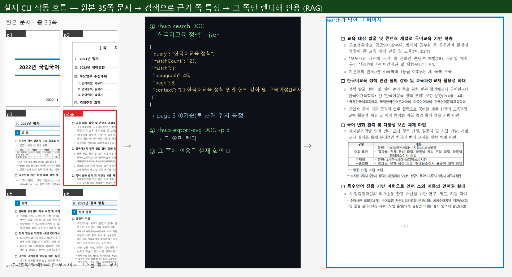
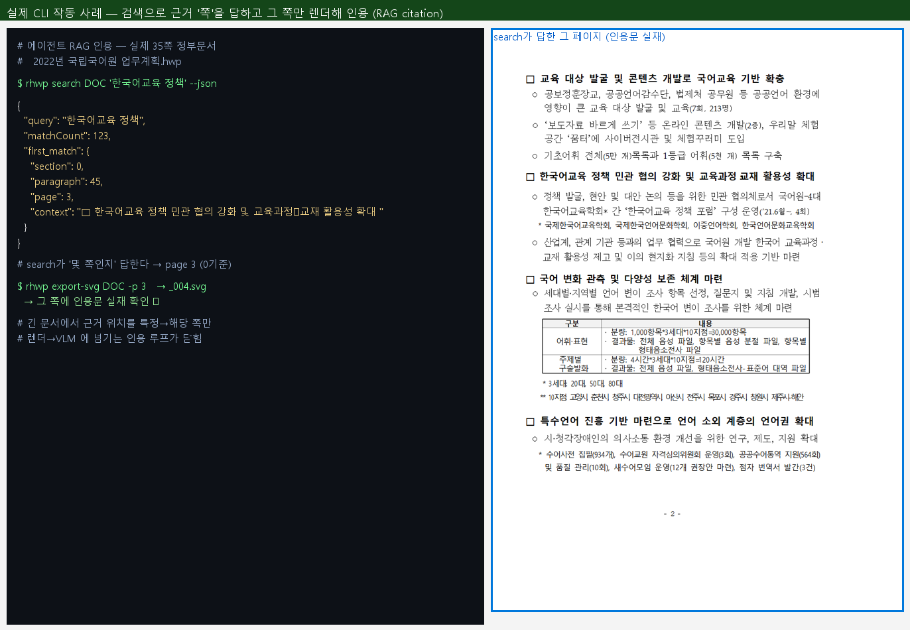

# 실제 CLI 작동 사례 — 검색으로 근거 '쪽'을 답하고 그 쪽만 렌더해 인용 (RAG citation)

> 여정: [버그 헌팅 playbook](../../manual/bug_hunting_playbook.md) "공고 검색 → 근거 조항 위치 → 해당 쪽만 렌더".
> 실행: `rhwp` CLI만으로 처음부터 끝까지. 정답지 = 실제 `export-svg` 렌더.

## 무엇을 증명하나

에이전트가 긴 공문서에서 어떤 조항의 **근거를 인용**하려면 세 가지가 순서대로 돼야 한다.

1. 문서를 검색해 매치를 찾는다 (`search`)
2. 그 매치가 **몇 쪽**인지 안다 (search 의 `page`)
3. 그 쪽만 렌더해 근거로 제시한다 (`export-svg -p <page>` / `export-png -p`)

평문만 뽑아 외부에서 찾으면 "몇 쪽"의 주소가 소멸해 근거 제시가 불가능하다. rhwp 는 조판 엔진이 있어 검색 결과에 페이지를 실어주고, 그 페이지만 렌더해 루프를 닫는다.

## 원본 문서 대비 흐름

원본 35쪽 문서(왼쪽, 근거 쪽 `p4★` 강조) → `search` 로 근거 쪽 특정 → `export-svg -p` 로 그 쪽만 렌더(오른쪽). 왼쪽 그리드의 `p4` 썸네일과 오른쪽 확대 페이지가 같은 쪽이다.



세부 화면(좌: CLI·JSON, 우: search 가 답한 그 페이지에 인용문 실재):



## 재현 (실제 35쪽 정부문서)

대상: `samples/2022년 국립국어원 업무계획.hwp` (35쪽).

```bash
# 1) 검색 — 매치마다 구역·문단·페이지·문자 오프셋
rhwp search "samples/2022년 국립국어원 업무계획.hwp" "한국어교육 정책" --json
# → matchCount:123, first_match.page = 3 (0기준),
#   context: "□ 한국어교육 정책 민관 협의 강화 및 교육과정‧교재 활용성 확대"

# 2) search 가 답한 그 쪽만 렌더 (page 와 -p 는 둘 다 0기준으로 일관)
rhwp export-svg "samples/2022년 국립국어원 업무계획.hwp" -p 3 -o out
# → out/…_004.svg 하나만 생성

# 3) 렌더된 그 쪽에 인용문이 실재하는지 기계 확인
#   _004.svg 안에 "한국어교육 정책 민관 협의 강화" 존재 ✅ → 인용 루프 닫힘
```

위 그림 오른쪽이 3단계에서 렌더된 그 페이지이며, search 가 돌려준 `context` 와 페이지 상단 표제("□ 한국어교육 정책 민관 협의 강화 …")가 일치한다.

## 인덱싱 계약 (한 번에 헷갈리기 쉬운 지점)

`search` 의 `page` 와 `export-svg`/`export-png` 의 `-p` 는 **모두 0기준**이다([CLI 매뉴얼](../../manual/cli_commands.md) §search·§export). 따라서 `search … | jq '.matches[0].page'` 값을 그대로 `-p` 에 넘기면 정확히 그 쪽이 렌더된다. (사람에게 보일 때만 `.page + 1` 로 1기준 표기.) `export-svg` 의 **파일명**은 `_001` 부터의 1기준이라 파일명과 `-p` 인덱스를 혼동하지 않도록 주의한다.

## 검증 범위와 발견한 격차

- 이 문서의 매치 123건을 실제 렌더(정답지)와 대조: **약 83%(103건) 페이지 정확**. 본문 문단·단일 페이지 표는 모두 정확했다.
- 남은 20건은 **전부 한 개의 페이지 분할 표**에서 나온다 — 표가 두 쪽에 걸치면 뒤쪽 셀 매치도 표 시작 페이지로 보고된다. 이 격차는 [#3403](https://github.com/edwardkim/rhwp/issues/3403) 으로 등재했다(재현·원인 코드 경로 포함). 본 데모의 인용 루프 자체는 본문·단일 페이지 표에서 정확히 닫힌다.

## 관련

- 방법론: [버그 헌팅 playbook](../../manual/bug_hunting_playbook.md)
- 명령 계약: [CLI 명령어 매뉴얼](../../manual/cli_commands.md)
- 발견 격차: [#3403](https://github.com/edwardkim/rhwp/issues/3403)
