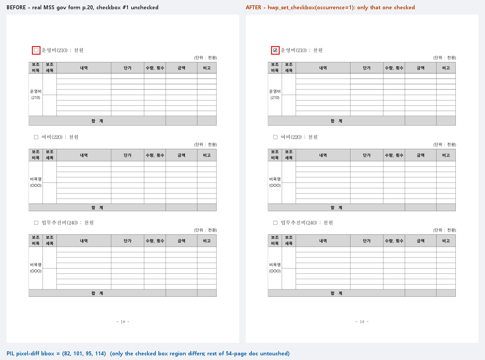

# #3395 처리 기록 — k번째 매치 치환(--occurrence) + hwp_set_checkbox (M3)

## 실측이 바꾼 설계

실물 정부 서식(중기부 54쪽) 조사 결과 체크박스는 특수 개체가 아니라 **□(U+25A1)
문자 19개**였다. 즉 '체크'는 □→☑ 치환으로 성립하되, replace-text 는 전량 치환이라
**19개 중 해당 항목 하나만** 지목할 수단이 없는 것이 진짜 공백이었다.

## 구현 (플레이북 규칙 2 — 새 편집 로직 없음)

1. 코어: `replace_all_native` 몸통을 `replace_matches_native(…, occurrence: Option<usize>)`
   로 일반화하고 `replace_nth_native`(문서 순서 k번째, 0 기준) 추가 — 기존 경로 재사용.
2. CLI: `edit replace-text --occurrence N` — 봉투에 `occurrence` 동봉. 범위 밖은
   계수 0(판정은 데이터), 0건이면 출력 파일 미생성(기존 규약).
3. MCP: `hwp_set_checkbox {path, occurrence, output}` — □→☑ 프리셋 의미론 래퍼.

## 실측 증적 — 실물 54쪽 서식, 2번째 □만 외과수술 체크

20쪽의 □ 하나만 ☑ 로 바뀌었다. PIL 픽셀 diff bbox = **(82,101,95,114) — 13×13px
체크박스 영역 하나**, 페이지의 나머지 전 픽셀 동일(붉은 사각형이 diff 영역):

봉투 실측: `{"replacedCount":1,"occurrence":1,"outputFormat":"hwp5"}`, exit 0.

## 검증

- 신규 `replace_occurrence_contract` **4건 green** (정확히 1건 치환+재독 총수 불변,
  범위 밖 계수 0·파일 미생성, 잘못된 값 exit 2, hwp_set_checkbox 배선 1:1)
- 기존 `edit_replace_text_contract` 무회귀, 코어 search_query lib 8건 green, clippy 0
