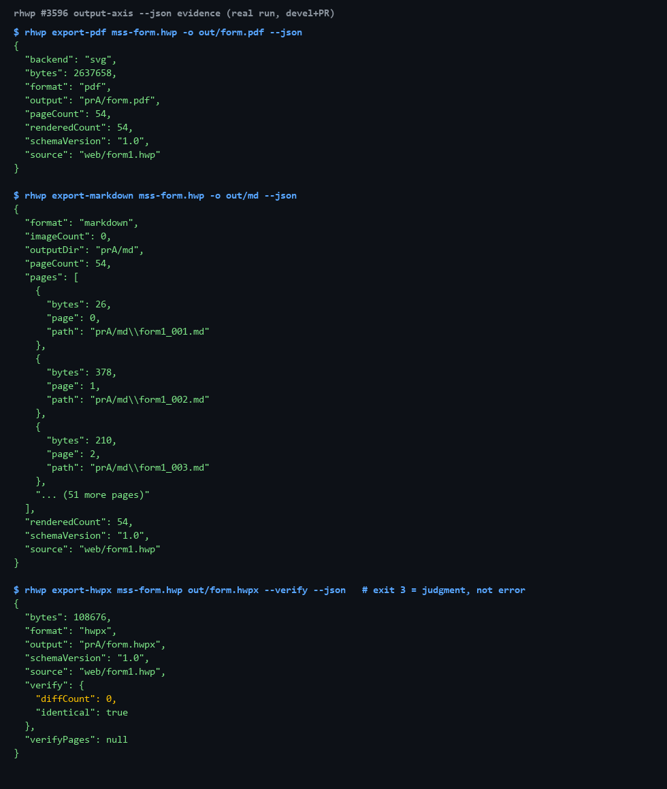

# #3596 처리 기록 — 산출물 축 `--json` 3종 + MCP 도구 노출

## 공백

에이전트 층(MCP·매니페스트 소비)은 stdout 순수 JSON 계약이 있는 명령만 도구로
노출할 수 있다. 조회 축은 완비됐지만 **산출물을 만드는 축**(PDF·Markdown·HWPX 변환)이
사람용 메시지뿐이라, 에이전트가 "제출용 PDF 만들기"·"변환+검증을 한 번에" 를 못 했다.

## 구현

`export-svg --json`(#3287) 매니페스트 선례를 3종으로 확장. 렌더/변환 동작 무변경,
`--json` 모드에서만 stdout 순수 JSON.

| 명령 | 봉투 |
|---|---|
| `export-pdf --json` | `{schemaVersion,source,format:"pdf",backend,output,bytes,pageCount,renderedCount}` |
| `export-markdown --json` | `{…,outputDir,pageCount,renderedCount,imageCount,pages:[{page,path,bytes}]}` |
| `export-hwpx --json` | `{…,output,bytes,verify,verifyPages}` — 판정 객체는 요청 시에만, 아니면 null |

설계 결정:

- **종료 코드 계약(#2707) 무변경** — `export-hwpx --verify --json` 은 차이 검출 시
  봉투를 stdout 에 낸 뒤 exit 3 으로 끝난다(`ir-diff --json` 과 같은 "판정은 데이터").
  재파싱 실패는 판정 불가이므로 stdout 을 비우고 기존 코드로 끝난다.
- **실패 경로 stdout 순수성** — 부분 산출을 매니페스트로 내지 않는다(export-svg 규약).
- **`convert` 는 `--json` 을 받지 않는다** — 공유 파서에 `allow_json` 게이트를 둬,
  구현 없는 명령이 옵션을 침묵 수용해 소비자가 빈 stdout 을 성공으로 오인하는 것을
  계약 테스트(`convert_does_not_gain_json_silently`)로 차단했다.
- MCP 도구 3종(`hwp_export_pdf`/`hwp_export_markdown`/`hwp_convert_hwpx`)은 단일 출처
  `mcp_tool_definitions()` 에 추가 — `capabilities --mcp` 선언과 `mcp-serve` 실행이
  자동으로 함께 얻는다. `hwp_convert_hwpx` 는 `--verify` 를 기본 내장한다.

## 실측 증적 (인터넷 배포 실물 54쪽 정부 서식)

- `export-pdf`: 54쪽 전부 렌더, 2,637,658 bytes, 매니페스트의 `bytes` == 실제 파일 크기
- `export-markdown`: 54개 MD + 페이지별 경로/크기 매니페스트
- `export-hwpx --verify`: `verify:{identical:true,diffCount:0}`, exit 0 — 실물 HWP5
  문서의 무손실 왕복이 기계 판정으로 확인됨

## 검증

- 신규 계약 테스트 `tests/output_axis_json_contract.rs` **7건 green**
  (red 선확인: 구현 전 3종 모두 `--json` 이 exit 2)
- `cargo clippy --release --bin rhwp -- -D warnings` 0건, `cargo fmt --check` clean
- `capabilities` 자기서술·MCP 선언 동시 갱신 (드리프트 가드 통과)
- `mydocs/manual/cli_commands.md` 3개 절 현행화
