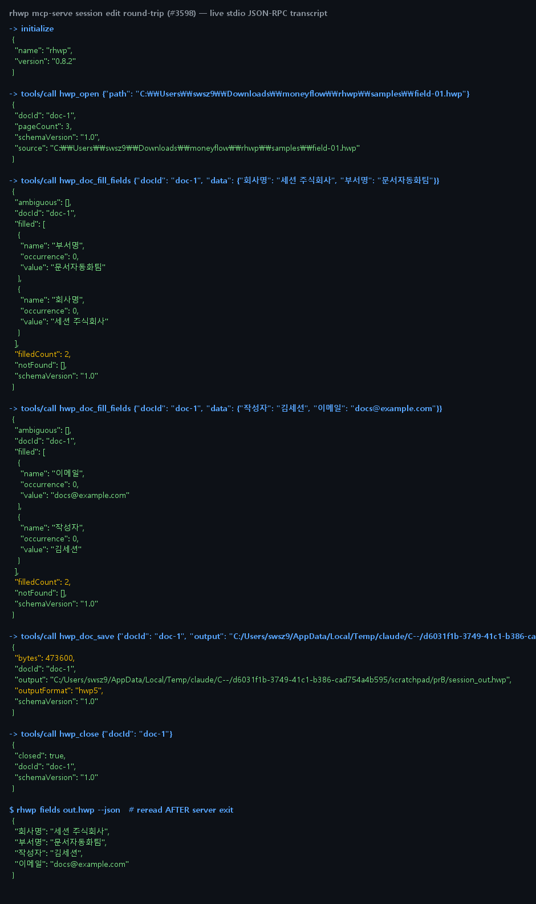

# #3598 처리 기록 — mcp-serve 세션 편집 2단계 (fill 누적 + 형식 보존 save)

## 공백

세션(#3571 의 hwp_open/hwp_doc_text/hwp_close)은 조회 전용이었다. 편집은 무상태
도구로만 가능해 "열어두고 → 여러 번 채우고 → 한 번 저장" 흐름이 성립하지 않았다 —
매 편집 호출이 재파싱 + 재기록이었다. #3140 이 짚은 세션의 존재 이유(재파싱 회피)가
편집에는 빠져 있었다.

## 구현 — 서버 전용 세션 도구 2종

- `hwp_doc_fill_fields {docId, data}` — 열린 핸들의 IR 에 직접 채움(디스크 미기록).
  여러 번 호출하면 **누적**된다. 적용 전에 전 키를 검증해(2-pass) 중간 실패로 절반만
  채워진 IR 을 남기지 않는다.
- `hwp_doc_save {docId, output}` — 누적 편집을 **형식 보존**(#3383: HWPX→HWPX,
  그 외→HWP5)으로 기록. 핸들은 저장 후에도 열려 있어 이어서 편집·재저장할 수 있다.

핵심 설계: **새 편집 로직이 없다.** 판정 어휘(filledCount/notFound/ambiguous·
`이름[N]` 순번)는 `parse_field_key`+`set_field_value_by_name_at`, 직렬화는
`edit_serialize`(HWP5 는 어댑터 경유) — 무상태 `edit` 경로와 같은 코어 함수를
재사용하므로 두 경로의 계약이 원리적으로 어긋날 수 없다.

## 실측 증적 — 라이브 stdio JSON-RPC 왕복

`initialize → hwp_open(field-01.hwp, 3쪽) → hwp_doc_fill_fields(회사명·부서명)
→ hwp_doc_fill_fields(작성자·이메일, 누적) → hwp_doc_save(473,600B, outputFormat
hwp5) → hwp_close` 후, **서버 종료 뒤** `rhwp fields --json` 재독으로 4개 값이
모두 산출물에 남아 있음을 대조했다(보고를 믿지 않는 검증).

## 검증

- 신규 계약 테스트 `tests/mcp_session_edit_contract.rs` **5건 green**
  (red 선확인: 구현 전 4건 FAILED)
  - 누적 채움 + HWP5 형식 보존 + 재독 대조 / HWPX 형식 보존(info 실측 대조)
  - 판정 어휘 동형(notFound 침묵 금지) / 닫힌 핸들 isError / tools/list 등재
- 기존 `mcp_server_contract` 6건 무회귀
- `cargo clippy --release --bin rhwp -- -D warnings` 0건, rustfmt clean

## 남은 일 (범위 밖)

- 세션판 replace-text/set-cell (`hwp_doc_replace_text`/`hwp_doc_set_cell`)
- 보호 문서 세션 열기(`--password` 대응), 저장 전 `ir-diff` 자기검증 옵션
