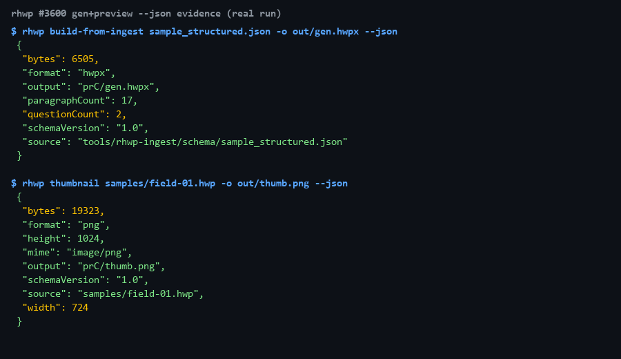
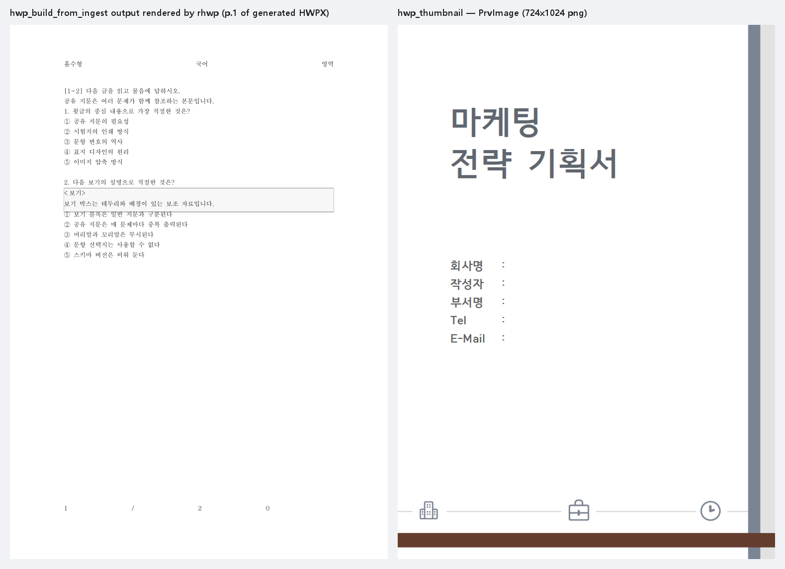

# #3600 처리 기록 — 생성·미리보기 축 `--json` + MCP 도구 2종

## 공백

Stage 6(#2659) 잔여 축 중 **생성**과 **미리보기**. `build-from-ingest` 는 저장소의
유일한 문서 생성 경로(ingest JSON→HWPX)인데 사람용 메시지뿐이었고, `thumbnail` 은
문서를 열지 않는 초경량 미리보기인데 기계 계약이 없어 둘 다 MCP 로 노출할 수 없었다.

## 구현

- `build-from-ingest … --json` — `{schemaVersion,source,output,format:"hwpx",bytes,questionCount,paragraphCount}`
  - 함께 고침: **미지 옵션 침묵 무시 제거** — 종전에는 `경고: 알 수 없는 인자 무시` 후
    진행했다(#3349/#2551 계열 위반). 이제 즉시 exit 2, 중복 positional 도 exit 2.
- `thumbnail … --json` — `{schemaVersion,source,format,mime,width,height,bytes,output|base64|dataUri}`
  (모드별 필드, 파일 모드가 아니면 `output:null`)
- MCP 도구 2종을 단일 출처 `mcp_tool_definitions()` 에 등재:
  - `hwp_build_from_ingest {path, output}` — 무(無)에서 문서를 만드는 유일한 생성 도구
  - `hwp_thumbnail {path}` — `--data-uri` 배선: 렌더 없이 즉시, VLM 직행 미리보기

## 실측 증적

터미널 봉투 (실행 원문):

**생성물을 실제 rhwp 로 열어 렌더한 화면** — 왼쪽은 `hwp_build_from_ingest` 가 만든
HWPX 를 `export-svg` 로 렌더한 1쪽(문항·보기 박스가 실제 조판됨), 오른쪽은
`hwp_thumbnail` 이 추출한 내장 PrvImage(724×1024) 원본:

- 생성: 6,505 bytes, 문항 2개, 문단 17개 — 산출물을 `info --json` 으로 재파싱해
  `format:"hwpx"` 실측 대조(테스트로 고정)
- 썸네일: 19,323 bytes png — 봉투의 `bytes` == 실제 파일 크기(테스트로 고정)

## 검증

- 신규 계약 테스트 `tests/genpreview_json_contract.rs` **5건 green** (red 선확인)
- `output_axis_json_contract` 7건·`cli_json_contract` 22건(드리프트 가드 포함) 무회귀
- clippy `-D warnings` 0건, rustfmt clean
