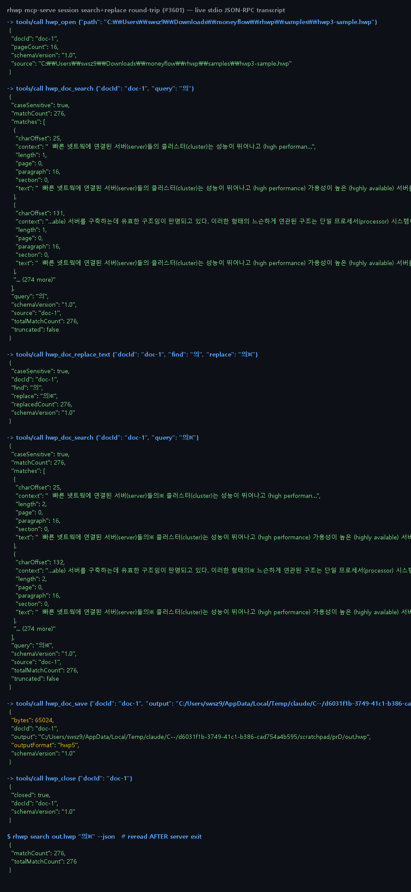
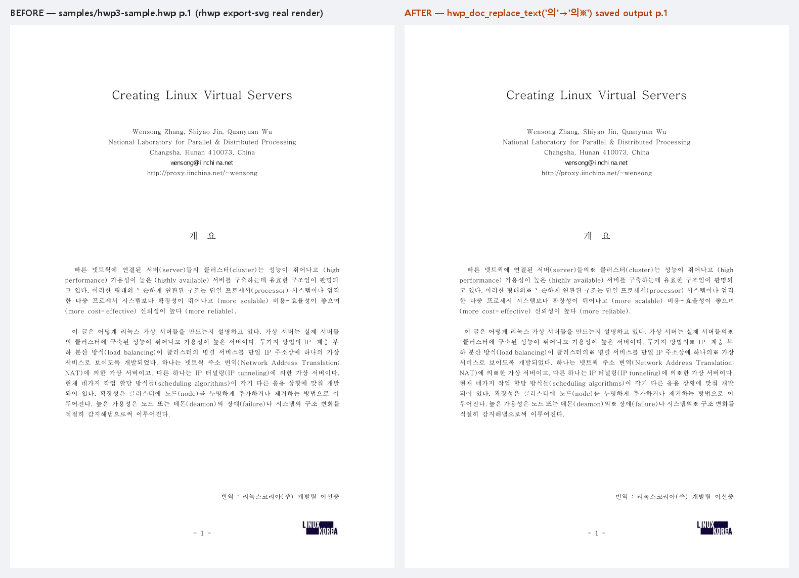

# #3601 처리 기록 — mcp-serve 세션 검색·치환 (hwp_doc_search / hwp_doc_replace_text)

## 공백

#3598 로 fill/save 는 세션화됐지만, 실무 편집 루프의 나머지 두 동작이 무상태
전용이었다: 검색은 매 호출 재파싱, 치환은 재파싱+즉시 재기록. "열고 → 찾고 →
바꾸고 → 채우고 → 한 번 저장" 흐름이 끊겨 있었다.

## 구현 — 서버 전용 세션 도구 2종

- `hwp_doc_search {docId, query, caseSensitive?}` — 열린 핸들에서 재파싱 없이 검색.
  봉투는 무상태 `search --json` 과 **같은 helper**(`search_json_value`)를 재사용해
  주소 어휘(matches[].section/paragraph/page/context) 동형을 보장한다.
- `hwp_doc_replace_text {docId, find, replace, caseSensitive?}` — 핸들 IR 에 치환
  누적(디스크 미기록). 코어 `replace_all_native` 재사용, `replacedCount` 로 정규화.
  0건은 오류가 아니라 계수 보고다.

## 실측 증적 — 라이브 stdio JSON-RPC 왕복 (16쪽 문서, 276건 치환)

`hwp_open(16쪽) → hwp_doc_search("의")=276건 → hwp_doc_replace_text("의"→"의※")
=276건 → hwp_doc_search("의※")=276건(핸들 반영 확인, 재파싱 없음) → hwp_doc_save
(65,024B) → hwp_close` 후 **서버 종료 뒤** `rhwp search --json` 재독으로 276건이
산출물에 남아 있음을 대조했다.

## 검증

- 신규 계약 테스트 `tests/mcp_session_query_contract.rs` **5건 green** (red 선확인)
  - 세션 검색 = 무상태 검색과 매치 수·주소 어휘 동형 / 치환 누적→save→재독 대조
  - 치환 0건 = 계수 0 보고 / 닫힌 핸들 isError / tools/list 등재
- 기존 `mcp_session_edit_contract` 5건·`mcp_server_contract` 6건 무회귀
- clippy `-D warnings` 0건, rustfmt clean

## 남은 일 (범위 밖)

- 세션판 set-cell — `edit_set_cell` 의 좌표 해석 로직 추출이 선행돼야 함
- 보호 문서 세션 열기(--password)

## 실측 증적 ② — 저장본을 실제 rhwp 로 열어 렌더한 전/후 비교

원본 1쪽(왼쪽)과 세션 치환 저장본 1쪽(오른쪽)을 `export-svg` 로 각각 렌더했다.
오른쪽 조판에 ※ 마커가 실제 본문("서버들의※ 클러스터" 등)에 반영되어 있고,
레이아웃·로고·번역자 줄은 그대로다 — 치환이 텍스트에만 정확히 닿았다는 시각 증명.

