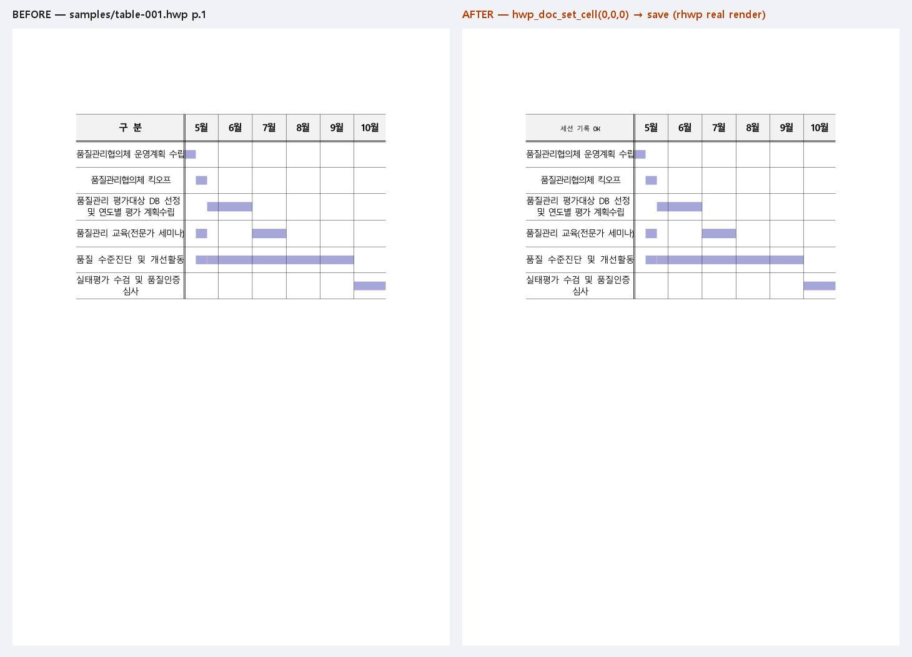

# #3603 처리 기록 — resolve_table_cell 추출 + hwp_doc_set_cell (M3 착수)

## 구현

1. **추출 리팩터(동작 무변경)**: `edit_set_cell` 안에 갇혀 있던 격자 주소→모델 좌표
   해석(병합 앵커 안내·para_lens·old_text 수집)을 crate helper `resolve_table_cell()`
   + `CellResolveError{Usage,Runtime}` 로 추출. CLI 는 exit 2/1 로, 세션 도구는
   isError 로 각자 매핑 — 판정 문구는 한 곳.
2. **`hwp_doc_set_cell {docId, table, row, col, text, keepStyle?}`**: 핸들 IR 에 기록
   (save 가 기록 지점). overflow 판정(`measure_cell_overflow`)·검정 정규화
   (`recolor_cell_text_black`)까지 무상태 hwp_set_cell 과 동형.

## 실측 증적 — 세션 set_cell → save 저장본 실렌더 전/후

## 검증

- 신규 `mcp_session_setcell_contract` **3건 green** (누적→save→export-tables 재독 대조,
  병합 덮인 칸 앵커 안내 isError, 닫힌 핸들·tools/list)
- **추출 무회귀**: 기존 `edit_set_cell_contract` 5건 green — CLI 동작 불변 증명
- clippy `-D warnings` 0건, rustfmt clean
