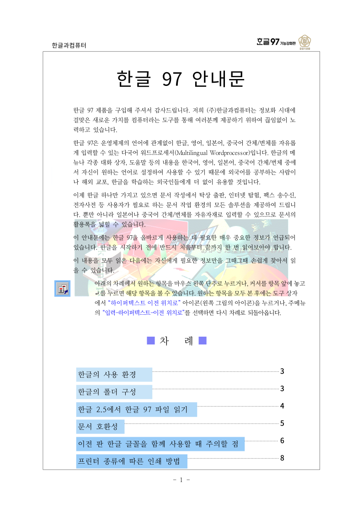

# #3604 처리 기록 — 보호 문서 MCP 암호 입력

## 구현

- 세션 `hwp_open`에 선택 `password`(`writeOnly`)를 추가했다. 값이 있으면
  `HwpDocument::from_bytes_with_password`를 호출하며, 열린 세션에는 문서와 형식 정보만
  남긴다.
- 무상태 문서 도구는 `inputSchema.password`와 `cli.passwordStdin` 계약을 선언한다. 서버는
  암호를 `cli.args`나 자식 argv에 넣지 않고 `--password-stdin`의 첫 줄로만 전달한다.
- `hwp_batch`와 `hwp_batch_search`는 stdin을 경로 목록에 이미 사용하므로 password를
  명시적으로 거부한다. 두 입력을 한 스트림에 섞지 않는다.
- 암호 문자열은 MCP 성공·오류 응답에 넣지 않는다. 다만 MCP 호스트가 도구 인자를 기록할 수
  있으므로 신뢰된 로컬 호스트에서만 `password`를 사용해야 한다.

## 실측 증적

암호 HWPX를 CLI stdin 암호 경로로 열고 1쪽을 SVG에서 PNG로 렌더했다. 세션 MCP가 사용하는
동일 `HwpDocument::from_bytes_with_password` 공개 API가 이 문서를 여는 것은
`mcp_password_contract`로 별도 고정했다.

```bash
printf '%s\n' '<fixture-password>' | \
  target/task_m100_3604/release/rhwp export-svg \
  samples/HWP5-password-123456.hwpx --password-stdin -p 0 \
  -o output/task_m100_3604/evidence/svg
rsvg-convert --output output/task_m100_3604/evidence/HWP5-password-123456_page001.png \
  output/task_m100_3604/evidence/svg/HWP5-password-123456_001.svg
```



- 페이지 수: 23
- PNG SHA-256: `17307ee6f96d4806f1ff7be8b106c9aad30db434798b6304adf0b0cc9ee17039`
- 육안 확인: 제목·본문·목차·본문 삽화가 모두 표시된다.

## 검증

- `CARGO_TARGET_DIR=target/task_m100_3604 CARGO_INCREMENTAL=0 cargo test --release --test mcp_password_contract --test mcp_server_contract --test hwp5_password_fixture --test hwp3_password_fixture --test hwpx_password_fixture`
  - HWP3 11건, HWP5 2건, 암호 HWPX 3건, 신규 MCP 암호 4건, 기존 MCP 6건 모두 성공
- `CARGO_TARGET_DIR=target/task_m100_3604 CARGO_INCREMENTAL=0 cargo test --release --test cli_json_contract`
  - 22건 성공
- `cargo fmt --check`, `git diff --check` 성공
