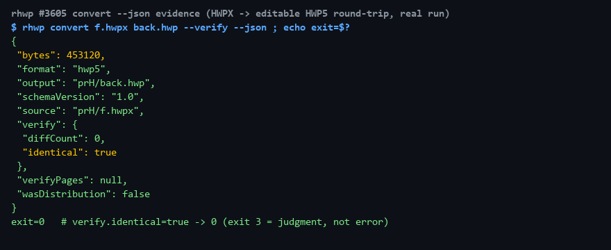

# #3605 처리 기록 — convert --json + hwp_convert_hwp5 (M5)

## 구현

`export-hwpx --json`(#3596) 패턴을 반대 방향(HWPX/배포용→편집 가능 HWP5)에 이식:
- `convert … --json` — `{schemaVersion,source,output,format:"hwp5",bytes,wasDistribution,verify,verifyPages}`.
  판정은 데이터(차이 시 봉투 후 exit 3/4), 재파싱 실패는 stdout 비움.
- #3596 의 `allow_json` 게이트 해제(true) — 게이트의 목적(구현 없는 침묵 수용 차단)이
  달성됐으므로, 가드 테스트를 봉투·exit 정합 테스트로 전환.
- MCP `hwp_convert_hwp5 {path,output}` — `--verify` 기본 내장, 단일 출처 등재.
- 교차 포맷 노이즈 제거(#3505 `strip_cross_format_noise`) 기존 경로 그대로.

## 실측 증적

HWP5→HWPX→다시 HWP5 왕복: 453,120 bytes, `verify:{identical:true,diffCount:0}`, exit 0.

## 검증

- `output_axis_json_contract` 7건 green(가드 전환 포함) · `cli_json_contract` 22건
  (드리프트 가드 — 새 도구·json 계약 자동 검증) 무회귀 · clippy 0 · rustfmt clean
