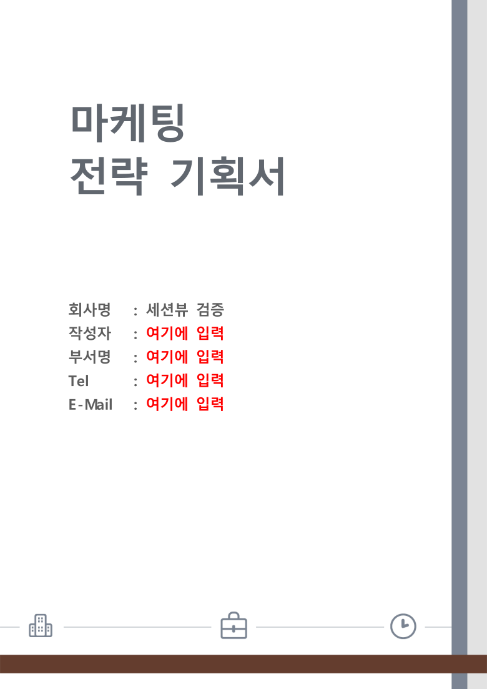

# #3609 처리 기록 — 세션 조회·렌더 완결 4종

## 구현

`hwp_doc_info`/`hwp_doc_fields`/`hwp_doc_tables`/`hwp_doc_render_page` — 전부 무상태
봉투 helper(`info_json_value`/`collect_field_records`+`fields_json_value`/
`tables_json_value`) 재사용으로 동형 보장. render 는 `render_page_svg` 배선.
공통 핸들 해석은 `with_doc` helper 로 중복 제거. SessionDoc 에 open 시점
크기·감지 형식을 기억해 info 봉투를 채운다.

## 실측 증적

세션 안에서 `fill(회사명="세션뷰 검증") → doc_render_page(p0)` 직후 렌더 —
**편집→즉시 눈검증 루프가 재파싱 없이 세션 안에서 닫힌다**:

같은 핸들의 `hwp_doc_fields` 재조회에서 회사명 값 반영 확인(테스트로 고정).

## 검증

- 신규 `mcp_session_view_contract` **5건 green** (red 선확인: 구현 전 4건 FAILED)
- 세션 edit 5·query 5·server 6건 무회귀, clippy 0건, rustfmt clean
