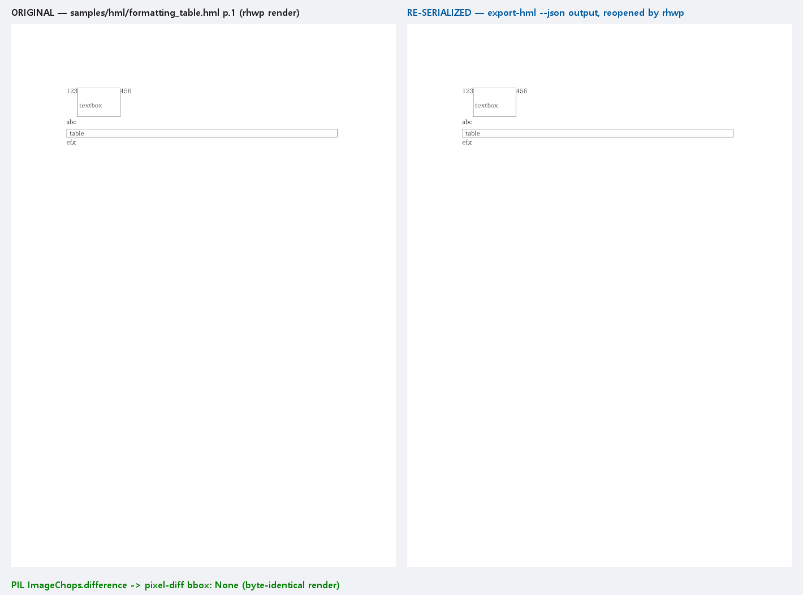

# #3616 처리 기록 — export-hml --json + hwp_export_hml (M5)

## 구현

- `export-hml <입력.hml> -o <출력.hml> --json` — `{schemaVersion,source,output,format:"hml",bytes}`.
  실패 경로 stdout 비움(산출물 축 규약). 파서(`parse_hml_export_args`)에 `--json` 수용 추가.
- MCP `hwp_export_hml {path,output}` — 단일 출처 `mcp_tool_definitions()` 등재.

## 실측 증적 — 재직렬화 전/후를 rhwp 로 열어 렌더 + 픽셀 대조

원본 HML(왼쪽)과 `export-hml` 산출물을 rhwp 로 다시 열어 렌더(오른쪽)한 1쪽 비교.
PIL `ImageChops.difference().getbbox()` = **None** — 두 렌더가 **바이트 단위 픽셀 동일**,
재직렬화가 시각 무손실임을 기계 판정으로 증명:

- 봉투 실측: 15,574 bytes, exit 0. 산출물 `info --json` 재파싱 `format:"hml"` (테스트 고정)

## 검증

- 신규 `export_hml_json_contract` **3건 green** (봉투 bytes==실제 크기, 재파싱 실측,
  실패 경로 stdout 순수성, capabilities/MCP 드리프트)
- `cli_json_contract` 22건 무회귀 · clippy 0 · rustfmt clean
