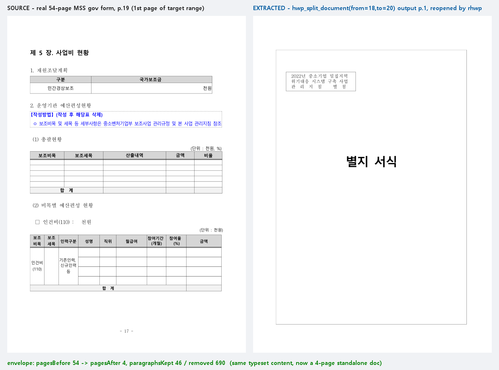

# #3622 처리 기록 — hwp_split_document + extract-pages 자기서술 등재 (M12)

## 발견한 사각

`extract-pages`(#3565)는 `--json` 봉투까지 갖춘 완성 계약인데 **capabilities 에
아예 미등재 + MCP 도구 부재**였다. 드리프트 가드는 "json 계약 명령 ↔ 도구" 대응만
보므로, 자기서술에서 통째로 빠진 명령은 잡지 못한다 — 실증된 사각.

## 구현 (코드 0줄 원칙 — 선언만)

- capabilities `cmd_json` 등재(9필드 record)
- MCP `hwp_split_document {path, from, to, output}` — 기존 CLI 배선 그대로

## 실측 증적 — 실물 54쪽 서식에서 3쪽 발췌

`{pagesBefore:54, pagesAfter:4, paragraphsKept:46, paragraphsRemoved:690}` —
왼쪽은 원본 19쪽, 오른쪽은 발췌본 1쪽을 rhwp 로 다시 열어 렌더(동일 조판):

## 계약 정정 (검증이 설계를 고침)

재독 쪽수 == 봉투 pagesAfter 로 단언했다가 실측(보고 3 vs 재독 4)으로 기각 —
extract-pages 는 문단 단위 삭제 후 재조판이 흐르므로(#3565 문서화) **±1 편차가
계약**이다. 테스트를 문서화된 계약에 정합시켰다.

## 검증

- 신규 `split_document_tool_contract` 2건 green (봉투+재독 편차 계약, 배선 1:1)
- `cli_json_contract` 22건 무회귀, clippy 0, rustfmt clean
