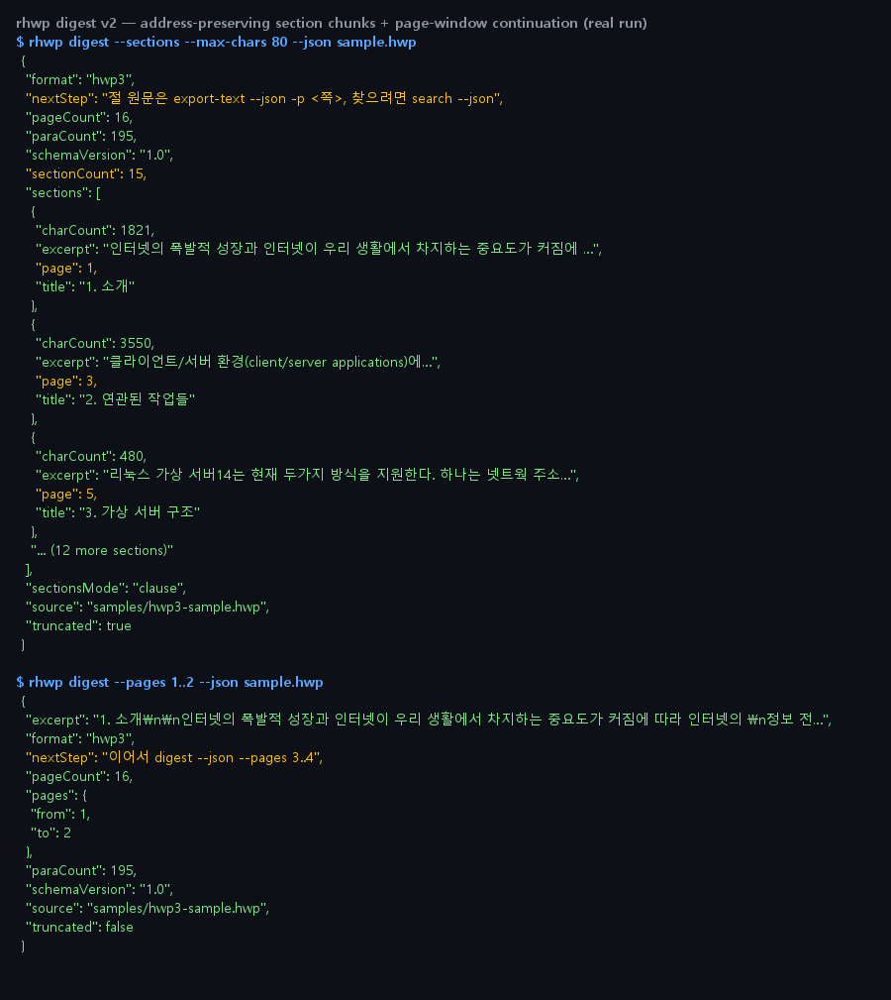

# #3688 처리 기록 — digest v2: 주소 보존 절 청킹 + 쪽 범위 연속 창

## 설계 원리 (자립 논증)

일괄 텍스트 덤프 방식의 요약 공급은 ① 쪽·절 주소를 상실해 요약 결과를 원문으로
되짚을 수 없고 ② 대형 문서 분할에 소비자 측 상태 관리를 요구한다. rhwp 는 조판
엔진을 보유하므로 **주소(0 기준 글로벌 쪽 번호)가 계약에 내장된 청크**를 공급할 수
있다 — 덤프 방식이 원리적으로 도달할 수 없는 지점이다.

## 구현

- `digest --sections` — `sections:[{title,page,charCount,excerpt}]`. page 단조
  비감소 보장(주소 신뢰성), charCount 대 excerpt 로 잔여량 판정, 구조 없는 문서는
  쪽 폴백 강등을 `sectionsMode:"page"` 로 명시. 절 본문은 build_structure 하위
  트리 수집 — 새 파싱 로직 없음.
- `digest --pages a..b` — 범위 발췌. `nextStep` 이 같은 폭의 다음 창을 그대로 받아
  적게 안내("이어서 digest --json --pages 3..4"), 끝 범위는 마지막 쪽으로 조임.
- MCP `hwp_digest` 는 devel 정식 optionalArgs({when,args}) 메커니즘으로 배선.

## 실측 증적

16쪽 실문서: 절 15개(제목·쪽 주소·잔여량) / 1..2 창 발췌 후 "이어서 3..4" 연속 안내.

## 검증

- `digest_v2_contract` **11건 green** — 주소 단조·절단·쪽 폴백·연속 창·꼬리 조임·
  불량 구문 5종 exit 2·stdout 순수성·한 줄 봉투
- v1 `digest_macro_contract` 8건 무회귀 · `cli_json_contract` 22건 · clippy 0
