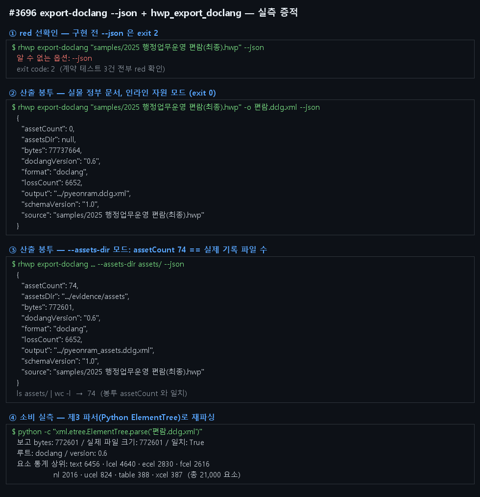

# #3696 처리 기록 — export-doclang --json + hwp_export_doclang (#3608 1-C)

## 공백

DocLang v0.6 XML 은 다운스트림 AI 파이프라인 입력인데, `export-doclang` 은 사람용
진행 메시지만 내서 stdout 순수 JSON 계약이 없고 MCP 도구로도 노출되지 않았다.

## 구현 — 산출 축 패턴(#3596)·export-hml(#3616) 재사용, 신규 발명 없음

- `export-doclang <입력> [-o <출력.xml>] [--assets-dir <dir>] --json` — 변환 동작
  무변경, `--json` 에서만 stdout 순수 JSON 봉투:
  `{schemaVersion:"1.0",source,output,format:"doclang",doclangVersion:"0.6",bytes,assetsDir,assetCount,lossCount}`
- `assetsDir` 는 `--assets-dir` 를 준 경우에만 문자열, 아니면 `null`
  (#3596 export-hwpx 의 `verify: null` 규약). `lossCount` 는 사람용 "손실 보고 N건"의
  기계 필드. `doclangVersion` 은 단일 출처 `DOCLANG_VERSION` 상수 재사용.
- 실패 경로 stdout 순수성(#3596)·종료 코드 계약(0/1/2) 무변경.
- MCP `hwp_export_doclang {path,output}` — 단일 출처 `mcp_tool_definitions()` 등재,
  `capabilities --mcp` 선언과 `mcp-serve`(#3571) 실행이 자동으로 함께 얻는다.

## 실측 증적 — 실물 정부 문서 (2025 행정업무운영 편람, HWP5)

- 인라인 모드: 77,737,664 bytes XML, `lossCount:6652`, exit 0
- `--assets-dir` 모드: 772,601 bytes XML + 에셋 74개 — 봉투 `assetCount` == 실제 기록
  파일 수, `bytes` == 실제 파일 크기
- **소비 실측**: 산출 XML 을 제3 파서(Python ElementTree)로 재파싱 — 루트
  `<doclang version="0.6">`, 총 21,000 요소(text 6456·table 388·OTSL 셀 토큰 등).
  계약 테스트도 quick-xml 로 같은 소비 실측을 고정한다.

## 검증

- 신규 `tests/export_doclang_json_contract.rs` **3건 green**
  (red 선확인: 구현 전 `--json` → exit 2 "알 수 없는 옵션")
  — 봉투 필드·보고 bytes==실측 크기·quick-xml 소비 실측·실패 경로 stdout 순수성·
  capabilities/MCP 드리프트 가드
- 인접 무회귀: `cli_json_contract` 22 · `mcp_server_contract` 6 ·
  `doclang_export` 3(win) · `issue_3359_export_family_option_order` 8 ·
  `export_hml_json_contract` 3 · `output_axis_json_contract` 7 — 전부 green
- `cargo clippy -- -D warnings` 0건 · rustfmt clean (CRLF 잡음 제외) ·
  `cargo test --profile release-test --tests` 전체 green
- `mydocs/manual/cli_commands.md` export-doclang 절 현행화
