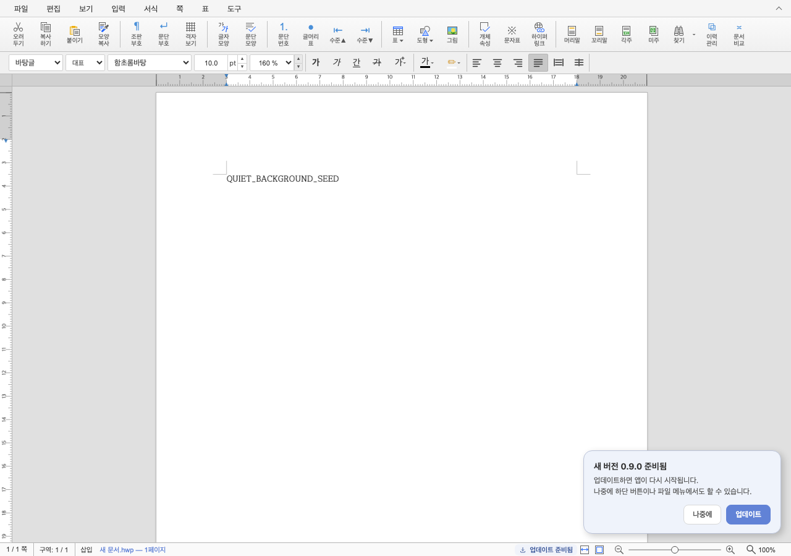
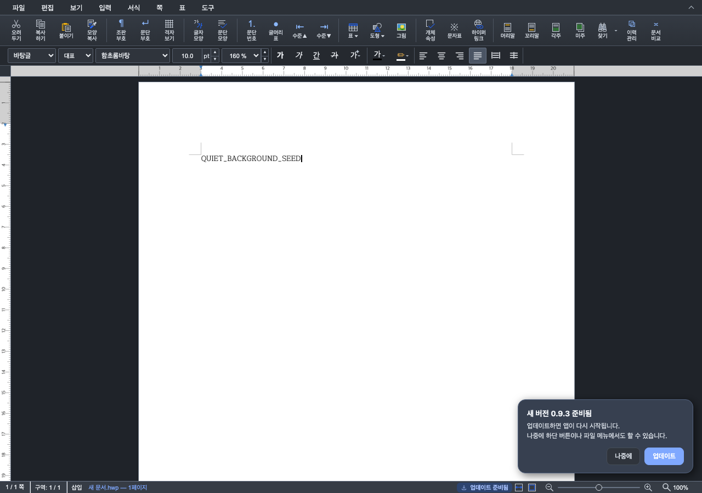

# Task #126 (M100) — Desktop 업데이트 준비 완료 작은 알림 최종 보고서

Issue: #126 · 계획: [task_m100_hp126.md](../plans/task_m100_hp126.md) · base `93b0a4a48` · 코드 커밋 `770f82561` + 2차 검토 반영 커밋

## 1. 결과 요약

업데이트 준비가 끝나면 화면 오른쪽 아래에 "새 버전 X 준비됨" 작은 알림을 버전마다 한 번 띄운다.
편집 포커스를 옮기지 않고 8초 뒤 자동으로 닫히며, 큰 업데이트 카드는 여전히 자동으로 열지 않는다.
모달이 열려 있거나 앱 창이 뒤에 있으면(다른 앱 사용·최소화) 그동안 미루고, 창을 떠나면 닫히는 시간도 멈춘다.

| 밝은 테마 | 어두운 테마 |
|---|---|
|  |  |

## 2. 변경 내역

| 파일 | 내용 |
|---|---|
| `rhwp-studio/src/ui/update-notice.ts` | `#desktop-update-nudge`(role=status, aria-live=polite), `maybeNudge`(버전당 1회·카드 확인 버전 억제·모달 또는 창 비주시 중 미루기), `windowAttended`(`visibilityState`·`hasFocus`), 창 `focus`/`blur`/`visibilitychange` 에서 미룬 알림 재개·타이머 정지/재시작, `hideNudge`(포커스가 안에 있을 때만 들어온 위치로 복원 — 모달이 열려 있으면 그 모달 안의 위치일 때만), 8초 타이머(실제 mousemove hover·내부 포커스·창 비주시 중 유지), 모달 감시 `MutationObserver`, window capture 키 처리(Esc 닫기, Enter/Space/Tab 전파 차단) |
| `rhwp-studio/src/styles/update-notice.css` | `.dialog-update-nudge`(fixed, 오른쪽 16px·아래 36px, z-index 10 — 편집 화면·상태 표시줄 위, 사용자가 연 모든 팝업·모달 아래), 폭 `min(320px, 100vw - 32px)`, 등장 애니메이션·reduced-motion 해제, 버튼 색은 카드 버튼과 공유 |
| `rhwp-studio/e2e/desktop-update-ui.test.mjs` | `nudgeState`·`popupAboveNudge` 도우미, 초기 ready 검사, 알림 시나리오 4개 묶음(아래 3.2) |
| `HanPage-Desktop/CHANGELOG.md` · `README.md` · `mydocs/manual/desktop_auto_update.md` | 미출시 항목, 사용자 경험 설명 |

공통 결과: 알림은 기존 `receiveStatus` 상태 전이 하나에서만 결정한다. `ready` 가 아닌 상태로 바뀌면 미루기·감시·알림을
모두 정리하므로 카드·진입점·알림이 서로 다른 상태를 보이지 않는다. 미룬 알림은 모달 닫힘과 창 복귀 어느 쪽에서든
같은 `resumeDeferredNudge` 로 재개하며, 그때 그 버전이 아직 준비 상태인지 다시 확인한다.

## 3. 검증

### 3.1 자동 검사 (2차 검토 반영 코드)

| 명령 | 결과 |
|---|---|
| `npx tsc --noEmit -p tsconfig.json` (rhwp-studio) | 통과 |
| `npm test` (rhwp-studio) | 1,837 중 1,835 PASS / 0 FAIL / 2 SKIP |
| `CHROME_PATH=… node e2e/run-with-vite.mjs -- node e2e/desktop-update-ui.test.mjs --mode=headless` | 140 PASS / 0 FAIL, 처리되지 않은 브라우저 예외 0 |
| 같은 E2E 를 변경 전(`93b0a4a48`) `update-notice.ts`/`.css` 로 실행 | 새 알림 검사 FAIL("초기 ready 조회는 … 작은 준비 알림을 한 번 띄운다" 등) |
| 같은 E2E 를 1차 검토 반영 전 구현으로 실행 | 3 FAIL: 모달 중 미루기, 팝오버보다 아래 쌓임, 자동 닫힘 시 모달 뒤 편집기 포커스 비이동 |
| 같은 E2E 를 2차 검토 반영 전 구현(`770f82561`)으로 실행 | 8 FAIL: 메뉴·양식 목록·비교 창이 알림 아래에 깔림(3), 모달 안 포커스 복귀·그 뒤 Esc 닫기(2), 창 복귀 시 미룬 알림 표시·창 이탈 중 유지·복귀 후 8초 재시작(3) |
| 같은 E2E 를 재개 경로 보완 전 구현(`2f66ea7e1`)으로 실행 | 1 FAIL: 창이 뒤에 있는 동안 미룬 알림을, 돌아왔을 때 열려 있던 모달이 닫힌 뒤에도 띄우지 않음 |

데스크톱 크레이트(`HanPage-Desktop/src-tauri`)와 루트 엔진 크레이트는 바꾸지 않아 Rust lint 묶음은 비해당이다.

### 3.2 E2E 시나리오와 관측

| 주장 | 검사 |
|---|---|
| 다운로드 중에는 띄우지 않는다 | downloading 상태에서 알림 없음 |
| 준비 완료 시 1회, 포커스 유지 | ready 0.9.0 → 표시, `document.activeElement` 불변, 위치(오른쪽 아래·상태 표시줄 위·화면 안) |
| 마우스 클릭은 포커스를 옮기지 않는다 | [나중에] 클릭 중 알림의 `focusin` 0회, 편집 포커스 유지 |
| 같은 버전은 다시 띄우지 않는다 | [나중에] 후 같은 0.9.0 재수신 → 미표시 |
| 자동 닫힘 | 0.9.1 을 멈춘 커서 아래에 띄워도 약 8초 뒤 닫힘 |
| hover·Esc | 실제 마우스 이동으로 올리면 유지, Esc 로 닫고 포커스 복원 |
| [업데이트] | 카드 + 저장 확인, 취소 시 적용 안 함, 카드가 열려 있으면 알림 없음 |
| 모달 미루기 | 정보 모달 중 0.9.5 수신 → 미룸, Esc 로 모달 닫으면 표시 |
| 모달 뒤 포커스 | 모달 열린 채 자동 닫힘 → 편집기로 포커스 이동 없음 |
| 쌓임 순서(실제 그리기) | 알림 중심의 `elementFromPoint` 가 알림(편집 화면 위). 실제로 연 표 메뉴, `#scroll-content` 안 양식 목록 상자, body 의 비교 결과 창을 알림 자리로 옮기면 겹친 곳의 `elementFromPoint` 가 각 팝업 |
| 찾기 창과 Esc | 찾기 창이 열린 채 알림 안에서 Esc → 알림만 닫히고 찾기 창 유지, 포커스는 찾기 창으로 |
| 모달 안에서 들어온 포커스 | 글자 모양 대화상자의 닫기 버튼 → 알림 → Esc: 알림만 닫히고 포커스가 그 버튼으로, 다음 Esc 로 대화상자 닫힘 |
| 창이 뒤에 있을 때 | 다른 탭을 앞으로(`hasFocus` false·`hidden`) 둔 채 0.9.10 수신·9초 대기 → 미표시, 돌아오면 표시·편집 포커스 유지 |
| 창 이탈 중 정지 | 알림이 뜬 채 다른 탭으로 9초 → 유지, 돌아온 뒤 약 8초에 닫힘 |
| 창 복귀 시 모달 | 창이 뒤에 있는 동안 0.9.11 수신, 그동안 정보 모달 열림 → 돌아와도 미룸, 모달을 닫으면 표시 |
| 플랫폼 문구 | Windows 본문에 "설치 프로그램", 웹 빌드는 알림 요소 없음 |

### 3.3 독립 검토

1차 검토에서 확인된 결함(모달 뒤 편집기로의 포커스 이동, 모달 아래에서 사라지는 알림, 멈춘 커서 밑의 영구 표시,
찾기 대화상자의 Esc 가로채기, 명령 팔레트보다 위 쌓임)을 반영했다.

1차 반영 코드를 포커스·키보드, 상태 전이·타이머, 배치·접근성·테스트 타당성 세 관점에서 다시 검토하고 각 주장을
반박 검증했다. 확인된 결함 3건을 반영했다.

| 결함 | 반영 |
|---|---|
| 앱 창이 뒤에 있을 때 준비되면 아무도 못 본 채 8초 뒤 사라지고 그 버전은 다시 뜨지 않음(세 관점 공통) | 창 비주시 중 미루기, 창 이탈 중 타이머 정지, 복귀 시 재개 |
| z-index 8900 이 메뉴(1000대)·양식 목록(20)·비교 창(1200~1300) 위에 놓여 그 클릭을 가로챔. 기존 검사는 상수 9000 과만 비교 | z-index 10, 실제 팝업과의 `elementFromPoint` 검사로 교체 |
| 모달 안에서 키보드로 들어온 알림을 닫으면 포커스가 body 로 빠져 그 모달의 Esc 가 동작하지 않음 | 가장 위 모달 안의 위치이면 그곳으로 복귀 |

반영 뒤 자체 점검에서 재개 경로의 빈틈 1건을 더 찾아 고쳤다. 창이 뒤에 있어 미룬 알림을 창 복귀 때 다시 시도하면서
모달이 열려 있으면 그냥 돌아가 모달 감시를 시작하지 않아, 그 모달이 닫혀도 알림이 뜨지 않았다. 재개는 이제
`maybeNudge` 를 다시 거쳐 모달이면 감시를 시작한다.

반박된 주장: 이미 떠 있는 알림이 나중에 열린 모달 아래에서 시간이 다 되는 것(의도한 동작 — 모달을 연 것은 사용자 행동),
role=status 영역의 표시 시점에 따른 화면 낭독기 미낭독(화면 낭독기별 동작 차이, 결함 근거 없음), 떠 있는 알림의
window capture 키 처리가 모달 키를 빼앗는다는 주장(알림 안에 포커스가 있을 때만 처리).
검증하지 않고 넘긴 테스트 타당성 지적 2건(마우스 클릭 포커스 검사, 찾기 창 Esc 검사)은 위 3.2 검사로 직접 보강했다.

## 4. 미검증·한계

- 실제 Tauri 앱의 업데이트 경로에서 표시되는 모습은 확인하지 못했다. 이 기능은 앱 안에 들어 있으므로 이 변경을
  포함한 버전(0.8.11 예정)을 설치한 뒤 다음 업데이트부터 보인다. 0.8.10 → 0.8.11 은 기존 방식으로 안내된다.
- E2E 는 모의 Tauri 브리지와 Chrome headless 에서 실행했다. 창 비주시는 탭 전환으로 재현했으며, WebKit(macOS)·
  WebView2(Windows) 실기기에서 창 전환·최소화 때의 `focus`/`visibilitychange` 동작과 표시는 미검증이다.
- 비교 결과 창처럼 모달이 아닌 창이 오른쪽 아래를 덮고 있을 때 준비되면, 알림은 그 아래에 놓인 채 8초 뒤 닫힌다
  (사용자가 연 창을 가리지 않는 쪽을 택함). 상태 표시줄 버튼과 파일 메뉴는 그대로 남는다.
