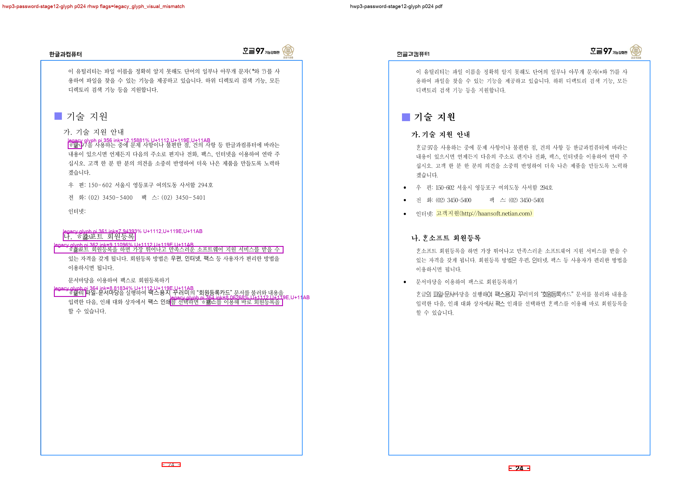

# #3486 Stage 12 — 옛자모·PUA PDF/SVG visual sweep 증적

## 목적과 범위

`scripts/task1274_visual_sweep.py`의 새 `legacy_glyph_visual_mismatch` 후보가 구조 heuristic이
0건인 경우에도 사용자가 지적한 제품명 glyph 차이를 잡는지 확인한다. 이 실행은 **rhwp SVG와
저장소 기준 PDF의 raster 비교**이며, Studio Canvas 또는 한컴 편집기의 최종 수용 판정이 아니다.

대상은 전체 24쪽 중 사용자가 지적한 p10과 반복성 확인용 p24 두 쪽이다. SVG/export-render-tree는
문서 전체 24쪽에서 성공했지만 raster·overlay·analysis는 선택한 두 쪽에만 수행했다. 따라서 이
문서는 24쪽 전체 sweep 완료를 주장하지 않는다.

## 입력과 실행 provenance

| 항목 | 값 |
| --- | --- |
| HWP fixture | `samples/HWP3-password-123456.hwp` — SHA-256 `db743d084efc9e08e839a5b4d978b16b8676434011776e090e4cda43e57304be` |
| 비교 PDF | `pdf/HWP3-password-123456.pdf` — SHA-256 `3ced5ad95ad30331e2756b5b34509c1ac91dfe3c72013c8e14f2556ca6bd5776` |
| rhwp | `rhwp v0.8.2`, 실행 binary SHA-256 `117b2379857d6d5d79f517fbd31f3d40b6581dcafbde5a2d25470962987e71f1` |
| sweep 코드 | `0fe34ea49577b77de695839c2854ed1c681bbebf` (`fix(visual): 옛자모·PUA PDF 불일치 후보를 검출한다`) |
| 선택 페이지 | `10,24` |
| raster | 144 dpi, 양쪽 `1191 × 1684` px |
| pixel diff threshold | 32 |
| 비밀 처리 | 암호 fixture는 stdin 전용 local launcher로 열었으며 암호·환경 값은 기록하지 않는다. |

실행은 아래와 동등했다. `<password-stdin-rhwp>`는 비밀을 출력하지 않는 local launcher이며,
증적 생성 직후 삭제했다.

```bash
python3 scripts/task1274_visual_sweep.py \
  --key hwp3-password-stage12-glyph \
  --hwp samples/HWP3-password-123456.hwp \
  --pdf pdf/HWP3-password-123456.pdf \
  --pages 10,24 \
  --out /private/tmp/rhwp_3486_stage12_svg_p010_p024_glyph \
  --rhwp-bin <password-stdin-rhwp> \
  --dpi 144
```

`pdftotext -bbox-layout`은 해당 legacy PDF에서 exit 6으로 실패했다. 문자 text layer를 성공적으로
비교했다는 주장은 하지 않았고, 이 후보는 PDF/SVG raster와 render tree만 사용해 검출했다.

## 결과

| 페이지 | pixel match | ink match / visual proxy | 새 glyph 후보 | 기존 구조 후보 |
| --- | ---: | ---: | ---: | --- |
| 10 | 92.47090% | 6.92828% | 6 | 없음 |
| 24 | 95.37655% | 9.66831% | 5 | 없음 |

두 페이지 모두 `legacy_glyph_visual_mismatch`로 flag됐다. 검출기는 옛자모 블록과 PUA를 포함한
`TextRun`만 대상으로, render-tree bbox를 동일 raster 좌표로 옮겨 국소 ink union이 24 px 이상이고
국소 `ink_match_percent`가 80% 이하일 때 후보를 남긴다. 이는 **review 우선순위**이지 결함 원인이나
자동 불합격 판정이 아니다.

### p10 — 사용자가 지적한 제품명

`render_tree_010.json`의 `pi=135`, path `root/6/0/0/0`은 `가. ᄒᆞᆫ글 드라이버 사용`이다.
코드 포인트는 `U+1112,U+119E,U+11AB`이고, 국소 bbox는 `[218,196,264,29]` px, ink union은 2,422 px,
국소 ink match는 **7.30801%**였다. 저장소 자산의 보라색 bbox와 label은 이 후보를 가리킨다.

| 증적 | 역할 |
| --- | --- |
| [p10 compare](assets/p010_compare.png) | rhwp SVG raster와 비교 PDF의 좌우 원본 비교 |
| [p10 overlay](assets/p010_overlay.png) | raster 불일치 위치 확인 |
| [p10 review](assets/p010_review.png) | compare와 overlay를 한 장에 결합한 검토 자료 |
| [p10 annotated](assets/p010_annotated.png) | 새 detector가 표시한 옛자모 후보 bbox와 `pi` |


### p24 — 다른 제품명 context의 반복성

대표 후보 `pi=361`, path `root/6/0/14/0`은 `나. ᄒᆞᆫ소프트 회원등록`이다. 같은 코드 포인트를
포함하며 국소 bbox `[218,768,252,29]` px에서 ink union 2,568 px, ink match **7.94393%**로 기록됐다.
이는 p10 한 곳에만 맞춘 문자열 검사 대신, 옛자모/PUA를 포함한 render-tree run과 실제 raster 차이를
교차한다는 보조 증거다.

| 증적 | 역할 |
| --- | --- |
| [p24 compare](assets/p024_compare.png) | rhwp SVG raster와 비교 PDF의 좌우 원본 비교 |
| [p24 overlay](assets/p024_overlay.png) | raster 불일치 위치 확인 |
| [p24 review](assets/p024_review.png) | p24 rhwp/PDF compare와 overlay 결합 검토 자료 |
| [p24 annotated](assets/p024_annotated.png) | p24의 반복 glyph 후보 bbox와 `pi` |



## 보존 자산 fingerprint

모든 자산은 일반 Git PNG이며 LFS filter 대상이 아니다. 아래 SHA-256은 저장소에 복사한 뒤 확인한 값이다.

| 파일 | SHA-256 |
| --- | --- |
| `assets/p010_compare.png` | `80bff2560f022f9cf0542edb7f27419c11adcd3800f782d80d60bad0a0184776` |
| `assets/p010_overlay.png` | `cfccbf12c395d4a3abdc0579f1795f314fda36257ee4e9f17ce88690ac31d6b2` |
| `assets/p010_review.png` | `67678f5b2cf25e6a1f4a73467181912596072f1a6413b4d187b0b6d3cc05214f` |
| `assets/p010_annotated.png` | `48a486a9abf87e3cedf1a916a51c0bca7e46763d5bebbc064d29ffffda6569b7` |
| `assets/p024_compare.png` | `8a3d23ff48e654e2d39074169a8dc477c7b62a3e8ed38091b5db20ff4ed5b245` |
| `assets/p024_overlay.png` | `a11c0b32e3f9651c1eb0b38cd2776a1a419dbac221994229d5fb9820832ececf` |
| `assets/p024_review.png` | `06e02952d75801eb45083fa567cceb61e5f06db24aaba263188b3ae60364e894` |
| `assets/p024_annotated.png` | `8c96774b29b0d632800cd21324fdb54613664453172fe9e2c350d46de493917b` |

## 검증 및 한계

- `python3 -m py_compile scripts/task1274_visual_sweep.py` 성공.
- `python3 scripts/tests/test_task1274_visual_sweep.py` 성공: 7 tests. 옛자모 mismatch 양성, PUA mismatch
  양성, 현대 `한글` 음성 경계를 포함한다.
- 이 증적은 `ᄒᆞᆫ글 → 한글` 전역 치환이나 HWP3 parser 보정을 정당화하지 않는다. raw IR을 보존하고,
  제품명 context 한정 display projection인지 일반 옛한글/font capability인지의 전수 분류는 후속
  source-to-canvas 조사에서 결정한다.
- 비교 PDF와 rhwp SVG의 전반적인 글꼴·행간 차이도 낮은 ink match에 포함될 수 있다. 따라서 후보별
  bbox·text·code point를 남겼으며, 사람의 한컴 편집기 판정을 대체하지 않는다.
