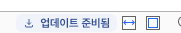
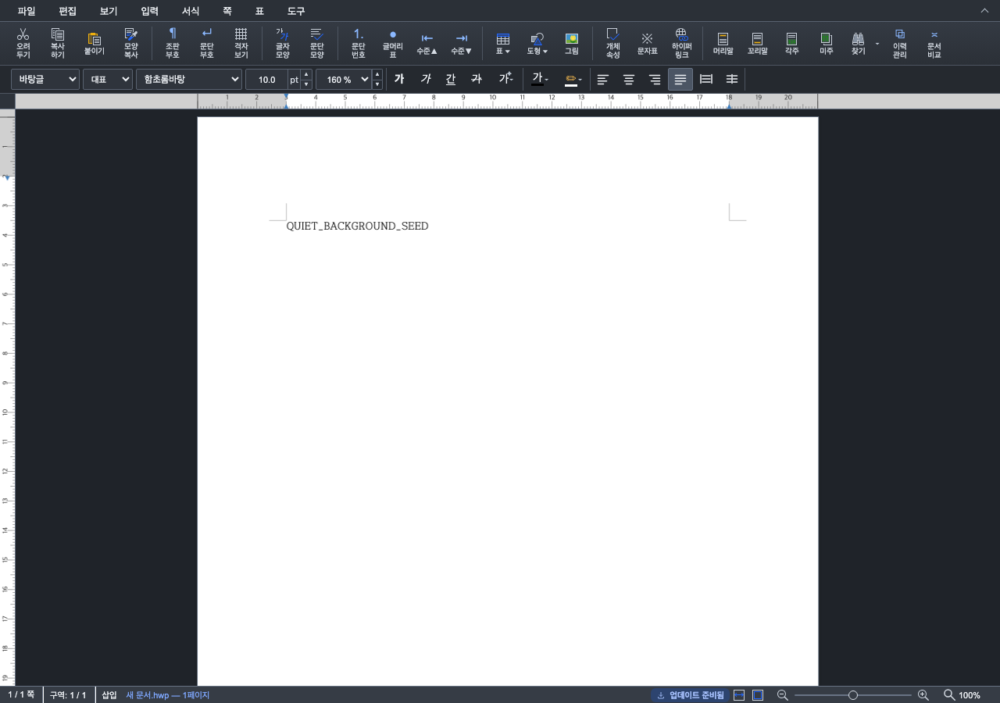
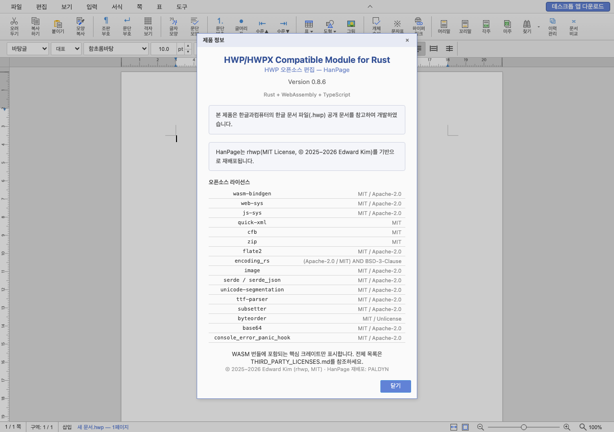

# Desktop 업데이트 자동 알림·PALDYN 표시 개선

- 사용자 요청: 표시된 회사명을 `PALDYN` 대문자로 통일하고, 실행 중 편집 화면 위에 뜨는 업데이트 알림을 정리한다.
- 기준 SHA: `52aeb4be36728109758c56b749c7946122f04d29`.
- 실제 브라우저 검증 SHA: `6087b3505d8cd5f3eeba249aec01f1ccebc2ad93`.
- 제품 코드·빌드·기존 프론트엔드 검사 SHA: `be7637ea9e369eb1d9e0677b07033b9adde59148`. 이후 두 커밋은 E2E 준비만 바꾸었으며 제품 파일 해시는 동일하다.
- 이번 작업은 로컬 구현·검증 완료다. 새 push·PR·릴리스·설치·앱 재시작은 수행하지 않았다. 공개 0.8.8 릴리스와 현재 설치 앱은 변경하지 않았다.

## 변경 결과

백그라운드 상태 이벤트·초기 조회는 하단 상태 버튼만 갱신한다. 준비 완료·다른 버전·중복 이벤트가 상세 카드를 자동으로 열거나 편집 포커스를 이동하지 않는다. 버튼에 작은 다운로드 아이콘을 두었고, 확인·다운로드 퍼센트·파일 검증·준비·실패·재시도를 구분한다. 매 진행 이벤트마다 음성 알림을 반복하지 않도록 상태 버튼의 새 `aria-live`를 제거했으며 현재 상태와 상세 열기 이름은 버튼의 접근성 레이블에 유지한다.

상태 버튼, 모든 Desktop 플랫폼의 `파일 > 업데이트 확인`, 기존 macOS `HanPage > 업데이트 확인` 메뉴가 같은 상세 카드를 연다. 상태 표시줄을 숨겨도 파일 메뉴를 사용할 수 있다. 웹에서는 업데이트 카드·버튼·새 메뉴를 만들지 않는다. 기존 진행 막대, 미저장 확인, 적용 중 편집 잠금, 중복 적용 방지, 실패 후 편집 복구와 재시도는 유지한다.

한국어·영어 제품 정보의 재배포 회사명을 `PALDYN`으로 바꾸고 Desktop Cargo 작성자·Tauri publisher도 대문자로 명시했다. 기반 rhwp·MIT·Edward Kim 고지는 보존한다. URL·앱 식별자는 기술 식별자로 유지한다. macOS 시스템 About에서 authors가 보인다는 주장은 하지 않는다.

## 검증 결과

| 검사 | 실제 결과·근거 |
| --- | --- |
| 수정 전 재현 | 같은 Studio 진입점에서 기준 update-notice 모듈을 실행. 초기 ready 조회와 다른 버전 ready 이벤트가 카드를 자동으로 열어 무팝업 계약 FAIL. 브라우저 오류 없이 재현했다. |
| 수정 후 브라우저 | 89 PASS / 0 FAIL. 초기 조회·상태 9종·늦은/다른 버전/중복 이벤트의 포커스·실제 seed 내용·dirty 보존, 수동 진입, Windows 숨김 상태줄→메뉴, 저장 취소/실패/성공, 적용 중 편집 차단과 복구, 재시도, 악성 문자열 무효화, 웹 무효화, KO/EN About 검사. |
| 창 크기·직접 화면 확인 | 800×600 및 1280×900에서 가장 긴 파일 확인 문구의 경계·텍스트 overflow와 좌우 상태·확대 제어의 가로 겹침을 검사했다. 390px 상세·저장 확인도 유지된다. 밝은/어두운 하단 버튼, 상세, KO/EN About에서 잘림 없이 PALDYN과 기존 고지를 확인했다. PNG 20장. |
| TypeScript·Desktop 프론트엔드 빌드 | PASS. 기존 큰 번들 크기 경고는 남는다. |
| 기존 Studio·editor 검사 | 1,834 PASS / 2 SKIP / 0 FAIL. |
| 배포 메타데이터 | 로컬 Tauri 2.11.2 설정 스키마 검사 PASS, Cargo TOML 파싱·PALDYN 작성자 검사 PASS. 설치 프로그램 자체는 실행하지 않았다. |
| WASM·Rust·조판 | 엔진·Rust source/test 미변경. 기존 검증 WASM을 JS·WASM 해시 일치 후 재사용했다. Rust 재빌드·조판 Visual Sweep은 비해당이며 앱 화면을 새로 캡처했다. |
| 사용자 변경 보존 | 기본 checkout의 원래 변경 39개가 기준 파일 해시와 모두 일치한다. 관리 worktree의 독립 브랜치에서만 수정했다. |

첫 브라우저 실행은 About 확인 전 프로토콜 timeout으로 미완료였다. 탭을 순서대로 생성·전면화해 재실행했다. 다음 두 실행의 2개 FAIL은 자동 알림 결함이 아니라 시작 문서가 편집 활성화되기 전 실제 seed 입력을 시도한 검사 준비 실패였다. 시작 문서는 별도 비동기 생성 경로이며 `pageCount > 0`과 `focus()`는 입력 활성화를 보장하지 않는다. 정식 새 문서 생성 후 실제 키 입력을 사용하고 seed 문자열·dirty=true 검사를 유지해 최종 89개를 통과했다. 직접 dirty 변경이나 WASM 문자열 주입은 하지 않았다. 실패 원문 로그도 ignored 경로에 보존했다.

독립 코드 검토에서 발견한 상태줄 음성 알림 반복 우려는 제거했다. 실제 스크린리더 음성·macOS/Windows 업데이트 설치·재시작·Windows publisher 화면은 미실행이다. 브라우저는 실제 Studio DOM·WASM·문서 입력·저장 경로를 사용하며 Tauri IPC와 전송 이벤트만 대역이다.

- [검증 SHA·파일/로그/이미지 해시와 범위](assets/desktop_update_quiet_brand_20261002/validation.json)
- [89개 검사와 수정 전 FAIL·최종 문서 상태·경계 좌표](assets/desktop_update_quiet_brand_20261002/browser-results.json)

