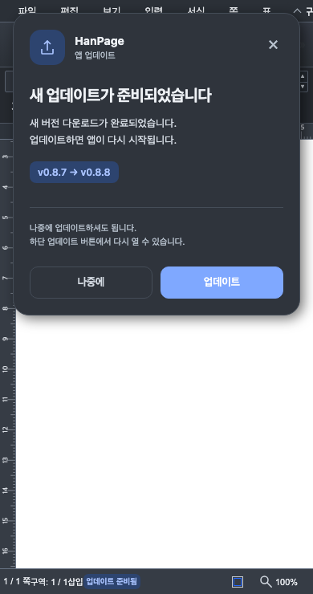

# Desktop 업데이트 안내 문구·줄바꿈 후속 검증

- 사용자 피드백: 재진입 문구를 `다시 열 수 있습니다.`로 끝내고, 문장 중간의 어색한 줄바꿈을 정리한다.
- 코드 SHA: `50f9de64ff1cbb929dbbd23214e5a4356871045d`.
- 기존 구현·Native 검증은 [업데이트 UI 개선 기록](desktop_update_ui_20261002.md)을 따른다. 이번 후속 변경은 안내 문구와 CSS 두 파일뿐이다.

## 변경 결과

하단 안내를 다음 두 문장으로 고정했다.

> 나중에 업데이트하셔도 됩니다. 
> 하단 업데이트 버튼에서 다시 열 수 있습니다.

본문도 짧은 문장으로 다듬고, 두 문장인 상태는 문장 끝에 명시적 개행을 넣었다. CSS는 `white-space: pre-line`, `word-break: keep-all`, `text-wrap: pretty`로 개행을 보존한다. 글자를 줄이거나 강제 nowrap으로 화면 밖에 밀어내지 않는다.

## 검증

| 검사 | 결과·범위 |
| --- | --- |
| 기존 Studio 검사 `npm test` | 1,834 PASS / 2 SKIP / 0 FAIL |
| `npm run build:desktop` | TypeScript·Vite PASS. 기존 큰 번들 크기 경고는 남아 있다. |
| 기존 실제 브라우저 검사 | 최종 code SHA에서 55 PASS / 0 FAIL, PNG 12장 재생성 |
| 직접 화면 판독 | Mac 밝은 카드·적용 중 카드·390px 다크 카드·Windows 안내에서 본문과 하단 문장은 각각 한 줄이며, 개행은 문장 끝에 있다. 제목·버튼·용량 줄 잘림 없음. |
| Native·Rust | 코드·테스트·정책 미변경. 기존 1399e077 기록을 참조하고 재실행하지 않았다. |
| 실제 Windows·설치·재시작 | 미실행. Windows 안내는 브라우저의 Tauri 플랫폼 대역으로 확인했다. |
| 조판 Visual Sweep | 엔진·문서 조판 미변경으로 비해당. 앱 UI를 새로 캡처해 직접 확인했다. |

새 테스트를 추가하지 않고 기존 검사를 재실행했다. 브라우저는 실제 Studio DOM·WASM·문서 입력·저장 경로를 사용하며 Tauri IPC와 업데이트 이벤트만 대역이다. 모든 테스트·브라우저·서버 프로세스는 종료했다.

- [최종 SHA·파일 hash·로그 hash](assets/desktop_update_ui_copy_20261002/validation.json)
- [55개 브라우저 검사](assets/desktop_update_ui_copy_20261002/browser-results.json)

로컬 변경과 검증을 완료했다. 새 push·PR·릴리스·앱 설치는 수행하지 않았으며, 새 UI는 이 변경을 포함한 앱 버전 설치 후 적용된다. 화면의 0.8.8은 검사에서 설정한 다음 버전 예시이며 실제 릴리스가 아니다. 이후 증적 커밋은 코드·테스트를 변경하지 않는다.

제출 전 원문·압축 실행 로그는 `local_validation.md`에 따라 ignored `output/pr-review/desktop088/logs/desktop_update_ui_copy_20261002/`에 바이트 동일 사본으로 보존하고 추적 asset에서 제외했다. 로그 SHA·실행 결과는 위 `validation.json`에 유지한다. PNG·브라우저 결과·상태 계약 증적은 추적 경로에 그대로 있다.
