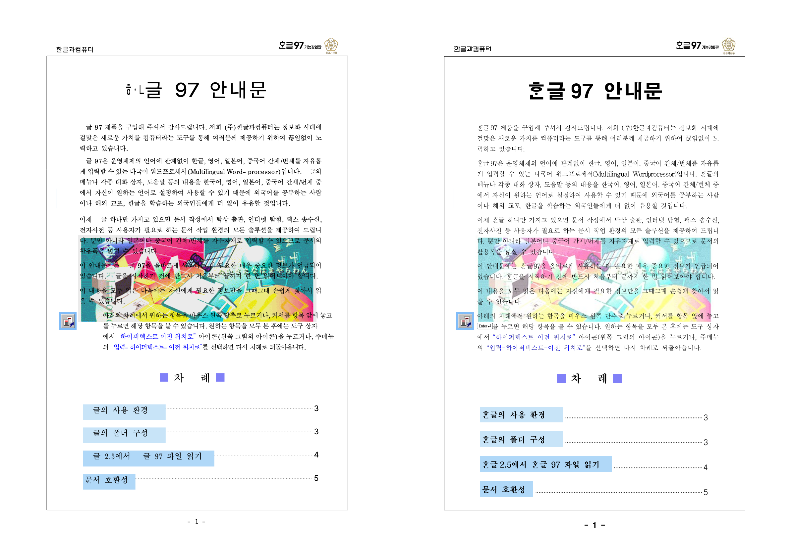
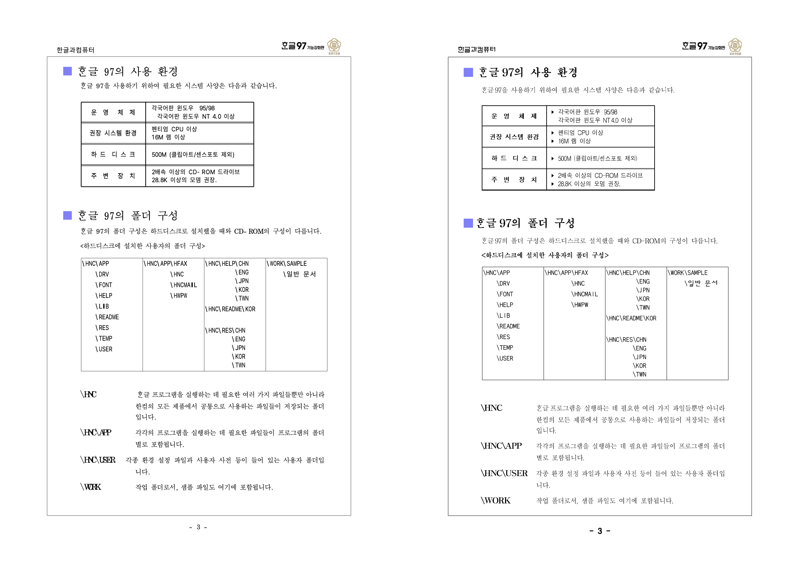
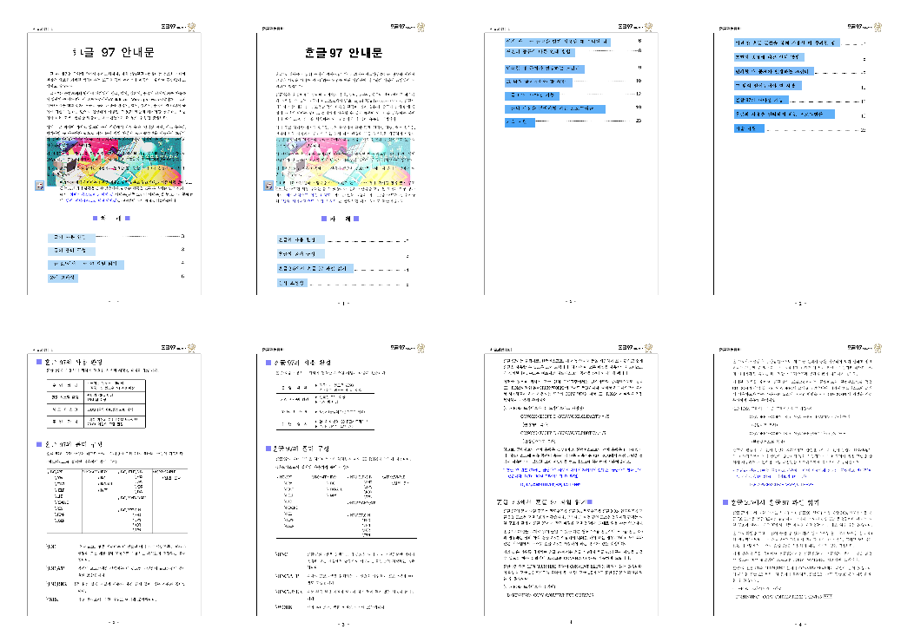
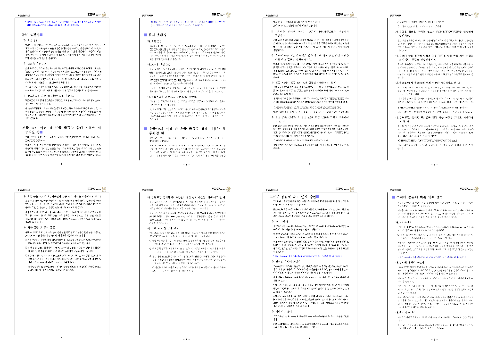
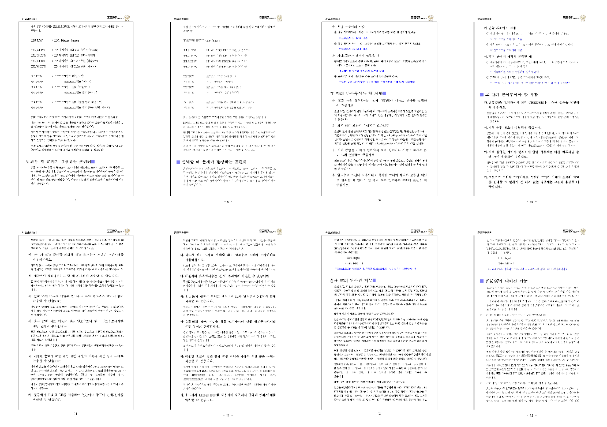
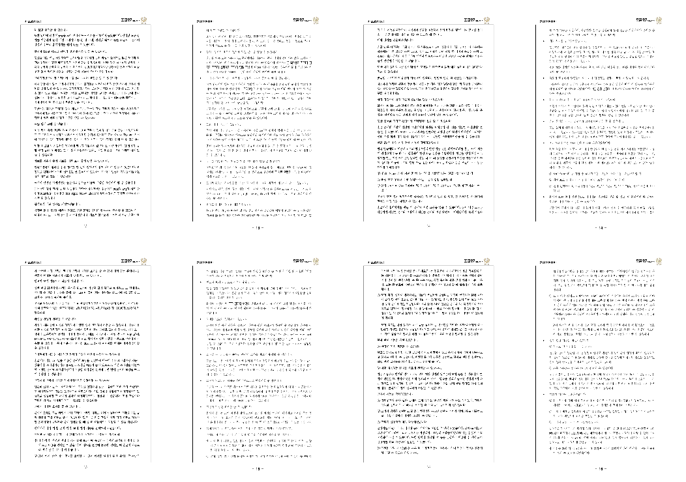
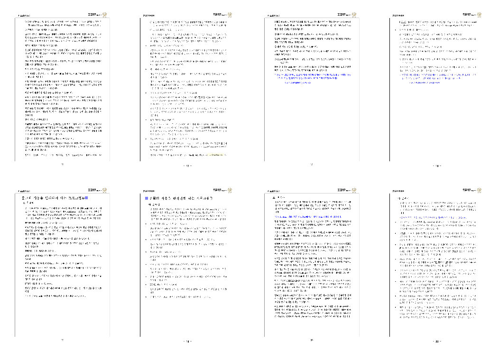
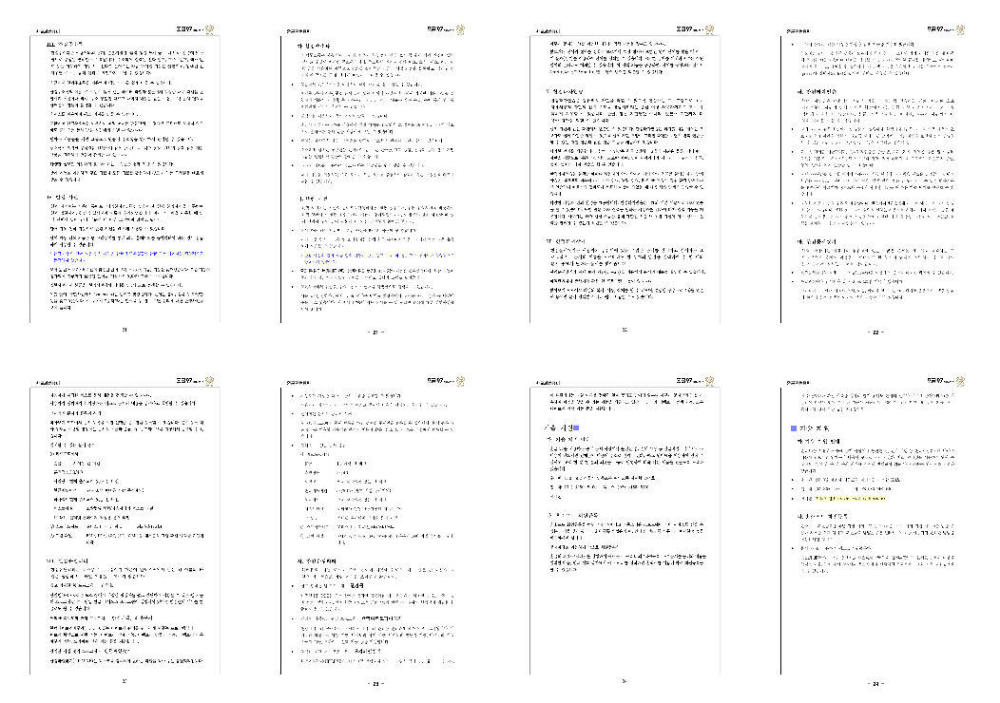
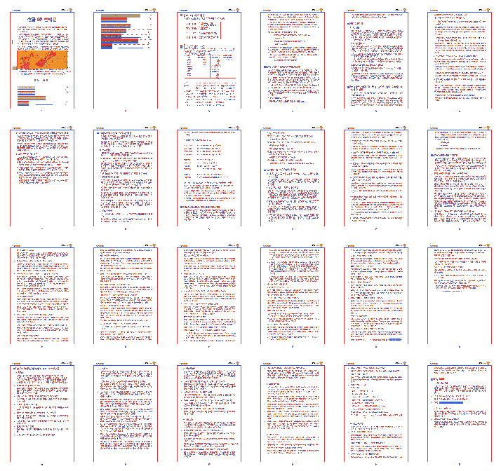

# Task #3486 Stage 10 — 실제 Studio Canvas 24쪽과 Hancom PDF의 1:1 대조

- 이슈: [#3486](https://github.com/edwardkim/rhwp/issues/3486)
- 브랜치: `task_m100_3486_hwp3_render_fidelity_v2`
- 선행 커밋: `e94194556` (Stage 9: 옛한글 CanvasKit shaping 확인)
- 입력: `samples/HWP3-password-123456.hwp` (24쪽)
- 오라클: `pdf/HWP3-password-123456.pdf` (24쪽)

## 왜 새 비교가 필요한가

Stage 8의 24쪽 sweep은 Rust SVG raster와 Hancom PDF를 대조했다. 이는 parser·공통 layout의 후보를
고르는 근거로 유효하지만, 사용자가 실제 Studio에서 확인한 HWP3 p3에는 표의 오른쪽 셀 내용이 검게
채워지는 차이가 있었다. 같은 p3의 Stage 8 SVG raster에는 그 검은 채움이 없었다.

따라서 **Rust SVG 대조 결과를 Studio Canvas의 1:1 대조 결과로 말하면 안 된다.** 이번 Stage는 암호
입력 UI를 거쳐 열린 동일 fixture에서 `renderPageToCanvas()`의 24쪽 raster를 추출하고, 동일 DPI의
기준 PDF raster와 페이지 번호별로 직접 비교한다. 이로써 다음을 분리한다.

1. SVG와 Studio Canvas에 공통인 parser/layout 차이
2. Studio Canvas만의 paint·font·WASM 전달 차이
3. PDF의 한컴 전용 글꼴 차이처럼 코드 보정의 근거가 아닌 차이

## 구현·보안 경계

- `rhwp-studio/e2e/hwp-password-open.test.mjs`의 검증된 암호 dialog 경로를 재사용한다. 비밀번호는
  기존 E2E와 같이 문자 코드에서만 조립하며, 명령 출력·파일명·보고서·asset 메타데이터에 쓰지 않는다.
- fixture를 `public/samples`에 복제하거나, 암호를 URL·환경 변수·브라우저 저장소에 넣지 않는다.
- Canvas PNG는 24쪽 전부를 임시 결과에 만들고, 대조 근거로는 page 번호가 보이는 전체 contact sheet와
  수정 대상 페이지의 before/after/OVL만 versioned asset으로 옮긴다.
- 현재 worktree의 renderer·parser 변경은 병행 작업이다. 이 Stage의 비교 하니스 외에는 그 변경을
  stage/commit/revert하지 않는다.

## 판정·다음 구현 경계

모든 페이지에 대해 canvas/PDF 크기·pixel ratio·ink mask를 기록한다. 자동 pixel ratio는 폰트 raster의
미세 차이를 포함하므로 수용 판정 자체가 아니다. 표 셀의 검은 채움, object geometry, page flow처럼
눈으로 구분되는 차이를 우선 표시한다.

- **Canvas p3의 검은 셀이 재현되고 PDF에는 없을 때만** HWP3 표 cell fill/clip/render-tree 경로를
  다음 코드 보정 대상으로 삼는다.
- **Canvas와 SVG가 둘 다 다를 때만** 공통 parser/layout 원인을 조사한다.
- **glyph 외관만 다르고 geometry가 맞을 때는** Stage 9의 글꼴 한계로 분류하며 전역 문자 치환을
  도입하지 않는다.

이 문서는 분석 시작 기록이다. 문서만 독립 commit하지 않는다. 비교 하니스, 실행 결과, 실제 Studio/PDF
시각 evidence와 그 결과로 확정된 코드 보정만 하나의 후속 commit에 포함한다.

## 실제 Studio Canvas 전수 결과 (보정 전)

암호 입력 dialog를 거쳐 문서를 열고, Studio가 사용하는 WASM의 `renderPageToCanvas(page, canvas, 1.5)`를
각 페이지에 직접 호출했다. Studio의 96dpi 논리 좌표에서 `1.5`는 PDF raster의 144dpi와 같은 bitmap
밀도다. PDF는 `pdftoppm -r 144`로 raster했다. 암호 문자열·토큰·환경 변수는 결과물에 기록하지 않았다.

| 항목 | 결과 |
| --- | --- |
| 대상 | HWP3 암호 fixture 24쪽 ↔ Hancom PDF 24쪽 |
| Studio Canvas 크기 | 모든 페이지 1190 × 1683 px |
| PDF raster 크기 | 모든 페이지 1191 × 1684 px |
| pixel-match 평균 / 최저 | 92.12836% / 87.61680% (p1) |
| ink-mask match 평균 / 최저 | 12.49293% / 8.19085% (p10) |
| 눈으로 확인한 p3 표 | 과거 화면의 검은 셀은 **현재 Studio에서 재현되지 않음**; 셀 내용은 표시되고 PDF와의 주된 차이는 글꼴·행간·문자 기호·표 geometry |

pixel/ink 비율은 서로 다른 한컴 원본 글꼴 raster까지 포함하는 진단값일 뿐 수용 점수가 아니다. 전수
contact sheet와 각 페이지의 좌우 비교·red/blue/orange overlay는 로컬 `tmp/task3486/stage10/`에 남겼고,
후속 검증이 끝나면 versioned 시각 evidence를 같은 commit에 옮긴다.

### 공통 1px 절단의 원인과 범위 제한 보정

`pdfinfo`의 기준 PDF는 A4 `595.32 × 841.92 pt`다. CSS 96dpi 좌표로 환산한 A4가
`793.700787 × 1122.519685`이고, 1.5x에서 `1190.551181 × 1683.779528`이 된다. 따라서 144dpi bitmap은
각 물리 경계를 포함하려면 `1191 × 1684`여야 한다.

그런데 `src/wasm_api.rs`의 `scaled_canvas_extent()`는 실수값을 `as u32`로 변환해 절사했다. 이 함수는
기본 `renderPageToCanvas`, 다층 `renderPageToCanvasFilteredWithProfile`, legacy Canvas의 세 경로가
공유하므로 같은 1px 절단이 24쪽 모두에 나타난다. 이 Stage의 보정은 bitmap extent만 `ceil`로 올려
PDF와 같은 물리 페이지 경계를 보존한다. draw scale·layout 좌표·문자 치환은 바꾸지 않는다.

이는 우·하단 clip 경계를 고치는 한정된 수정이다. 글꼴, 실제 HWP3 PUA/pictogram, 줄 폭·행간, 표 내용
geometry, watermark 차이를 "1:1 완료"로 가장하지 않는다. 보정 뒤 Rust 단위 검사와 실제 암호 HWP3
Studio E2E를 다시 실행하고, 같은 24쪽 PDF 대조를 재생성한다.

## 보정 후 전수 재검증

`scaled_canvas_extent()`를 절사 대신 `ceil`로 변경했다. 기본·다층·legacy Canvas API 모두 이 helper를
사용하므로 실제 bitmap 경계가 같은 규칙을 따른다. 레이아웃 좌표나 paint scale은 변경하지 않았다.

| 검증 | 결과 |
| --- | --- |
| `cargo test --profile release-test --lib wasm_api::tests::test_scaled_canvas_extent_keeps_fractional_a4_edge` | 통과 (A4 1.5x = 1191 × 1684, 최대 canvas clamp 포함) |
| `wasm-pack build --target web --out-dir pkg` | 통과 |
| `npm run e2e:hwp-password-open` | 통과 (HWP3/HWP5 암호 dialog·오답·취소·저장소 비보존 + HWP3 A4 Canvas extent) |
| Studio Canvas 24쪽 ↔ PDF 24쪽, 144dpi | **24/24 같은 1191 × 1684 px** |

동일 크기 bitmap에서 재계산한 진단값은 pixel match 평균 `91.86688%` (최저 `86.14261%`, p1), ink-mask
overlap 평균 `23.70099%` (최저 `10.66502%`, p10)다. 이는 글꼴 raster와 원본 고유 glyph도 포함하는
차이 지표이며 수용 기준 자체는 아니다. 중요한 판정은 다음과 같다.

- p1: Studio(왼쪽)는 제목의 옛한글 glyph와 본문·image 조판이 PDF(오른쪽)와 다르다. 1px clip 보정으로
  이를 해결했다고 볼 수 없다.
- p3: 과거에 보였던 오른쪽 표 셀의 검은 채움은 재현되지 않았다. 현재 남은 차이는 표 bullet, 글꼴,
  표 폭·문자 spacing이다.
- p1–p24: bitmap 물리 경계는 모두 정합했지만, HWP3 원본 글꼴·PUA/pictogram·표/문단 조판의 실제
  fidelity 보정은 다음 Stage에서 개별 원인으로 계속 다뤄야 한다.

### 실제 전수 비교 증적

각 이미지의 **왼쪽은 암호 dialog를 거쳐 연 Studio Canvas**, 오른쪽은 같은 페이지의 Hancom PDF다.
아래 p1/p3는 원본 해상도 쌍이며, 이어지는 6개 이미지는 p1–p24를 네 쪽씩 실제로 보이는 형태로
묶은 것이다. 따라서 링크만 남기지 않고 모든 페이지의 비교 결과를 이 문서에서 확인할 수 있다.

아래는 24쪽 전체의 overlay다. red=Studio 전용 ink, blue=PDF 전용 ink, orange=양쪽 ink이나 색/위치가
다른 영역이다. 숫자만으로 품질을 선언하지 않고, 위 좌우 쌍과 함께 판정한다.

