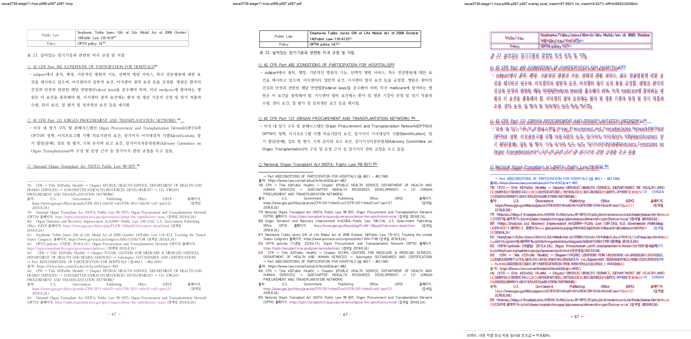

# Task #3738 Stage 11 — HWP p66–p67 footnote reservation visual sweep

## 기준·실행·증적

원본 HWP/HWPX와 한컴오피스 2020 기준 PDF의 보관 위치와 SHA-256은
[증적 보관 목록](../../pdf/pr3740/README.md)에 고정돼 있다. 이 Stage의 PNG 여섯 장은
`git check-attr filter`로 `unspecified`(비-LFS)임을 확인한 뒤 저장했다.

```bash
CARGO_TARGET_DIR=target/review-planet6897-20260802 CARGO_INCREMENTAL=0 \
  cargo test --profile release-test \
  --test issue_3738_rowbreak_table_footnote_fragment \
  --test issue_3738_hwp_caption_cell_alignment

CARGO_TARGET_DIR=target/review-planet6897-20260802 CARGO_INCREMENTAL=0 \
  cargo build --profile release-test --bin rhwp

python3 scripts/task1274_visual_sweep.py \
  --key issue3738-stage11-hwp-p066-p067 \
  --hwp 'samples/정책연구용역사업 중간진도보고서(살아있는 간장 기증자의 의학적 선별기준 연구).hwp' \
  --pdf 'pdf/pr3740/hwp/정책연구용역사업 중간진도보고서(살아있는 간장 기증자의 의학적 선별기준 연구)-2020.pdf' \
  --pages 66-67 --dpi 144 \
  --rhwp-bin target/review-planet6897-20260802/release-test/rhwp
```

focused test 두 건은 모두 1 passed했고, sweep은 SVG/render tree 224쪽과 선택 raster p66–p67
2/2를 완료했다. 최종 임시 산출물은
`/private/tmp/rhwp-stage11-visual.PrX6u4/issue3738-stage11-hwp-p066-p067`이다.

## 페이지별 대조

| 페이지 | PNG 증적 | 자동 지표 | 사람 검토 판정 |
| --- | --- | --- | --- |
| 66 | [compare](../pr/assets/pr_3740_issue3738_stage11/hwp_p066_compare.png) · [overlay](../pr/assets/pr_3740_issue3738_stage11/hwp_p066_overlay.png) · [review](../pr/assets/pr_3740_issue3738_stage11/hwp_p066_review.png) | pixel 90.70707%, ink proxy 8.86853%, structural 후보 없음 | 표 23 0–4행 및 각주 76·77은 Stage 9과 같은 p66에 남는다. renderer-only reservation 보정으로 fragment ownership은 변하지 않았다. |
| 67 | [compare](../pr/assets/pr_3740_issue3738_stage11/hwp_p067_compare.png) · [overlay](../pr/assets/pr_3740_issue3738_stage11/hwp_p067_overlay.png) · [review](../pr/assets/pr_3740_issue3738_stage11/hwp_p067_review.png) | pixel 87.59241%, ink proxy 6.62704%, structural 후보 없음 | 각주 78–85는 기준 PDF처럼 p67에 유지된다. `FootnoteArea y=600.6, h=438.7px`과 actual bottom `1039.3px`이 footer top과 일치해 Stage 9의 35px frame-overflow 후보가 사라졌다. |



pixel/ink proxy는 글꼴 raster 차이를 포함한 보조값이다. p67 완료 판정은 footer collision의 render-tree
경계, 기준 PDF의 각주 78–85 페이지 ownership, focused regression을 함께 사용한다. 전체 HWP/HWPX
224쪽과 PDF 215쪽의 9쪽 차이는 해결됐다고 표현하지 않으며 다음 Stage에서 조사한다.
