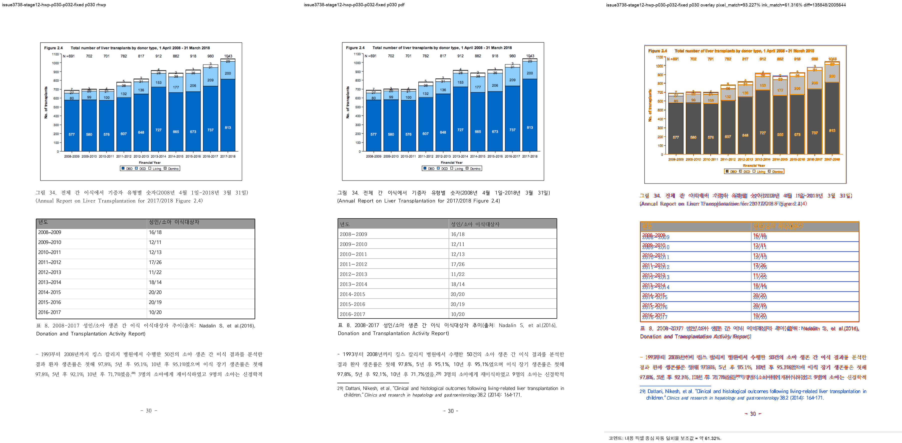
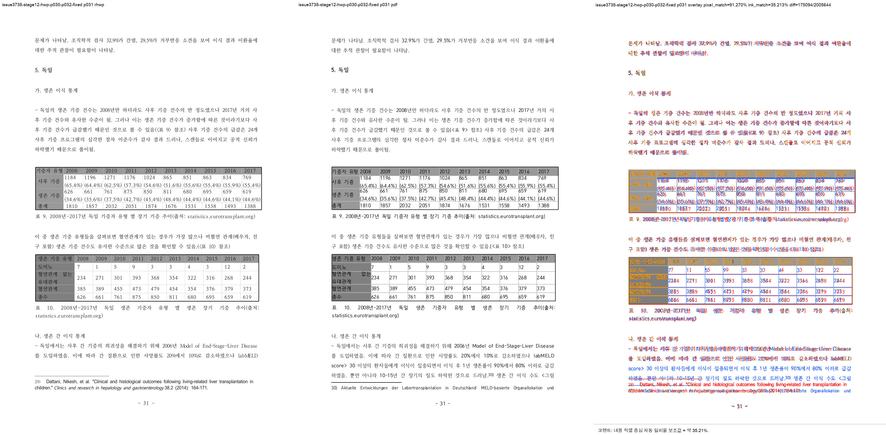
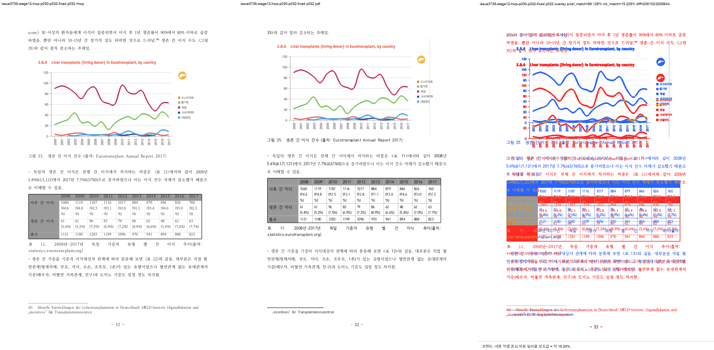

# Task #3738 Stage 12 — HWP p30–p32 각주 reset visual sweep

## 기준·실행·증적

원본 HWP/HWPX와 한컴오피스 2020 기준 PDF의 보관 위치와 SHA-256은
[증적 보관 목록](../../pdf/pr3740/README.md)에 고정돼 있다. 이 Stage의 PNG 아홉 장은
`git check-attr filter`로 모두 `unspecified`(비-LFS)임을 먼저 확인한 뒤 저장했다.

```bash
CARGO_TARGET_DIR=target/review-planet6897-20260802 CARGO_INCREMENTAL=0 \
  cargo test --profile release-test \
  --test issue_3738_rowbreak_table_footnote_fragment \
  --test issue_3738_hwp_caption_cell_alignment

CARGO_TARGET_DIR=target/review-planet6897-20260802 CARGO_INCREMENTAL=0 \
  cargo build --profile release-test --bin rhwp

python3 scripts/task1274_visual_sweep.py \
  --key issue3738-stage12-hwp-p030-p032-fixed \
  --hwp 'samples/정책연구용역사업 중간진도보고서(살아있는 간장 기증자의 의학적 선별기준 연구).hwp' \
  --pdf 'pdf/pr3740/hwp/정책연구용역사업 중간진도보고서(살아있는 간장 기증자의 의학적 선별기준 연구)-2020.pdf' \
  --pages 30-32 --dpi 144 \
  --rhwp-bin target/review-planet6897-20260802/release-test/rhwp
```

focused test는 3 passed했고, sweep은 SVG/render tree 224쪽과 선택 raster 3/3을 완료했다. 최종
임시 산출물은
`/private/tmp/rhwp-stage12-p030-p032-fixed.sGjJ4s/issue3738-stage12-hwp-p030-p032-fixed`이다.

## 페이지별 대조

| 페이지 | PNG 증적 | 자동 지표 | 사람 검토 판정 |
| --- | --- | --- | --- |
| 30 | [compare](../pr/assets/pr_3740_issue3738_stage12/hwp_p030_compare.png) · [overlay](../pr/assets/pr_3740_issue3738_stage12/hwp_p030_overlay.png) · [review](../pr/assets/pr_3740_issue3738_stage12/hwp_p030_review.png) | structural 후보 없음 | 각주 29 위 본문은 `10년 후 71.7%`까지로 끝난다. 기존의 두 tail line과 각주 영역 겹침은 없다. |
| 31 | [compare](../pr/assets/pr_3740_issue3738_stage12/hwp_p031_compare.png) · [overlay](../pr/assets/pr_3740_issue3738_stage12/hwp_p031_overlay.png) · [review](../pr/assets/pr_3740_issue3738_stage12/hwp_p031_review.png) | structural 후보 없음 | p30 tail `문제가 나타남` 뒤 `5. 독일` 절이 같은 physical page에서 시작해 PDF의 순서와 일치한다. |
| 32 | [compare](../pr/assets/pr_3740_issue3738_stage12/hwp_p032_compare.png) · [overlay](../pr/assets/pr_3740_issue3738_stage12/hwp_p032_overlay.png) · [review](../pr/assets/pr_3740_issue3738_stage12/hwp_p032_review.png) | structural 후보 없음 | 독일 절 tail `35>와 같이 점차 감소하는 추세임` 뒤에 그림 35가 남는다. p30의 각주 경계가 이후 그림 소유권을 밀지 않는다. |







세 페이지 overlay의 pixel match 평균은 90.87502%, ink proxy 평균은 37.25284%다. 이 proxy는 글꼴과
차트 raster 차이도 포함하므로, 완료 판정은 p30 각주 충돌 제거, p31–p32 본문·그림 page ownership,
render-tree 경계 및 focused regression을 함께 사용한다. p68의 그림 49 table near-fit 이월은 별도
잔여이며 Stage 13에서 다룬다.
