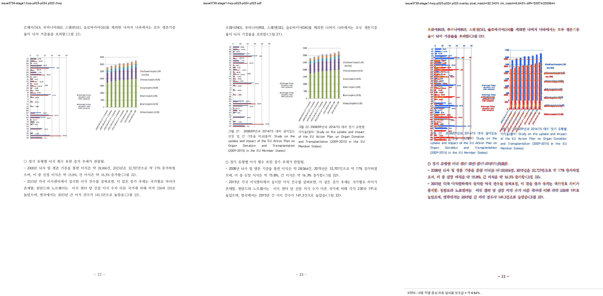
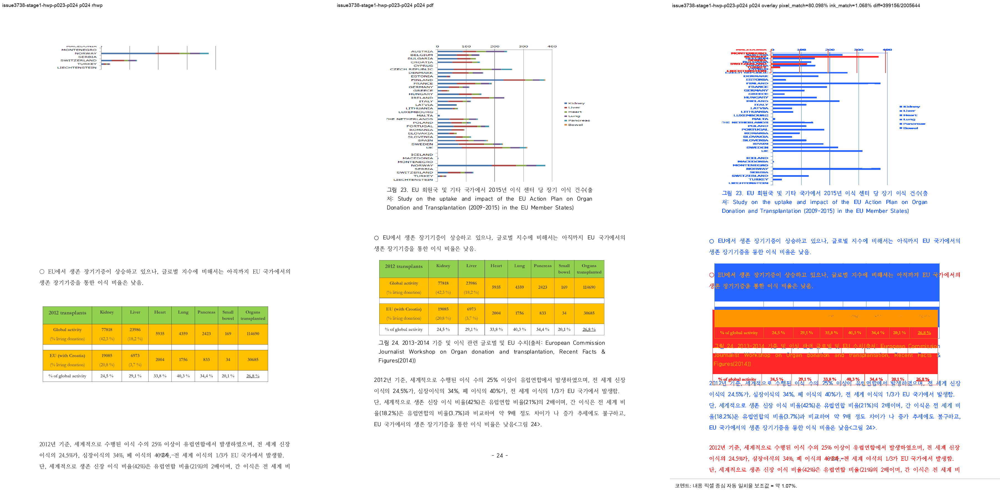

# Task #3738 Stage 1 — 그림 23 p23–p24 visual sweep

## 기준과 실행

한컴 2020 MCP가 같은 개인정보 제거 문서의 HWP와 HWPX에서 각각 만든 215쪽 PDF를 기준으로
사용했다. rhwp는 현재 작업 source를 `release-test` profile로 빌드한 전용 binary로 실행했다.
두 sweep 모두 144 DPI, 선택 범위 p23–p24이며 `run_state=complete`, 선택 SVG/PDF 페이지는 2/2다.

```bash
python3 scripts/visual_sweep.py \
  --key issue3738-stage1-hwp-p023-p024 \
  --hwp 'samples/정책연구용역사업 중간진도보고서(살아있는 간장 기증자의 의학적 선별기준 연구).hwp' \
  --pdf 'pdf/pr3740/hwp/정책연구용역사업 중간진도보고서(살아있는 간장 기증자의 의학적 선별기준 연구)-2020.pdf' \
  --pages 23-24 --dpi 144 \
  --rhwp-bin target/review-planet6897-20260802/release-test/rhwp \
  --out /private/tmp/rhwp-issue-3738-stage1-hwp-c9gZuz
```

HWPX 실행은 같은 명령에서 입력과 기준 PDF만 `.hwpx`, `pdf/pr3740/hwpx/…-2020.pdf`로 바꿨다.
전수 215쪽 완료를 주장하는 실행이 아니라, 그림 23의 페이지 소유권을 재현·판정한 선택 sweep이다.

## 페이지별 증적과 판정

| 입력 | 페이지 | 비교·overlay·review | visual accuracy proxy | 자동 후보 | 사람 판정 |
| --- | ---: | --- | ---: | --- | --- |
| HWP | 23 | [compare](/private/tmp/rhwp-issue-3738-stage1-hwp-c9gZuz/issue3738-stage1-hwp-p023-p024/compare/compare_023.png) · [overlay](/private/tmp/rhwp-issue-3738-stage1-hwp-c9gZuz/issue3738-stage1-hwp-p023-p024/overlay/overlay_023.png) · [review](../pr/assets/pr_3740_issue3738_stage1/hwp_p023_review.png) | 6.64308% | 없음 | 그림 23이 p23에서 사라져 PDF의 페이지 소유권과 맞음 |
| HWP | 24 | [compare](/private/tmp/rhwp-issue-3738-stage1-hwp-c9gZuz/issue3738-stage1-hwp-p023-p024/compare/compare_024.png) · [overlay](/private/tmp/rhwp-issue-3738-stage1-hwp-c9gZuz/issue3738-stage1-hwp-p023-p024/overlay/overlay_024.png) · [review](../pr/assets/pr_3740_issue3738_stage1/hwp_p024_review.png) | 1.06800% | `frame_overflow_pixels`, `question_marker_flow_drift` | **미해결** — 그림 23이 p24 상단에서 잘리고 본문·표 4가 PDF 위치와 다름 |
| HWPX | 23 | [compare](/private/tmp/rhwp-issue-3738-stage1-hwpx-jXIxo1/issue3738-stage1-hwpx-p023-p024/compare/compare_023.png) · [overlay](/private/tmp/rhwp-issue-3738-stage1-hwpx-jXIxo1/issue3738-stage1-hwpx-p023-p024/overlay/overlay_023.png) · [review](../pr/assets/pr_3740_issue3738_stage1/hwpx_p023_review.png) | 3.65547% | 없음 | HWP와 별개로 그림 21·22 이후 흐름 차이가 남음 |
| HWPX | 24 | [compare](/private/tmp/rhwp-issue-3738-stage1-hwpx-jXIxo1/issue3738-stage1-hwpx-p023-p024/compare/compare_024.png) · [overlay](/private/tmp/rhwp-issue-3738-stage1-hwpx-jXIxo1/issue3738-stage1-hwpx-p023-p024/overlay/overlay_024.png) · [review](../pr/assets/pr_3740_issue3738_stage1/hwpx_p024_review.png) | 2.03139% | `question_marker_flow_drift` | **미해결** — 그림 23과 p24 본문·표 4의 page-local 배치가 기준과 다름 |



page 23

- compare: `/private/tmp/rhwp-issue-3738-stage1-hwp-c9gZuz/issue3738-stage1-hwp-p023-p024/compare/compare_023.png`
- overlay: `/private/tmp/rhwp-issue-3738-stage1-hwp-c9gZuz/issue3738-stage1-hwp-p023-p024/overlay/overlay_023.png`
- review: `mydocs/pr/assets/pr_3740_issue3738_stage1/hwp_p023_review.png`
- visual_accuracy_proxy_percent: 6.64308

코멘트: 내용 픽셀 중심 자동 일치율 보조값 = 약 6.64%.
높을수록 좋음: 기준 PDF와 rhwp PNG가 더 비슷함
낮을수록 나쁨/검토 필요: 잉크 위치나 형태 차이가 큼
단, 사람 판정 정확도가 아니라 내용 픽셀 중심 자동 일치율 보조값입니다.



page 24

- compare: `/private/tmp/rhwp-issue-3738-stage1-hwp-c9gZuz/issue3738-stage1-hwp-p023-p024/compare/compare_024.png`
- overlay: `/private/tmp/rhwp-issue-3738-stage1-hwp-c9gZuz/issue3738-stage1-hwp-p023-p024/overlay/overlay_024.png`
- review: `mydocs/pr/assets/pr_3740_issue3738_stage1/hwp_p024_review.png`
- visual_accuracy_proxy_percent: 1.06800

코멘트: 내용 픽셀 중심 자동 일치율 보조값 = 약 1.07%.
높을수록 좋음: 기준 PDF와 rhwp PNG가 더 비슷함
낮을수록 나쁨/검토 필요: 잉크 위치나 형태 차이가 큼
단, 사람 판정 정확도가 아니라 내용 픽셀 중심 자동 일치율 보조값입니다.

## 해석

이번 보정은 HWP p23의 잘못된 조기 그림 배치를 해소했지만, p24의 그림 내부 상대좌표가 새
페이지의 body origin으로 다시 계산되지 않아 그림 일부가 상단으로 잘렸다. HWPX는 native HWP5
전용 조건의 적용 대상이 아니므로 이 보정으로 합격시키지 않았으며, 독립적인 page-local 그림
anchor 문제로 남겼다.

pixel/ink proxy는 글꼴 raster와 그림 anti-aliasing 차이를 포함하는 보조값이다. 다만 이 회차는
p24의 `frame_overflow`와 review 이미지의 실제 잘림이 함께 확인됐으므로, 낮은 수치가 단순
false positive가 아니라 미해결 결함을 뒷받침한다.
