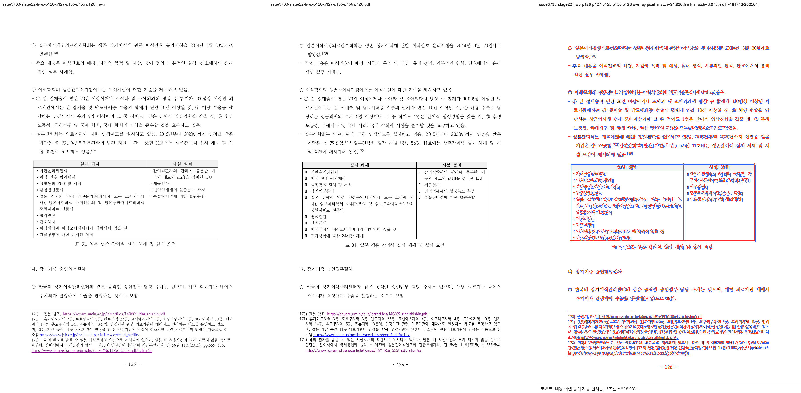
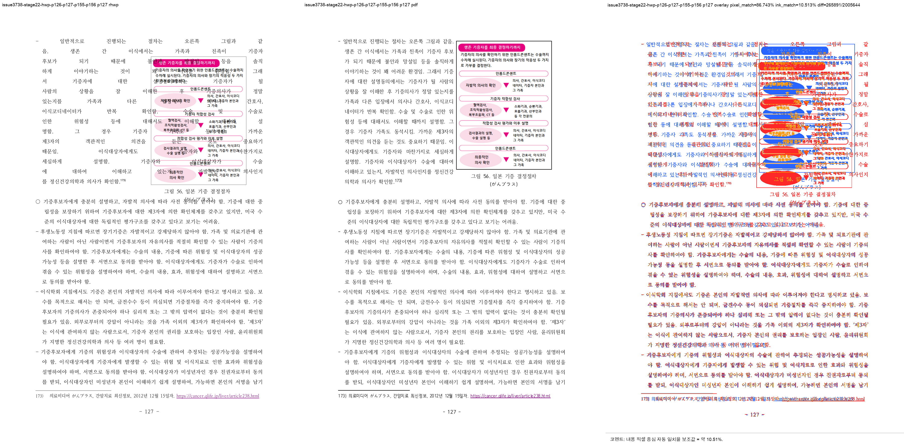
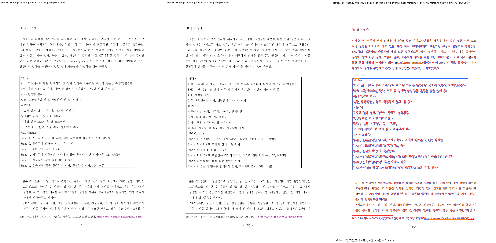
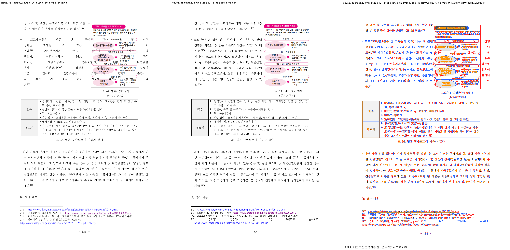

# Task #3738 Stage 22 visual sweep — Square 그림 56·64 next-page owner 복원

## 범위와 독립 기준

- HWP: `samples/정책연구용역사업 중간진도보고서(살아있는 간장 기증자의 의학적 선별기준 연구).hwp`
- 동일 개인정보 제거 HWPX: `samples/정책연구용역사업 중간진도보고서(살아있는 간장 기증자의 의학적 선별기준 연구).hwpx`
- 한컴 2020 기준 PDF: `pdf/pr3740/hwp/정책연구용역사업 중간진도보고서(살아있는 간장 기증자의 의학적 선별기준 연구)-2020.pdf`
- 구현 revision: `a5612fd2534dbe5ccf4b85e330769213ce30f93c`

HWP가 렌더 입력이고 한컴 PDF가 독립적인 physical-layout 기준이다. HWPX와 PDF는 복사본을 새로 만들지
않고 위 canonical 저장소 경로에 보관한다. 이 Stage는 그림 56의 p126→p127, 그림 64의 p155→p156
owner 이동만 판정하며, 215쪽 전체의 완료를 주장하지 않는다.

```bash
python3 scripts/task1274_visual_sweep.py \
  --key issue3738-stage22-hwp-p126-p127-p155-p156 \
  --hwp 'samples/정책연구용역사업 중간진도보고서(살아있는 간장 기증자의 의학적 선별기준 연구).hwp' \
  --pdf 'pdf/pr3740/hwp/정책연구용역사업 중간진도보고서(살아있는 간장 기증자의 의학적 선별기준 연구)-2020.pdf' \
  --pages 126,127,155,156 --dpi 144 \
  --rhwp-bin target/review-planet6897-20260802/release-test/rhwp \
  --out /private/tmp/rhwp-stage22-evidence-sweep.4VvVcr
```

`run_state=complete`, `requested_pages=completed_pages=[126,127,155,156]`, `missing_pages=[]`다. 같은 실행은
native HWP의 SVG와 render tree를 각각 219쪽 전체로 export하고, 요청한 네 쪽의 rhwp/PDF raster,
compare, overlay, review를 모두 산출했다.

## 직접 판정

| HWP 쪽 | 기준 PDF와 대조한 target | 판정 |
| --- | --- | --- |
| 126 | 그림 56 (`pi=1355/ci=0`)와 bottom caption이 anchor·각주 쪽으로 새지 않아야 한다. | 그림·caption 모두 없음, 본문과 각주가 가려지지 않음 — **일치** |
| 127 | 그림 56과 caption이 우측 owner에 있고 좁은 본문 wrap이 뒤따라야 한다. | 그림·caption·narrow text의 physical owner가 기준 PDF와 같음 — **일치** |
| 155 | 그림 64 (`pi=1692/ci=1`)가 표·본문·각주 211을 덮지 않아야 한다. | 그림·caption 모두 없음, 표/본문/각주 211이 가려지지 않음 — **일치** |
| 156 | 그림 64와 caption이 우상단 owner에 있고 p1693 continuation·뒤 표가 이어져야 한다. | 그림·caption·continuation·뒤 표의 순서가 기준 PDF와 같음 — **일치** |









## 자동 후보와 판정 한계

구조 탐지는 p126·p155·p156에서 flag 0건, p127에서 `question_marker_flow_drift` 1건을 냈다. 네 쪽 모두
frame overflow, line-order overlap, render-tree frame-tail overflow 후보는 0건이다. p127 후보는 분홍
workflow diagram의 색·glyph/raster 차이를 question-marker 휴리스틱이 잡은 것이며, 위 direct review에서
그림 56이 기준과 같은 p127에 있고 p126 각주로의 누출·겹침이 없음을 확인했으므로 이 Stage의 owner 결함은
아니다. 후보를 무시한 자동 통과로 바꾸지 않고 `flagged_pages.json`에 그대로 보관한다.

overlay pixel match는 p126 91.93561%, p127 86.74286%, p155 93.15357%, p156 90.83302%다. 로컬/Hancom
font raster와 이미지 raster 차이를 포함하므로 이 수치는 전체 fidelity의 pass/fail가 아니라 다시 그림이
anchor page로 되돌아가지 않았는지 확인하는 보조 지표다. 최종 판정은 위 physical owner의 직접 대조다.

## focused 회귀

```text
CARGO_TARGET_DIR=target/review-planet6897-20260802 CARGO_INCREMENTAL=0 \
  cargo test --profile release-test --test issue_3738_rowbreak_table_footnote_fragment
```

13/13 통과했다. 새 회귀 둘은 p126→p127 그림 56과 p155→p156 그림 64의 image/caption owner를 직접
고정하고, 기존 Stage 9–21 회귀 11개도 함께 통과한다. 사용자가 이미 수행한 WASM 빌드는 재실행하지 않았다.

## 장기 증적·provenance

LFS 속성은 asset을 복사하기 전에 확인했고 `filter/diff/merge=unspecified`이며 `git lfs track`에도 일치
패턴이 없었다. 따라서 아래 증적은 일반 Git 파일로 보관한다.

- [run manifest](../pr/assets/pr_3740_issue3738_stage22/run_manifest.json), [구조 지표](../pr/assets/pr_3740_issue3738_stage22/metrics.json), [자동 후보](../pr/assets/pr_3740_issue3738_stage22/flagged_pages.json), [overlay 지표](../pr/assets/pr_3740_issue3738_stage22/overlay_metrics.json), [contact sheet](../pr/assets/pr_3740_issue3738_stage22/review_contact_sheet.png)
- HWP SHA-256: `50094a3db2b2003b293c5cbf43014d001aa97929acb488cef0cb7ea0e16b3113`
- HWPX SHA-256: `8ae9dc95643d0902fcced2af73badd732aea86c1cc5b875ef7b1272bccba862c`
- PDF SHA-256: `7879ffee6313575132187c44c0090cd2e62c32c12c29b7eabd989181acf27b3a`
- review PNG SHA-256: p126 `1444eacf0f73ce3f13b7327ad3730b75ea5d63391ec52b9f9cb9d639fd4975aa`, p127 `7a5f92a4e213b6a11100cbdb8a21abe99a7c6804de641f2f133e5ce636bd1a8d`, p155 `9742cd775241959782c152f43efe9c4b00e61aa18c4d008c7023f5b6fa807f97`, p156 `a3604f8a6fa178c42178532625c05f4c63047dc95a903a33f7ee8b536a20c25c`
- run manifest SHA-256: `a1298733da0829a46cbc00b28e097a4888d3256720adeddeab072570c8125d4c`
- sweep script SHA-256: `a01638b3bac0640cddf4772a4a4626d46de4fe95626f4cfaf5f7fe3ef415ee89`
- rhwp binary SHA-256: `4785868b299f8a8fb9a0ce898b1f6fbc6c3f40e149548514a681170d381148b7`

## 이월

Stage 22의 두 Square 그림 owner 결함은 해소했다. p43의 본문/각주 겹침을 우선으로, p44–45, p52–53,
p66–67, p83–85, p90, p94, p106, p107–108 및 215↔219 전체 page-map 차이는 별도 source contract로
재현한 뒤 다음 Stage에서 처리한다.
