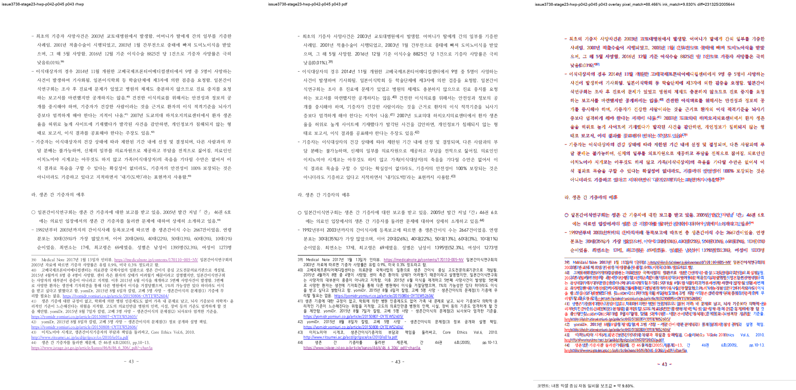
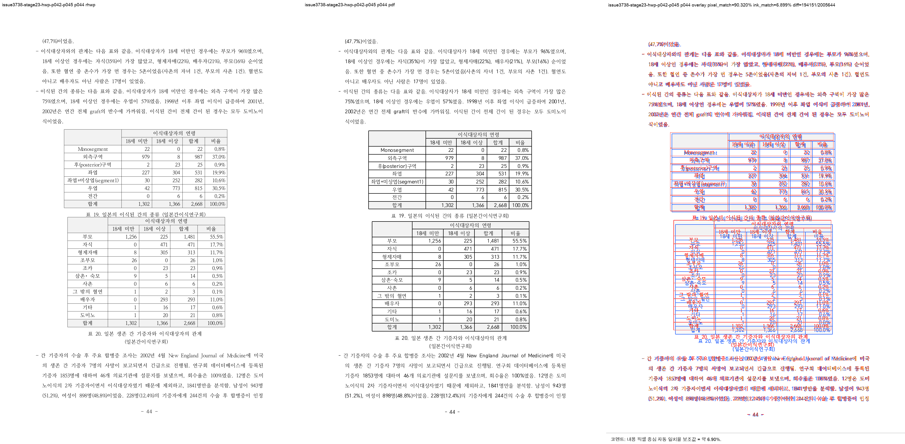

# Task #3738 Stage 23 visual sweep — HWP p43 기존 각주 reset tail

## 범위와 독립 기준

- HWP: `samples/정책연구용역사업 중간진도보고서(살아있는 간장 기증자의 의학적 선별기준 연구).hwp`
- 같은 개인정보 제거 HWPX: `samples/정책연구용역사업 중간진도보고서(살아있는 간장 기증자의 의학적 선별기준 연구).hwpx`
- 한컴 2020 기준 PDF: `pdf/pr3740/hwp/정책연구용역사업 중간진도보고서(살아있는 간장 기증자의 의학적 선별기준 연구)-2020.pdf`
- code revision: `659e1efca6453ce8510f679da1e2b4ace7362f6f`
- native binary SHA-256: `402d607d0690f4407bd8feb8e07eedcafd73ef33ee164abc418d7d86198e56ef`

HWP는 renderer 입력이고 한컴 PDF는 physical-layout 정답지다. HWP/HWPX/PDF는 중복 복사하지 않고 위
canonical 경로에 보관한다. p43의 본문·각주 collision만 완료로 판정하며, native HWP 219쪽과 PDF 215쪽의
전체 page-map 또는 p44–45의 표 흐름은 완료로 주장하지 않는다.

```bash
python3 scripts/visual_sweep.py \
  --key issue3738-stage23-hwp-p042-p045 \
  --hwp 'samples/정책연구용역사업 중간진도보고서(살아있는 간장 기증자의 의학적 선별기준 연구).hwp' \
  --pdf 'pdf/pr3740/hwp/정책연구용역사업 중간진도보고서(살아있는 간장 기증자의 의학적 선별기준 연구)-2020.pdf' \
  --pages 42-45 --dpi 144 \
  --rhwp-bin target/review-p127-audit/release-test/rhwp \
  --out /private/tmp/rhwp-stage23-p43-sweep-20260802
```

`run_state=complete`, `requested_pages=completed_pages=[42,43,44,45]`, `missing_pages=[]`다. native SVG와
render tree는 219쪽 전체로 export했고 HWP/PDF raster·overlay·3-way review만 선택한 네 쪽에 만들었다.

## p43 판정

| HWP 쪽 | 한컴 PDF와 대조한 계약 | 결과 |
| --- | --- | --- |
| 43 | `pi=512`의 1–3줄은 각주 separator 위에 남고 reset tail `(47.7%)이었음.`만 p44로 간다. 각주 39–44는 p43에 남는다. | **일치** — p43 line-band `45/45`, p90 drift `1.5px`, max `2.5px`, 자동 flag 없음 |
| 44 | p43에서 이월된 reset tail이 p44 첫 본문으로 시작한다. | **p43 contract 일치** — tail은 p44로 이동. 다만 표 19·20 및 p44–45 flow 결함은 아래 잔여 항목이다. |



focused regression은 p43의 `pi=512` body bottom이 footnote separator를 넘지 않는 것, 39–44가 p43에 남는 것,
그리고 reset tail이 p44에 있는 것을 render tree/text로 함께 단언한다. 정확한 실행은 다음과 같고 14/14를
통과했다.

```text
CARGO_TARGET_DIR=target/review-p127-audit CARGO_INCREMENTAL=0 \
  cargo test --profile release-test --test issue_3738_rowbreak_table_footnote_fragment
```

## 자동 후보와 남은 결함

`fidelity_compare.py` direct text-only + layout ledger의 p42–45는 text multiset과 현재 다섯 geometry 열이 모두
0이다. p43 reset-tail collision은 focused source/render-tree regression과 visual review로 해소를 고정한다.
반대로 이 0은 p44 table-flow의 완료 증거가 아니다.

`visual_sweep.py`는 p44의 오른쪽 column에서 `column_text_flow_collapse`를 냈다. rhwp 53 line band와
PDF 40 line band, p90 y drift `335.5px`(max `432.5px`)다. 3-way review도 표 19·20과 그 뒤 문단의 physical
flow가 PDF와 다름을 보인다. 이것은 기존 P0 `p44–45` 항목을 재확인한 결과이며 다음 Stage의 primary로
이월한다. p42의 `question_marker_flow_drift`는 이번 p43 보정과 독립인 review candidate로 남긴다.



## 장기 증적과 provenance

asset 복사 전 `git check-attr filter diff merge`와 `git lfs track`을 확인했다. 이 Stage asset은 모두
`filter/diff/merge=unspecified`이며 LFS tracked pattern과 일치하지 않아 일반 Git 증적으로 보관한다.

- [run manifest](../pr/assets/pr_3740_issue3738_stage23_p43/run_manifest.json), [구조 지표](../pr/assets/pr_3740_issue3738_stage23_p43/metrics.json), [자동 후보](../pr/assets/pr_3740_issue3738_stage23_p43/flagged_pages.json), [overlay 지표](../pr/assets/pr_3740_issue3738_stage23_p43/overlay_metrics.json), [contact sheet](../pr/assets/pr_3740_issue3738_stage23_p43/review_contact_sheet.png)
- [p42 review](../pr/assets/pr_3740_issue3738_stage23_p43/hwp_p042_review_after.png), [p43 review](../pr/assets/pr_3740_issue3738_stage23_p43/hwp_p043_review_after.png), [p44 review](../pr/assets/pr_3740_issue3738_stage23_p43/hwp_p044_review_after.png), [p45 review](../pr/assets/pr_3740_issue3738_stage23_p43/hwp_p045_review_after.png)
- [p43 structural metrics](../pr/assets/pr_3740_issue3738_stage23_p43/page_043.json), [p44 structural metrics](../pr/assets/pr_3740_issue3738_stage23_p43/page_044.json)
- [fidelity layout ledger](../pr/assets/pr_3740_issue3738_stage23_p43/fidelity_layout_candidates.tsv), [text ledger](../pr/assets/pr_3740_issue3738_stage23_p43/fidelity_text_report.tsv), [run state](../pr/assets/pr_3740_issue3738_stage23_p43/fidelity_run_state.tsv)
- HWP SHA-256: `50094a3db2b2003b293c5cbf43014d001aa97929acb488cef0cb7ea0e16b3113`
- HWPX SHA-256: `8ae9dc95643d0902fcced2af73badd732aea86c1cc5b875ef7b1272bccba862c`
- PDF SHA-256: `7879ffee6313575132187c44c0090cd2e62c32c12c29b7eabd989181acf27b3a`
- run manifest SHA-256: `89f4b99d03f3e0afb00cf037b166f5744753270550c72ba56c12d4a10043604f`
- review PNG SHA-256: p43 `eec2430c751c03e349c52d0820a3fdf9a0635e66d009ba1eb53ec9398f2918cd`, p44 residual `c081ad4ae70fdc2cce83d1bd8592de0f97f8e838e2c2d45cb2b4f1da06beeaaa`

## 이월

Stage 23은 p43의 existing Body footnote separator collision만 해소했다. p44–45 table/paragraph flow와
p26–27, p52–53, p54, p66–67, p83–85, p90, p94, p106, p107–108 및 전체 215↔219 page-map은 해결로
간주하지 않으며 다음 Stage 원장으로 옮긴다.
