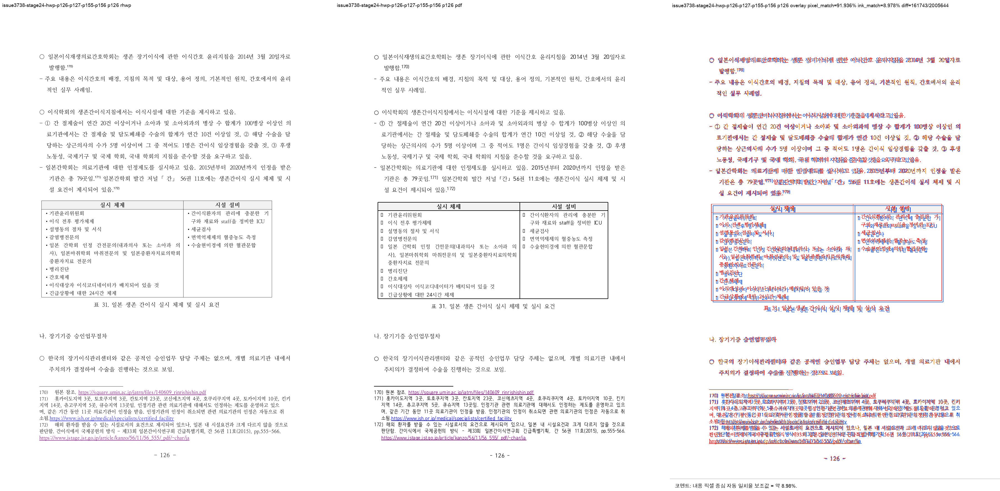
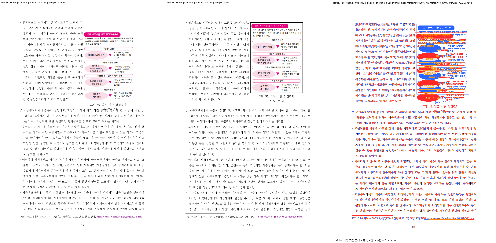
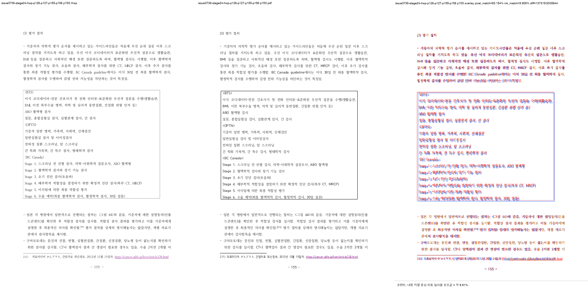
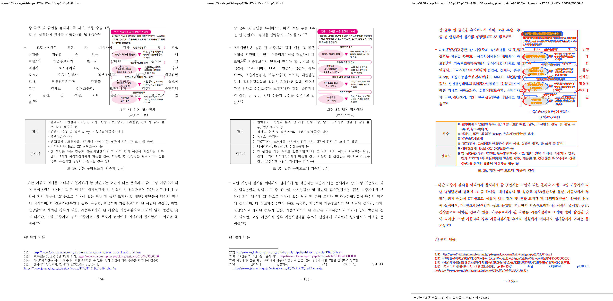

# Task #3738 Stage 24 visual sweep — p127 그림 56 Square wrap 경계

## 범위와 독립 기준

- HWP: `samples/정책연구용역사업 중간진도보고서(살아있는 간장 기증자의 의학적 선별기준 연구).hwp`
- 같은 개인정보 제거 HWPX: `samples/정책연구용역사업 중간진도보고서(살아있는 간장 기증자의 의학적 선별기준 연구).hwpx`
- 한컴 2020 기준 PDF: `pdf/pr3740/hwp/정책연구용역사업 중간진도보고서(살아있는 간장 기증자의 의학적 선별기준 연구)-2020.pdf`
- code revision: `775370b2f48339f84ee627bb058b94444c9ed933`

HWP가 renderer 입력이고 한컴 PDF가 physical-layout 정답지다. HWP/HWPX/PDF는 중복 복사하지 않고
위 canonical 경로에 보관했다. 이 Stage는 p127 그림 56의 본문 침범과 같은 owner contract의 p156 그림 64를
검증할 뿐, PDF 215쪽과 native HWP 219쪽의 전체 page-map 정합을 주장하지 않는다.

```bash
python3 scripts/visual_sweep.py \
  --key issue3738-stage24-hwp-p126-p127-p155-p156 \
  --hwp 'samples/정책연구용역사업 중간진도보고서(살아있는 간장 기증자의 의학적 선별기준 연구).hwp' \
  --pdf 'pdf/pr3740/hwp/정책연구용역사업 중간진도보고서(살아있는 간장 기증자의 의학적 선별기준 연구)-2020.pdf' \
  --pages 126,127,155,156 --dpi 144 \
  --rhwp-bin target/review-planet6897-20260802/release-test/rhwp \
  --out /private/tmp/rhwp-stage24-p127-sweep.l05ZRC
```

`run_state=complete`, `requested_pages=completed_pages=[126,127,155,156]`, `missing_pages=[]`다.
native HWP SVG와 render tree는 219쪽 전체로 export하고, HWP/PDF raster·overlay·3-way review는 요청한 네 쪽만
생성했다.

## 직접 판정

| HWP 쪽 | 기준 PDF와 대조한 계약 | 판정 |
| --- | --- | --- |
| 126 | `pi=1355/ci=0` 그림 56과 caption이 anchor·각주 쪽에 남지 않는다. | 그림·caption 없음 — **일치** |
| 127 | 그림 56 좌측 본문 `pi=1356`은 Square boundary를 물리적으로 넘지 않는다. | image `x=401.9px`; 세로 교차 본문은 `x=112.1px,w=289.9px`로 정확히 그 왼쪽에서 끝남 — **침범 해소** |
| 155 | `pi=1692/ci=1` 그림 64가 표·본문·각주 위로 되돌아오지 않는다. | 그림·caption 없음 — **일치** |
| 156 | 그림 64의 `pi=1693` continuation도 image 왼쪽 boundary에서 끝난다. | image `x=429.7px`; 본문 `x=112.1px,w=317.6px` — **침범 없음** |









## 자동 후보와 fidelity ledger

`visual_sweep.py`의 새 `column_text_flow_collapse`는 p127에서 **0건**이다. 그림 내부의 분홍
workflow glyph를 marker로 오인하는 기존 `question_marker_flow_drift`만 1건 남는다. 이는 image와 본문
TextLine bbox의 physical non-overlap 및 위 3-way review를 함께 대조해 이 Stage 결함의 재발이 아닌
false-positive 후보로 판정했다. 후보를 삭제하거나 자동 pass로 숨기지 않았다.

`fidelity_compare.py`에는 이 Stage 앞에서 Square/Tight/Through image를 폭의 절반 이상 가로지르는 Body
TextLine이 3행 이상일 때 `square_wrap_text_overlap`으로 세는 layout ledger를 추가했다. 같은 clean revision의
direct text-only run에서 p126–128 모든 행은 0이고, p127 text multiset 차이도 0이다.

```text
page  body_footnote_lines  table_footer  table_outside_frame  image_outside_frame  square_wrap_text_overlap
126   0                    0             0                    0                    0
127   0                    0             0                    0                    0
128   0                    0             0                    0                    0
```

### 실제 수정 전/후 detector 재현

자동 후보화가 가정이 아니라 실제 수정 전 출력에서도 성립하는지, detector가 들어간 직후이면서 p127 보정 전인
`d90b3d9de83ff21d540c1cd7a8d3fc627c08de75`를 분리 build하여 같은 direct-pair 명령으로 p127만 재실행했다.
수정 전 binary SHA-256은 `1072dd1e94eeb403d85aa1bb3b01122a17b0e9f00479d58bf2739c43c4115d7a`다.

```text
RHWP_BIN=target/review-fidelity-pre-p127-d90/release-test/rhwp \
  python3 tools/fidelity_compare/fidelity_compare.py 126 126 \
  --source 'samples/정책연구용역사업 중간진도보고서(살아있는 간장 기증자의 의학적 선별기준 연구).hwp' \
  --reference-pdf 'pdf/pr3740/hwp/정책연구용역사업 중간진도보고서(살아있는 간장 기증자의 의학적 선별기준 연구)-2020.pdf' \
  --label issue3738-p127-pre-fix-detector \
  --reference-grade '한컴 2020 기준 PDF' --text-only --layout-ledger
```

수정 전은 `square_wrap_text_overlap=1`, 수정 후 clean revision은 `0`이다. 수정 전 candidate의 source owner는
그림 56 `pi=1355/ci=0`, `textWrap=Square`이고, image bbox `[401.9,130.7,253.1,340.7]`를 본문 13행이
교차했다(첫 행 `[112.1,136.5,587.2,13.3]`, 마지막 행 `[112.1,456.5,587.2,13.3]`). 전·후 `text-report.tsv`의
p127 문자 multiset 차이는 모두 0이므로, 이것은 PDF 문자 비교가 구별하지 못하는 physical overlap을 별도
layout ledger가 포착한 경우다. Python positive/negative regression은 Square 3행 교차를 1건으로 내고
`InFrontOfText` overlay는 제외한다.

Stage 22의 과거 render-tree는 이 JSON schema(`pi`/`ci`/`textWrap`)가 추가되기 전 산출물이므로, 그 파일을
나중 detector에 그대로 재입력한 0은 결함 부재 판정이 아니다. 위 exact revision 재실행이 그 공백을 메운다.

## focused 회귀

```text
CARGO_TARGET_DIR=target/review-planet6897-20260802 CARGO_INCREMENTAL=0 \
  cargo test --profile release-test --test issue_3738_rowbreak_table_footnote_fragment
```

13/13 통과했다. 그림 56/p127와 그림 64/p156 regression은 세로로 같은 band에 있는 각 TextLine이 image bbox와
가로로 교차하지 않는 것을 직접 확인한다. 추가로 다음 Python detector test는 27/27 통과했다.

```text
python3 -m unittest scripts/tests/test_fidelity_compare.py scripts/tests/test_visual_sweep.py
```

사용자가 이미 수행한 WASM build는 재실행하지 않았다.

## 장기 증적과 provenance

asset을 복사하기 전에 `git check-attr filter diff merge`와 `git lfs track`을 확인했다. 모든 Stage 24 asset은
`filter/diff/merge=unspecified`이고 LFS tracked pattern과 일치하지 않아 일반 Git 증적으로 보관한다.

- [run manifest](../pr/assets/pr_3740_issue3738_stage24/run_manifest.json), [구조 지표](../pr/assets/pr_3740_issue3738_stage24/metrics.json), [자동 후보](../pr/assets/pr_3740_issue3738_stage24/flagged_pages.json), [overlay 지표](../pr/assets/pr_3740_issue3738_stage24/overlay_metrics.json), [contact sheet](../pr/assets/pr_3740_issue3738_stage24/review_contact_sheet.png)
- [수정 후 fidelity layout ledger](../pr/assets/pr_3740_issue3738_stage24/fidelity_layout_candidates.tsv), [수정 후 text ledger](../pr/assets/pr_3740_issue3738_stage24/fidelity_text_report.tsv), [수정 후 run state](../pr/assets/pr_3740_issue3738_stage24/fidelity_run_state.tsv)
- [수정 전 fidelity layout ledger](../pr/assets/pr_3740_issue3738_stage24/fidelity_pre_fix_layout_candidates.tsv), [수정 전 text ledger](../pr/assets/pr_3740_issue3738_stage24/fidelity_pre_fix_text_report.tsv), [수정 전 run state](../pr/assets/pr_3740_issue3738_stage24/fidelity_pre_fix_run_state.tsv)
- HWP SHA-256: `50094a3db2b2003b293c5cbf43014d001aa97929acb488cef0cb7ea0e16b3113`
- HWPX SHA-256: `8ae9dc95643d0902fcced2af73badd732aea86c1cc5b875ef7b1272bccba862c`
- PDF SHA-256: `7879ffee6313575132187c44c0090cd2e62c32c12c29b7eabd989181acf27b3a`
- rhwp binary SHA-256: `0b1aad707db06258d40640bf71d40869127b4bb2f09d8bd06dd2da6730b64c7b`
- 수정 전 layout ledger SHA-256: `f0a06a9eb5da16f7cbfb19f026953d5eb30130d98146b176cdc04acb309b74f7`
- 수정 전 text ledger SHA-256: `5ca7c54f3f213ef60b8ed90e90142cb0d0991e1c84a97dbfcb3167a9599e0f1c`
- 수정 전 run state SHA-256: `fc0c09ea63d2db2da7671c5842d839635dca7b0f34f1ce91779357ec3c7e7cbc`
- review PNG SHA-256: p126 `684859d9f14419451dd6526f818c29bec0c552851097a4b6e810f7988409f102`, p127 `9b3578ebf48d32adff0de2b980d517381fdb19bd5f8d5864b5bbcce245efa43e`, p155 `9fcc4896d7c5eeee02cc4f21a97fe7e3f38c4188318502345255d2ede95abcca`, p156 `9efa2a90a1357e6ed21e7cde157b4f6d6ff735464b3a0eefb1afcfd3b8626c02`
- run manifest SHA-256: `b69970ba93f175073dbc05708759b141ffddefb70f93f5012f171cf37b9c6001`

## 이월

Stage 24는 p127/p156 Square 본문 침범과 그 자동 후보화를 해소했다. p43, p44–45, p52–53, p66–67, p83–85,
p90, p94, p106, p107–108 및 전체 215↔219 page-map은 해결로 간주하지 않으며 Stage 23/후속 stage의
원장으로 남긴다.
