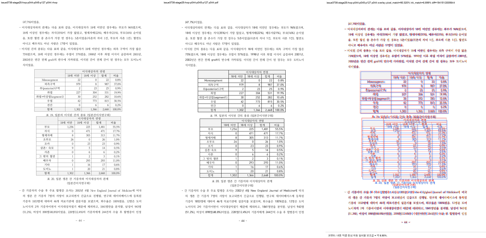
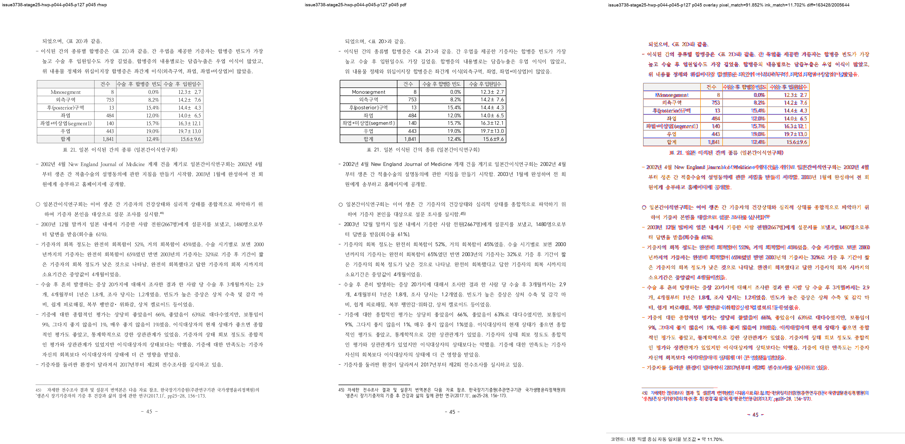
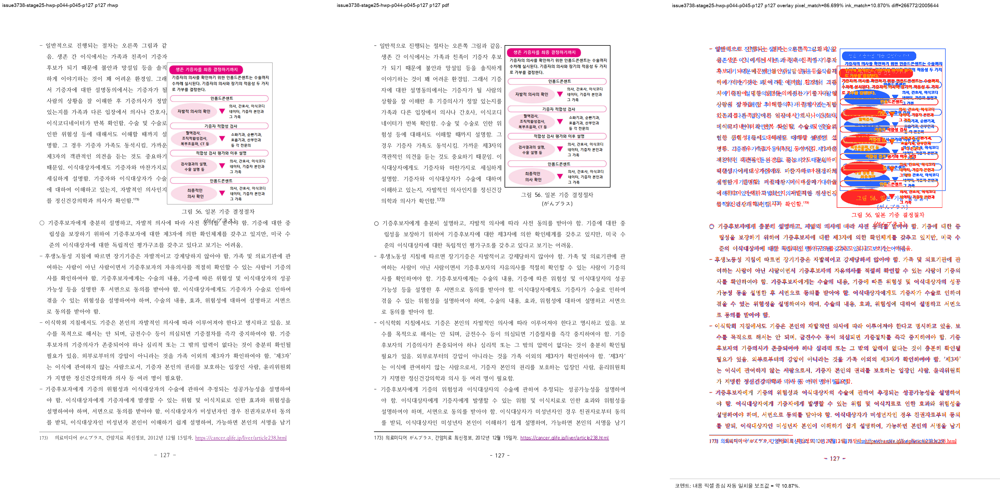

# Task #3738 Stage 25 visual sweep — p44–45 owner 정정과 table-flow 오탐 제거

## 범위와 기준

- HWP: `samples/정책연구용역사업 중간진도보고서(살아있는 간장 기증자의 의학적 선별기준 연구).hwp`
- 같은 개인정보 제거 HWPX: `samples/정책연구용역사업 중간진도보고서(살아있는 간장 기증자의 의학적 선별기준 연구).hwpx`
- 한컴 2020 기준 PDF: `pdf/pr3740/hwp/정책연구용역사업 중간진도보고서(살아있는 간장 기증자의 의학적 선별기준 연구)-2020.pdf`
- visual-sweep code revision: `982e50dbf0142c5ce97ccd71650fb76ee447c47c`
- renderer binary: `target/review-p127-audit/release-test/rhwp`
  SHA-256 `402d607d0690f4407bd8feb8e07eedcafd73ef33ee164abc418d7d86198e56ef`

HWP는 renderer 입력이고 한컴 PDF는 physical-layout 정답지다. HWP/HWPX/PDF는 이미 canonical
경로에 보관돼 있어 중복 복사하지 않았다. 이 Stage는 p44–45의 false-positive 정정과 p127
Square-wrap detector 무회귀만 판정하며, 전체 native HWP 219쪽 ↔ PDF 215쪽 page-map의 완료를
주장하지 않는다.

## p44–45의 실제 owner

source `pi=516`의 stored line은 `vpos=[62711,64711,66711,68711,70711,0]`이다. `vpos=0`의
reset tail `되었으며, <표 20>과 같음.`은 p45 owner여야 한다.

현재 native dump는 p44에 `pi=516 lines=0..5`, p45에 `pi=516 lines=5..6`과 `pi=517`을 낸다.
`pdftotext -f 44 -l 45 -layout`도 PDF p44를 `…합병증이 인정`으로 끝내고 p45를 정확히
`되었으며, <표 20>과 같음.`으로 시작한다. 따라서 Stage 23에서 p44 residual로 해석한 것은
renderer 결함이 아니라 자동 후보의 오독이었다.

수정 전 Stage 20 `fidelity_compare` text ledger는 original owner 결함을 실제로 잡았다.

| revision | p44 (`reference_only/svg_only`) | p45 (`reference_only/svg_only`) |
| --- | ---: | ---: |
| 수정 전 Stage 20 | `8 / 11` | `14 / 0` |
| 현재 direct run | `0 / 0` | `0 / 0` |

즉 `fidelity_compare.py`는 page 간 **텍스트 owner 이동**을 구분한다. 반대로 같은 문자/owner의
표 raster·row geometry는 문자 multiset만으로 확정할 수 없으므로 visual sweep과 PDF review가
필요하다.

## table-stroke false positive 보정

기존 p44 `column_text_flow_collapse`는 render tree의 Body bbox가 아니라 raster가 추정한 page frame을
사용했다. 테두리 없는 이 page에서는 중심 표 19·20의 넓은 rule이 page top으로 오인됐고, 좌·우 half가
표 rule/cell text를 서로 다른 line band로 세었다.

`982e50dbf`는 flow-only 비교에서 다음을 적용한다.

1. render tree의 Body bbox를 rhwp/PDF raster 좌표로 투영해 flow frame으로 쓴다.
2. Body `Table` bbox를 두 raster에서 mask해 cell/rule을 paragraph baseline에서 제외한다.
3. raw column diagnostic·표 visual 자료는 남기며, table fragment의 합격을 자동 선언하지 않는다.

새 sweep에서 p44·p45는 `column_text_flow_collapse=[]`, `flags=[]`다. p127은 Body table mask가 없고,
Square 그림 본문 침범은 Stage 24의 `fidelity_compare.square_wrap_text_overlap` pre-fix `1` → fixed `0`
regression으로 계속 보호된다. 이번 sweep에 남은 p127 `question_marker_flow_drift`는 분홍 workflow
그림 내부 glyph를 marker로 읽는 기존 review-only 후보이며, image/TextLine physical non-overlap을
판정한 Stage 24 결론을 뒤집지 않는다.

## 실행과 결과

```bash
python3 scripts/visual_sweep.py \
  --key issue3738-stage25-hwp-p044-p045-p127 \
  --hwp 'samples/정책연구용역사업 중간진도보고서(살아있는 간장 기증자의 의학적 선별기준 연구).hwp' \
  --pdf 'pdf/pr3740/hwp/정책연구용역사업 중간진도보고서(살아있는 간장 기증자의 의학적 선별기준 연구)-2020.pdf' \
  --pages 44-45,127 --dpi 144 \
  --rhwp-bin target/review-p127-audit/release-test/rhwp \
  --out /private/tmp/rhwp-stage25-flow-mask-evidence-20260802
```

전체 native SVG/render tree는 219쪽으로 export했고, requested raster/PDF/overlay/review는
p44·p45·p127 세 쪽 모두 생성했다. `run_state=complete`, requested=completed=`[44,45,127]`,
missing은 없다.

| HWP 쪽 | automatic result | PDF/source 대조 판정 |
| --- | --- | --- |
| 44 | `flags=[]`, flow-collapse `[]`; Body table mask 두 개 | `pi=516` reset 전 5줄이 p44에 남음 — **일치** |
| 45 | `flags=[]`, flow-collapse `[]` | `pi=516` reset tail이 첫 줄 — **일치** |
| 127 | `question_marker_flow_drift`만 1건, flow-collapse `[]` | 기존 Square-wrap non-overlap 계약 유지 — **무회귀** |







같은 binary로 `fidelity_compare`를 별도 direct run했다.

```bash
RHWP_BIN=target/review-p127-audit/release-test/rhwp \
  python3 tools/fidelity_compare/fidelity_compare.py 43 44 \
  --source 'samples/정책연구용역사업 중간진도보고서(살아있는 간장 기증자의 의학적 선별기준 연구).hwp' \
  --reference-pdf 'pdf/pr3740/hwp/정책연구용역사업 중간진도보고서(살아있는 간장 기증자의 의학적 선별기준 연구)-2020.pdf' \
  --label issue3738-stage25-p44-p45 \
  --reference-grade '한컴 2020 기준 PDF' --text-only --layout-ledger \
  --out-dir /private/tmp/rhwp-stage25-fidelity-p44-p45-20260802
```

이 run도 p44–45 `reference_only=svg_only=0`, 다섯 layout-ledger 열 모두 0,
requested=completed=`44,45`, `run_state=complete`다.

## focused 검증

```text
python3 -m unittest scripts/tests/test_visual_sweep.py scripts/tests/test_fidelity_compare.py
```

**29/29 통과**했다. 새 synthetic regression은 (a) 표 rule이 본문 flow collapse로 오인되는 경우를
mask 뒤 제외하고, (b) FootnoteArea table은 Body mask에 넣지 않으며, 기존 Square image positive/negative
detector regression은 유지하는 것을 고정한다. `python3 -m py_compile scripts/visual_sweep.py`와
`git diff --check`도 통과했다. renderer code 변경이 아니므로 cargo/WASM build는 재실행하지 않았다.

## 장기 증적과 provenance

asset 복사 전 `git check-attr filter diff merge`와 `git lfs track`을 확인했다. 아래 파일은 모두
`filter/diff/merge=unspecified`이고 LFS pattern(`pdf-large/**/*.pdf`)과 일치하지 않아 일반 Git으로
보관한다.

- [run manifest](../pr/assets/pr_3740_issue3738_stage25_flow_mask/run_manifest.json), [metrics](../pr/assets/pr_3740_issue3738_stage25_flow_mask/metrics.json), [flagged pages](../pr/assets/pr_3740_issue3738_stage25_flow_mask/flagged_pages.json), [overlay metrics](../pr/assets/pr_3740_issue3738_stage25_flow_mask/overlay_metrics.json), [contact sheet](../pr/assets/pr_3740_issue3738_stage25_flow_mask/contact_sheet.png)
- [p44 metrics](../pr/assets/pr_3740_issue3738_stage25_flow_mask/page_044.json), [p45 metrics](../pr/assets/pr_3740_issue3738_stage25_flow_mask/page_045.json), [p127 metrics](../pr/assets/pr_3740_issue3738_stage25_flow_mask/page_127.json)
- [current fidelity text ledger](../pr/assets/pr_3740_issue3738_stage25_flow_mask/fidelity_text_report.tsv), [layout ledger](../pr/assets/pr_3740_issue3738_stage25_flow_mask/fidelity_layout_candidates.tsv), [run state](../pr/assets/pr_3740_issue3738_stage25_flow_mask/fidelity_run_state.tsv)
- HWP SHA-256: `50094a3db2b2003b293c5cbf43014d001aa97929acb488cef0cb7ea0e16b3113`
- HWPX SHA-256: `8ae9dc95643d0902fcced2af73badd732aea86c1cc5b875ef7b1272bccba862c`
- PDF SHA-256: `7879ffee6313575132187c44c0090cd2e62c32c12c29b7eabd989181acf27b3a`
- run manifest SHA-256: `39b54dd29e160b370f01833433f6222ecb051afcf2deefb7c00233fcd969399c`
- sweep metrics SHA-256: `8f8843b87bd41649ee02652a2876985c8c710c73f5665d9d2d2f7cdd211d3df9`
- fidelity text/layout/run-state SHA-256: `a64d8808ff207ef9f03bad617e043a20af52640659f70718032f399e53ca2b5c`, `dea771cd4a14b6195a476d7af888d69d678a3310d4abfa9f58b4006a32da4aff`, `be3a14f75d6f46eb1d0f711f8940ba896e39e3cafc0dd336591925a4f6d8027c`
- review PNG SHA-256: p44 `4794f1a643c83063207a0c337184f0b44c3444e4711c6369fc8f9ccafc83d5c1`, p45 `06ad3d76c88285ffe268dd392a95c94a7626585eb16980c2c7cf2a292fdf13aa`, p127 `6a3bfa7ca5f36a0eb7af4679d5d22864277ee83eed4eee37bb47e9b2aa2d1c12`

## 이월

p44–45는 resolved로 정정한다. 다음 Stage는 p26–27 각주 26 owner를 first unresolved code path로
분리하되, p52–53, p54, p66–67, p83–85, p87, p90, p94, p99–100, p106, p107–108과 전체 215↔219
page-map을 누락 없이 원장으로 옮긴다.
