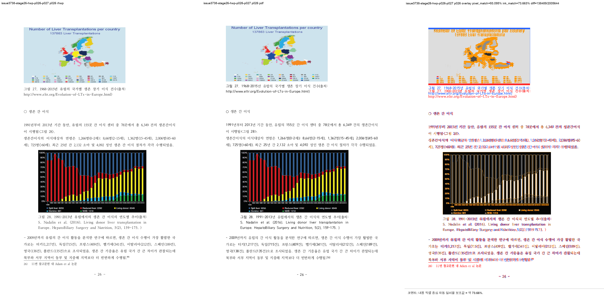
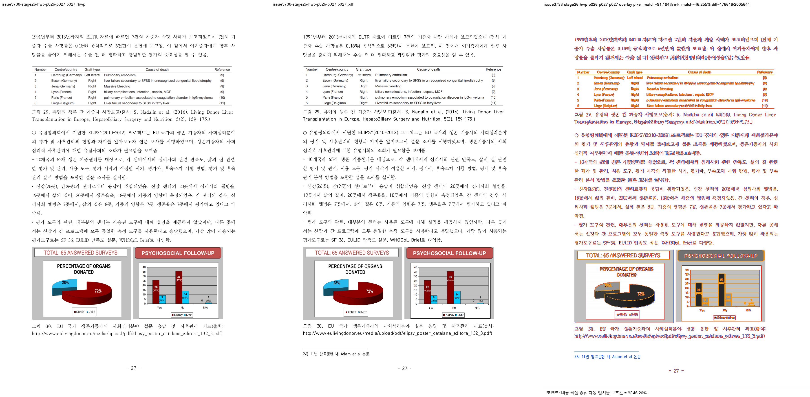
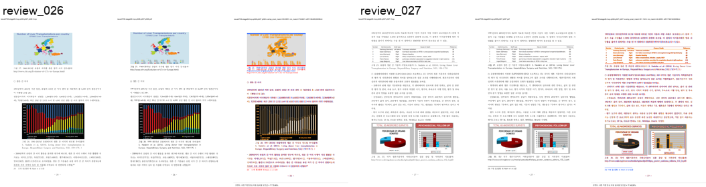

# Task #3738 Stage 26 visual sweep — p26–27 owner-shift detector 증적

## 목적과 기준

이 Stage는 p26–27 renderer 결함을 아직 해결했다고 주장하지 않는다. 목적은 사용자가 지적한
각주 26의 한 쪽 이른 physical owner를 자동 후보화할 수 있는지, `fidelity_compare`와
`visual_sweep.py`의 결과를 독립 PDF 기준으로 분리해 고정하는 것이다.

- HWP: `samples/정책연구용역사업 중간진도보고서(살아있는 간장 기증자의 의학적 선별기준 연구).hwp`
- 같은 개인정보 제거 HWPX: `samples/정책연구용역사업 중간진도보고서(살아있는 간장 기증자의 의학적 선별기준 연구).hwpx`
- 한컴 2020 기준 PDF: `pdf/pr3740/hwp/정책연구용역사업 중간진도보고서(살아있는 간장 기증자의 의학적 선별기준 연구)-2020.pdf`
- detector revision: `8f84a5ecb0bfd4ee556239eaee3679946df10e02`
- renderer binary: `target/review-p127-audit/release-test/rhwp`, SHA-256
  `402d607d0690f4407bd8feb8e07eedcafd73ef33ee164abc418d7d86198e56ef`

HWP SHA-256은 `50094a3db2b2003b293c5cbf43014d001aa97929acb488cef0cb7ea0e16b3113`,
HWPX는 `8ae9dc95643d0902fcced2af73badd732aea86c1cc5b875ef7b1272bccba862c`, PDF는
`7879ffee6313575132187c44c0090cd2e62c32c12c29b7eabd989181acf27b3a`다. 세 원본은 canonical
경로에 이미 보관되어 있어 중복 복사하지 않았다.

## `fidelity_compare` 자동 후보 결과

```bash
RHWP_BIN=target/review-p127-audit/release-test/rhwp \
  python3 tools/fidelity_compare/fidelity_compare.py 25 26 \
  --source 'samples/정책연구용역사업 중간진도보고서(살아있는 간장 기증자의 의학적 선별기준 연구).hwp' \
  --reference-pdf 'pdf/pr3740/hwp/정책연구용역사업 중간진도보고서(살아있는 간장 기증자의 의학적 선별기준 연구)-2020.pdf' \
  --label issue3738-stage26-p26-p27 --reference-grade '한컴 2020 기준 PDF' \
  --text-only --layout-ledger \
  --out-dir /private/tmp/rhwp-stage26-fidelity-owner-shift-evidence-20260802
```

요청/완료는 p26–27 모두이고 run state는 complete다. PDF p26은 marker `26)` 뒤의 각주 text를
p27에 두지만, rhwp는 그 text 전체를 p26 FootnoteArea에 너무 일찍 그린다.

| signal | p26 | p27 | 판정 |
| --- | ---: | ---: | --- |
| PDF-only (`reference_only`) | 0 | 21 | PDF p27에만 각주 26 text 존재 |
| SVG-only (`svg_only`) | 21 | 0 | rhwp p26에만 같은 text 존재 |
| adjacent owner shift | p26 → p27, 21자 | coverage `1.000 / 1.000` | `rhwp_earlier_than_reference` 후보 |
| Body ↔ FootnoteArea | 1 | 0 | p26 physical collision 후보 교차 확인 |

따라서 raw text multiset가 단순히 nonzero인 것보다 강한 **인접 페이지 reciprocal owner-shift** 후보로
구분된다. 이는 최종 시각 판정을 대체하지 않지만, 215쪽을 사람이 순서대로 찾아야 했던 상태를 피하고
p26–27을 자동 review queue로 올린다.

새 `page-count-ledger.tsv`는 same run에서 PDF 215쪽과 full render tree 219쪽(차이 `+4`)도 별도로
기록한다. selected SVG 두 쪽만 만들었으므로 SVG total은 `-`로 기록해 partial cache를 전체 count로
오인하지 않았다. 이 drift는 전역 page-break 보정 근거가 아니라 개별 owner 결함을 조사할 candidate다.

## visual sweep 교차 대조

```bash
python3 scripts/visual_sweep.py \
  --key issue3738-stage26-hwp-p026-p027 \
  --hwp 'samples/정책연구용역사업 중간진도보고서(살아있는 간장 기증자의 의학적 선별기준 연구).hwp' \
  --pdf 'pdf/pr3740/hwp/정책연구용역사업 중간진도보고서(살아있는 간장 기증자의 의학적 선별기준 연구)-2020.pdf' \
  --pages 26-27 --dpi 144 \
  --rhwp-bin target/review-p127-audit/release-test/rhwp \
  --out /private/tmp/rhwp-stage26-p26-p27-sweep-evidence-20260802
```

native SVG/render tree는 219/219으로 완주했고 selected p26–27 raster/PDF/overlay/review도 모두
생성했다. 그러나 current `task1274`의 raster-only flags는 `[]`이며 `flagged_page_count=0`이다.
이는 이 결함이 없다는 의미가 아니라 line-band/pixel heuristic만으로는 **같은 각주가 한 쪽 이동한
owner 결함을 승격하지 못한 false negative**라는 증거다. 따라서 visual sweep은 review PNG와
physical comparison을 제공하고, page-owner gate는 새 fidelity ledger가 담당한다.







## focused 검증

```text
python3 -m py_compile tools/fidelity_compare/fidelity_compare.py
python3 -m unittest scripts/tests/test_fidelity_compare.py scripts/tests/test_visual_sweep.py
```

**34/34 통과**했다. 새 unit regression은 p26 같은 complete reciprocal pair를 1-based p26→p27
candidate로 기록하고, 75% 미만 partial match를 배제하며, full render-tree page count만 global page count로
기록하는 계약을 고정한다. p127 Square-wrap detector와 existing sweep tests도 함께 통과했다.

## 보존된 증적

asset 복사 전 `git check-attr filter diff merge`와 `git lfs track`을 확인했다. 모두
`filter/diff/merge=unspecified`이고 유일한 LFS pattern `pdf-large/**/*.pdf`와 일치하지 않아 일반 Git으로
보관한다.

- [fidelity provenance](../pr/assets/pr_3740_issue3738_stage26_owner_shift/fidelity_provenance.tsv),
  [text ledger](../pr/assets/pr_3740_issue3738_stage26_owner_shift/fidelity_text_report.tsv),
  [owner-shift ledger](../pr/assets/pr_3740_issue3738_stage26_owner_shift/fidelity_text_owner_shift_candidates.tsv),
  [page-count ledger](../pr/assets/pr_3740_issue3738_stage26_owner_shift/fidelity_page_count_ledger.tsv),
  [layout ledger](../pr/assets/pr_3740_issue3738_stage26_owner_shift/fidelity_layout_candidates.tsv),
  [run state](../pr/assets/pr_3740_issue3738_stage26_owner_shift/fidelity_run_state.tsv)
- [sweep summary](../pr/assets/pr_3740_issue3738_stage26_owner_shift/sweep_summary.json),
  [manifest](../pr/assets/pr_3740_issue3738_stage26_owner_shift/sweep_manifest.json),
  [metrics](../pr/assets/pr_3740_issue3738_stage26_owner_shift/sweep_metrics.json),
  [flagged pages](../pr/assets/pr_3740_issue3738_stage26_owner_shift/sweep_flagged_pages.json),
  [p26 metrics](../pr/assets/pr_3740_issue3738_stage26_owner_shift/sweep_page_026.json),
  [p27 metrics](../pr/assets/pr_3740_issue3738_stage26_owner_shift/sweep_page_027.json)

SHA-256: text `61abde276dffb3e320f4c3a1c27fa305d8d6203717477e0446050afee8a588b5`, owner shift
`2656adf2cc40b3ed4a966e7b0f03f56f7379835094561e074fe6521ad2240e07`, page count
`6f24ac5059397e31ac8a3ea375a5da0f01e671c0fe17acd11aae371173265d43`, layout
`b0d23fb17c819313c54f9a4986fc694c3315f1496f7c72d1a03cf083790bb1e4`, run state
`8b5d3d0e957f44613c2997ea0fd8a10b419b8f0de92f3e95c90dcdaa881e2390`, sweep summary
`9e314b2a08cb193233ae957466997aea296fad2376bd12ae372ef859de649d47`, p26/p27 review PNG
`770e8f8944e662964ca8c9b0be15181ba3d2d56851c4bf4aa2cc37edfa22f939` /
`1d1e7fcb7d785f757b5e096083e74d68246e6a2ef5104b216943b6b34d63ae9f`다.

## 다음 Stage

Stage 27은 detector가 확정한 p26–27 renderer 결함을 고친다. native HWP5·single composed footnote
line·marker가 parent 마지막 body line·다음 relevant body paragraph의 first `vpos=0` reset·각주 예약 뒤
실제 FootnoteArea collision이 동시에 성립할 때만 note registration을 다음 physical page로 defer한다.
p31 two-line fragment와 p43 existing-note reset-tail contract는 그대로 유지한다. Stage 26의 잔여
원장은 다음 Stage에 누락 없이 이월한다.
