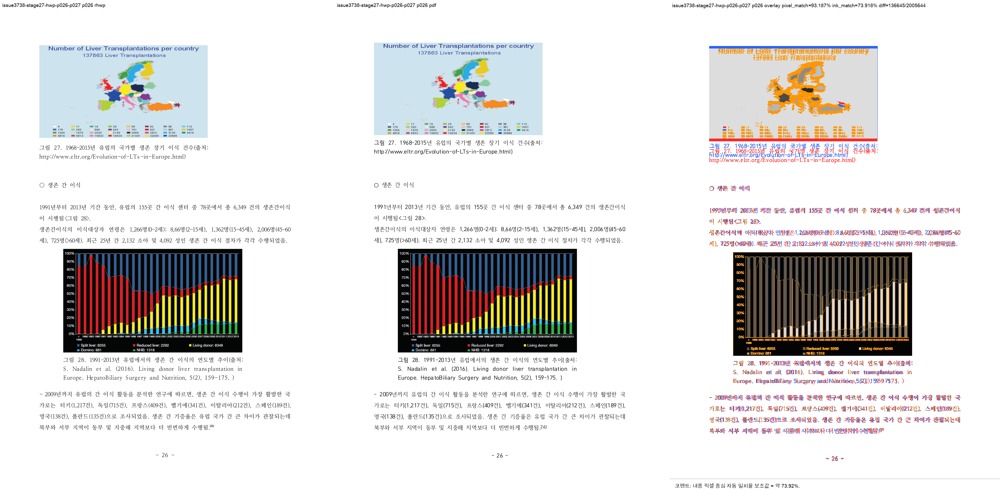
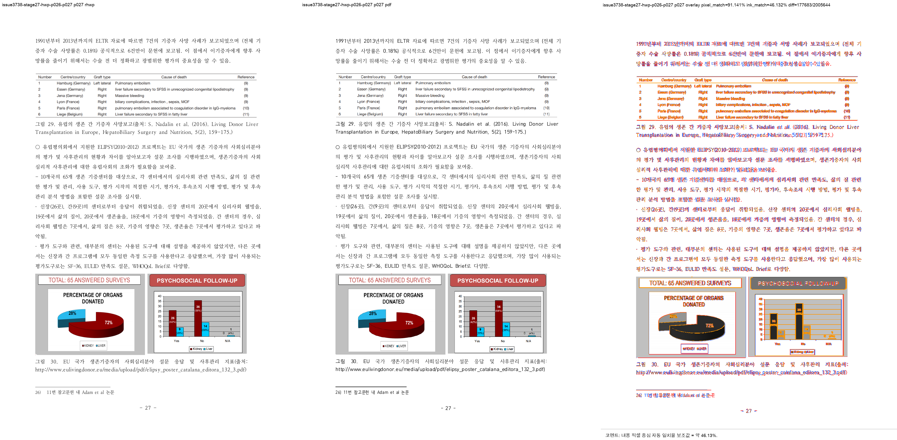
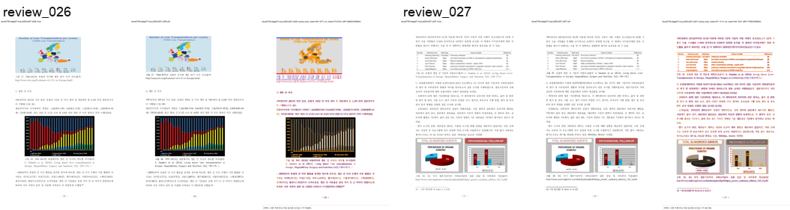

# Task #3738 Stage 27 visual sweep — p26–27 각주 26 physical owner

## 기준과 범위

`c893d9889bca37f688e9195e8a02e7aa5ca951fb`는 native HWP5의 매우 좁은 형상에서 본문을
현재 쪽에 유지하고 각주 26 registration만 다음 physical page로 보낸다. 기준은 한컴 2020 PDF이며,
원본 HWP/HWPX/PDF는 이미 canonical 경로에 보관되어 중복 저장하지 않았다.

- HWP SHA-256: `50094a3db2b2003b293c5cbf43014d001aa97929acb488cef0cb7ea0e16b3113`
- HWPX SHA-256: `8ae9dc95643d0902fcced2af73badd732aea86c1cc5b875ef7b1272bccba862c`
- PDF SHA-256: `7879ffee6313575132187c44c0090cd2e62c32c12c29b7eabd989181acf27b3a`
- renderer: `target/review-pr3740-stage27/release-test/rhwp`, SHA-256
  `51905e08d11e556b64eed75ccf4a792b503a10f60f333eb1561ed74793666feb`

## focused regression

```text
CARGO_TARGET_DIR=target/review-pr3740-stage27 CARGO_INCREMENTAL=0 \
  cargo test --profile release-test \
  --test issue_3738_rowbreak_table_footnote_fragment -- --nocapture
```

**15/15 통과**했다. 새 regression은 p26에 body tail/marker `26)`만 남고 p27 FootnoteArea가
`26) 11번 참고문헌 내 Adam et al 논문` 전체를 소유하며, p31 two-line fragment·p43 existing
footnote reset-tail·p127 Square-wrap contract가 그대로인 것을 함께 고정한다.

## PDF direct owner 비교

```bash
RHWP_BIN=target/review-pr3740-stage27/release-test/rhwp \
  python3 tools/fidelity_compare/fidelity_compare.py 25 26 \
  --source 'samples/정책연구용역사업 중간진도보고서(살아있는 간장 기증자의 의학적 선별기준 연구).hwp' \
  --reference-pdf 'pdf/pr3740/hwp/정책연구용역사업 중간진도보고서(살아있는 간장 기증자의 의학적 선별기준 연구)-2020.pdf' \
  --label issue3738-stage27-p26-p27 --reference-grade '한컴 2020 기준 PDF' \
  --text-only --layout-ledger \
  --out-dir /private/tmp/rhwp-stage27-fidelity-p26-p27-20260802
```

요청/완료는 p26–27 모두이고 run state는 complete다.

| signal | 수정 전 Stage 26 | 수정 후 | 판정 |
| --- | ---: | ---: | --- |
| p26 `svg_only` | 21 | 0 | 이른 각주 owner 제거 |
| p27 `reference_only` | 21 | 0 | PDF 각주 owner 수용 |
| p26→p27 owner shift | 21자, coverage 1.000/1.000 | 0건 | reciprocal 이동 해소 |
| p26 `body_footnote_lines` | 1 | 0 | Body/FootnoteArea 충돌 해소 |

native full render tree는 여전히 219쪽, PDF는 215쪽이다. 이는 이 Stage에서 전역 page-map을
맞췄다는 뜻이 아니라, 기존 `+4` candidate가 남아 있음을 명시적으로 보존한 것이다.

## visual sweep 및 후보 판정

```bash
python3 scripts/task1274_visual_sweep.py \
  --key issue3738-stage27-hwp-p026-p027 \
  --hwp 'samples/정책연구용역사업 중간진도보고서(살아있는 간장 기증자의 의학적 선별기준 연구).hwp' \
  --pdf 'pdf/pr3740/hwp/정책연구용역사업 중간진도보고서(살아있는 간장 기증자의 의학적 선별기준 연구)-2020.pdf' \
  --pages 26-27 --dpi 144 \
  --rhwp-bin target/review-pr3740-stage27/release-test/rhwp \
  --out /private/tmp/rhwp-stage27-p26-p27-sweep-20260802
```

SVG/render tree 219/219과 selected p26–27 PDF/raster/review가 모두 생성됐다. p26은 flags 0건이다.
p27의 `endnote_separator_gap_drift` 1건은 해결 실패로 처리하지 않았다. detector가 PDF raster의
수평선 candidate 116개 중 graph/table 내부 선을 separator로 택했고, rhwp에는 실제 FootnoteArea line
1개가 있다. PDF bbox의 각주 text `26)` y=`768.37pt`(96dpi 환산 `1024.5px`)와 rhwp render-tree
FootnoteArea text y=`1027.3px`가 약 2.8px 차이이며, review PNG에서도 같은 p27 하단에 표시된다.
따라서 이 flag는 재검토 가능한 **후보**로 남기되 p26–27 owner 결함의 잔여라고 가장하지 않는다.







## 보존된 증적

복사 전 `git check-attr filter diff merge`와 `git lfs track`을 확인했다. PNG/TSV/JSON 모두
`filter/diff/merge=unspecified`이며 유일한 LFS pattern `pdf-large/**/*.pdf`에 해당하지 않는다.

- [fidelity provenance](../pr/assets/pr_3740_issue3738_stage27_p26_owner/provenance.tsv),
  [text ledger](../pr/assets/pr_3740_issue3738_stage27_p26_owner/text-report.tsv),
  [owner-shift ledger](../pr/assets/pr_3740_issue3738_stage27_p26_owner/text-owner-shift-candidates.tsv),
  [page-count ledger](../pr/assets/pr_3740_issue3738_stage27_p26_owner/page-count-ledger.tsv),
  [layout ledger](../pr/assets/pr_3740_issue3738_stage27_p26_owner/layout-candidates.tsv),
  [run state](../pr/assets/pr_3740_issue3738_stage27_p26_owner/run-state.tsv)
- [sweep manifest](../pr/assets/pr_3740_issue3738_stage27_p26_owner/manifest.json),
  [run manifest](../pr/assets/pr_3740_issue3738_stage27_p26_owner/run_manifest.json),
  [metrics](../pr/assets/pr_3740_issue3738_stage27_p26_owner/metrics.json),
  [flagged pages](../pr/assets/pr_3740_issue3738_stage27_p26_owner/flagged_pages.json),
  [p26 metrics](../pr/assets/pr_3740_issue3738_stage27_p26_owner/page_026.json),
  [p27 metrics](../pr/assets/pr_3740_issue3738_stage27_p26_owner/page_027.json)

SHA-256: text `f57c01ae91885d105b8c77e6aee5877ab845bb44a86031aab4c14df03ba3b307`, owner shift
`ad4e1466d01e3bf06636b1ad6bab5115343548048cedffb2df33a4e977c92ced`, layout
`a9fe8dab0ab0df4468bb65f8628e2960202061d0716aef730c66b5574cc21332`, run state
`8b5d3d0e957f44613c2997ea0fd8a10b419b8f0de92f3e95c90dcdaa881e2390`, p26/p27 review PNG
`dbd72f42cdd19d5aede8a0e17e956df75e6a9b63e1591b36dd6d59c3b36f665e` /
`134c493cffa3e3fa1b75133773999f73a123fcc8f7768b99c4a0011154e72697`이다.

## 다음 Stage

Stage 28은 p26–27을 resolved로 이월하지 않고, Stage 27의 모든 잔여 원장을 그대로 시작 근거로
옮긴 뒤 p52–53 각주 58–62 owner를 다음 P0 항목으로 조사한다.
