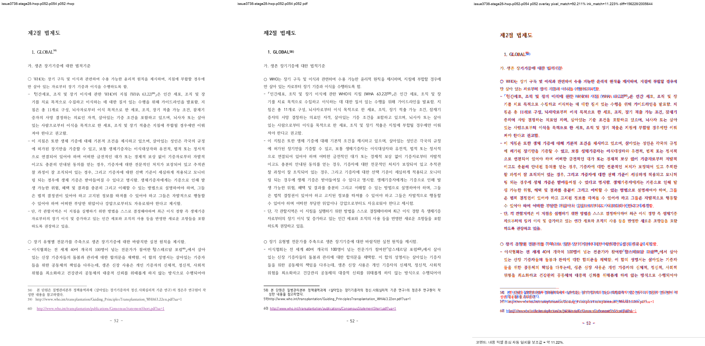
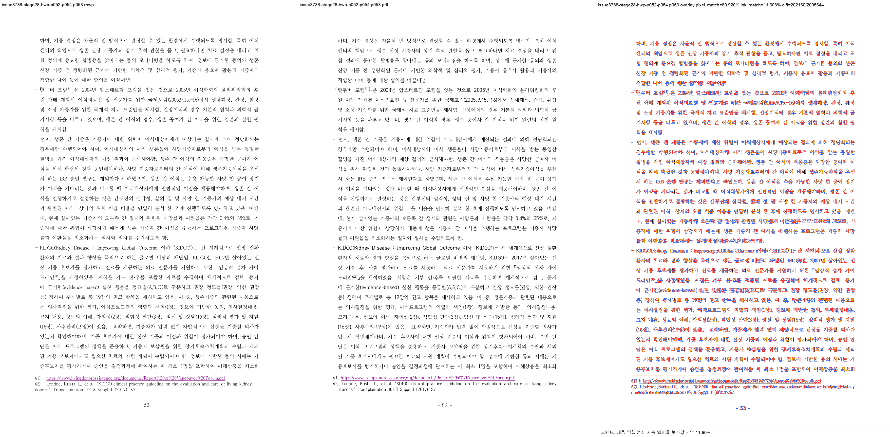
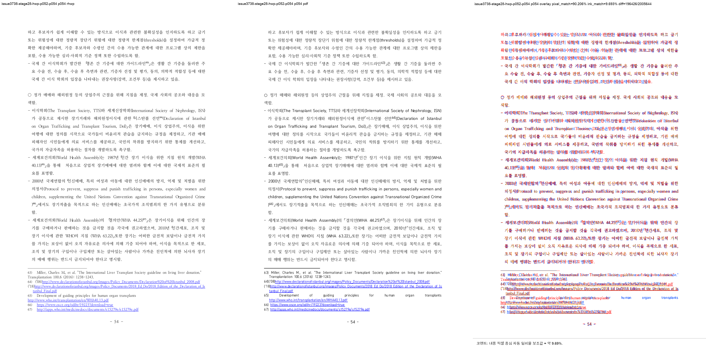
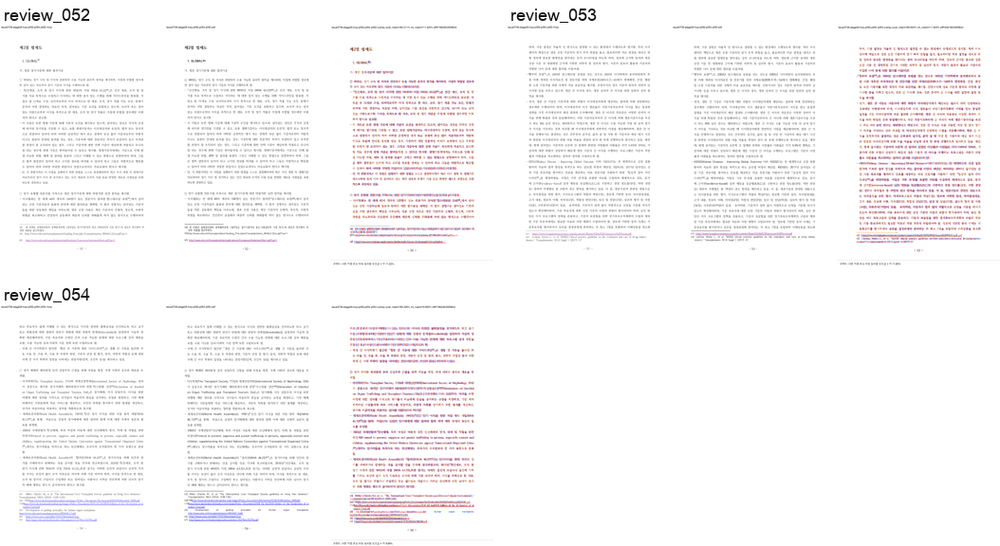

# Task #3738 Stage 28 visual sweep — p52–54 multi-note owner

## 기준과 범위

commit `543c5b3988512945c1273368a25a1edfd97d15c3`는 p52–p54에서 split된 Body paragraph의
각주 60·62를 marker가 든 completed page로 소급 등록한다. 기준은 한컴 2020 PDF이며, 원본
HWP/HWPX/PDF는 canonical 경로에 보관되어 있어 중복 저장하지 않았다.

- HWP SHA-256: `50094a3db2b2003b293c5cbf43014d001aa97929acb488cef0cb7ea0e16b3113`
- HWPX SHA-256: `8ae9dc95643d0902fcced2af73badd732aea86c1cc5b875ef7b1272bccba862c`
- PDF SHA-256: `7879ffee6313575132187c44c0090cd2e62c32c12c29b7eabd989181acf27b3a`
- renderer: `target/review-pr3740-stage28/release-test/rhwp`, SHA-256
  `fbcf693e1cf98fd8dbdd4b9b93b0e6068abce35435e12b46f69cb31890fa6557`

## focused regression 및 automatic candidate

```text
CARGO_TARGET_DIR=target/review-pr3740-stage28 CARGO_INCREMENTAL=0 \
  cargo test --profile release-test \
  --test issue_3738_rowbreak_table_footnote_fragment -- --nocapture
```

**16/16 통과**했다. 새 fixture는 p52 FootnoteArea가 note 60을, p53이 note 62를 소유하고 p54는
note 62를 상속하지 않으며, p52 `pi=602`/p53 `pi=605` 본문 하단이 각주 separator 위에 있고 전체
page count가 219인 것을 함께 고정한다. p30/p31 two-line fragment, p43 reset-tail, p26 next-page
owner도 같은 실행에서 통과했다.

`fidelity_compare.py`의 ordered owner ledger는 PDF/SVG text의 NFC·공백 차이를 정규화하고 16자 이상
sequence만 기록한다. unit test **25/25 통과**로 p52→p53/p53→p54 chain과 same-page reorder 오탐
차단을 고정했다.

## PDF direct owner 비교

```bash
RHWP_BIN=target/review-pr3740-stage28/release-test/rhwp \
  python3 tools/fidelity_compare/fidelity_compare.py 51 53 \
  --source 'samples/정책연구용역사업 중간진도보고서(살아있는 간장 기증자의 의학적 선별기준 연구).hwp' \
  --reference-pdf 'pdf/pr3740/hwp/정책연구용역사업 중간진도보고서(살아있는 간장 기증자의 의학적 선별기준 연구)-2020.pdf' \
  --label issue3738-stage28-p52-p54-fixed --reference-grade '한컴 2020 기준 PDF' \
  --text-only --layout-ledger \
  --out-dir /private/tmp/rhwp-stage28-fidelity-p52-p54-fixed-20260802
```

요청/완료는 p52–54 모두이고 run state는 complete다.

| signal | 수정 전 | 수정 후 | 판정 |
| --- | ---: | ---: | --- |
| p52 `reference_only` | 83 | 0 | note 60이 p52 owner로 복귀 |
| p53 `reference_only` / `svg_only` | 73 / 21 | 0 / 0 | note 60 이월 제거, note 62 수용 |
| p54 `svg_only` | 135 | 0 | note 62의 p54 이월 제거 |
| p52→53, p53→54 ordered owner sequence | 2건 | 0건 | Counter 상쇄 결함도 해소 |
| p54 `body_footnote_lines` | 1 | 0 | body/FootnoteArea 충돌 제거 |

native full render tree는 여전히 219쪽, PDF는 215쪽이다. 이는 이번 세 physical owner가 맞았다는
증거이지 전역 page-map이 해결됐다는 뜻은 아니다.

## visual sweep 및 직접 판정

```bash
python3 scripts/visual_sweep.py \
  --key issue3738-stage28-hwp-p052-p054 \
  --hwp 'samples/정책연구용역사업 중간진도보고서(살아있는 간장 기증자의 의학적 선별기준 연구).hwp' \
  --pdf 'pdf/pr3740/hwp/정책연구용역사업 중간진도보고서(살아있는 간장 기증자의 의학적 선별기준 연구)-2020.pdf' \
  --pages 52-54 --dpi 144 \
  --rhwp-bin target/review-pr3740-stage28/release-test/rhwp \
  --out /private/tmp/rhwp-stage28-p52-p54-sweep-20260802
```

SVG/render tree 219/219과 selected p52–54 PDF/raster/review가 생성됐고, requested/completed 3/3,
visual flags 0건이다. PNG의 font raster·glyph 차이 때문에 overlay ink score 자체를 fidelity pass로
해석하지 않고, 직접 review에서 p52 하단 notes 58–60, p53 notes 61–62, p54 다음 notes/body가 PDF와
동일한 physical owner인지 확인했다.









## 보존된 증적

복사 전 `git check-attr filter diff merge`와 `git lfs track`을 확인했다. PNG/TSV/JSON은 모두
`filter/diff/merge=unspecified`이고 유일한 LFS pattern `pdf-large/**/*.pdf`에 해당하지 않는다.

- [수정 전 text ledger](../pr/assets/pr_3740_issue3738_stage28_p52_owner/before-text-report.tsv),
  [수정 전 ordered owner ledger](../pr/assets/pr_3740_issue3738_stage28_p52_owner/before-text-owner-sequence-candidates.tsv),
  [수정 전 layout ledger](../pr/assets/pr_3740_issue3738_stage28_p52_owner/before-layout-candidates.tsv)
- [수정 후 provenance](../pr/assets/pr_3740_issue3738_stage28_p52_owner/provenance.tsv),
  [text ledger](../pr/assets/pr_3740_issue3738_stage28_p52_owner/text-report.tsv),
  [Counter owner ledger](../pr/assets/pr_3740_issue3738_stage28_p52_owner/text-owner-shift-candidates.tsv),
  [ordered owner ledger](../pr/assets/pr_3740_issue3738_stage28_p52_owner/text-owner-sequence-candidates.tsv),
  [layout ledger](../pr/assets/pr_3740_issue3738_stage28_p52_owner/layout-candidates.tsv),
  [page-count ledger](../pr/assets/pr_3740_issue3738_stage28_p52_owner/page-count-ledger.tsv),
  [run state](../pr/assets/pr_3740_issue3738_stage28_p52_owner/run-state.tsv)
- [sweep manifest](../pr/assets/pr_3740_issue3738_stage28_p52_owner/manifest.json),
  [run manifest](../pr/assets/pr_3740_issue3738_stage28_p52_owner/run_manifest.json),
  [metrics](../pr/assets/pr_3740_issue3738_stage28_p52_owner/metrics.json),
  [flagged pages](../pr/assets/pr_3740_issue3738_stage28_p52_owner/flagged_pages.json),
  [p52 metrics](../pr/assets/pr_3740_issue3738_stage28_p52_owner/page_052.json),
  [p53 metrics](../pr/assets/pr_3740_issue3738_stage28_p52_owner/page_053.json),
  [p54 metrics](../pr/assets/pr_3740_issue3738_stage28_p52_owner/page_054.json)

SHA-256: post text `9be0a707d4d21bfde41ad97a6e5c5292eafd30be1910660468f22df16cd9a03c`,
ordered owner `068cd4ce56f09f24ed9bcf10aea8f7893f3e90aae0e881635ea2ef9fc3b0f977`, layout
`32471dc575d7c6b9d24ad93da2b2e205072351e26b3767bac089bf895b2fc106`, p52/p53/p54 review PNG
`35bffd41df37af0fe515c783760e2c307d8b6cd9e5cf13a386447938a1075463` /
`e8c0076338393cf0b00be53245c0af71eb56305da98732e240f93db7c7ff5e8e` /
`f1f6f9293487ac2d1ae9f3503de72a15de61c5733452d252387c251e566703ec`이다.

## 다음 Stage

Stage 29는 p52–54를 재이월하지 않는다. Stage 28의 잔여 원장 전체를 유지한 채 p66–67 표 23과
각주 76–85 physical flow부터 조사한다.
