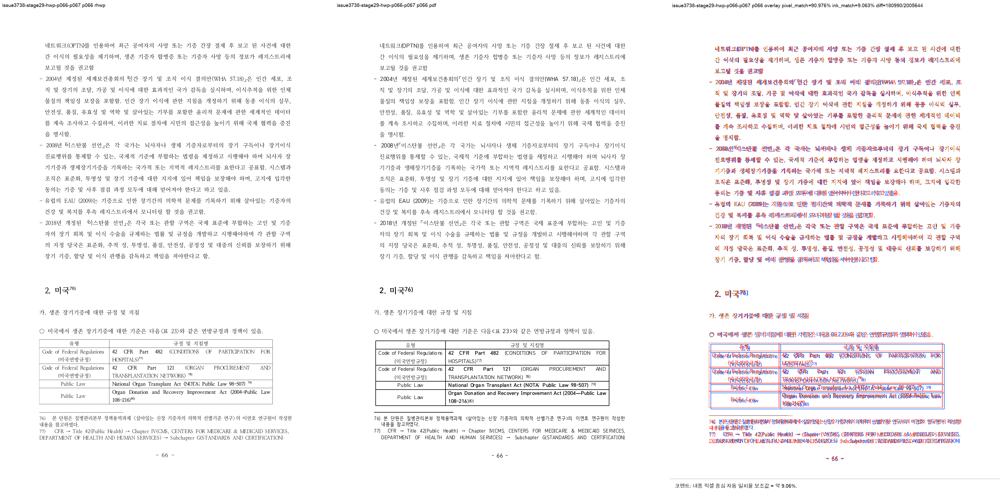
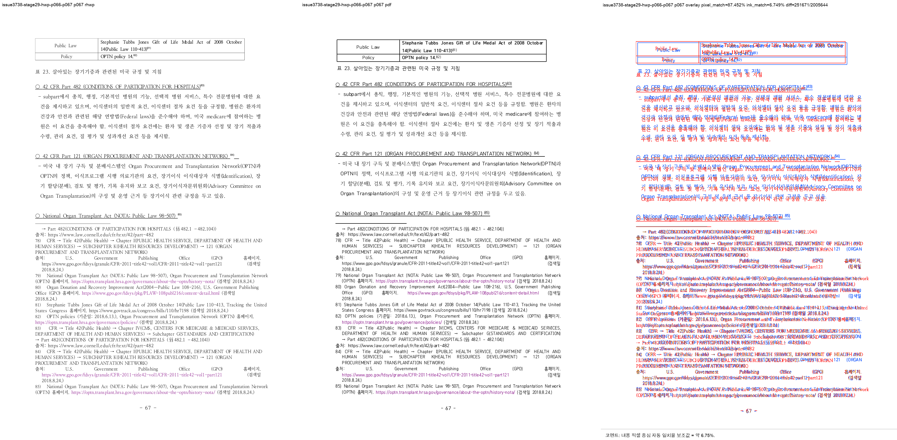
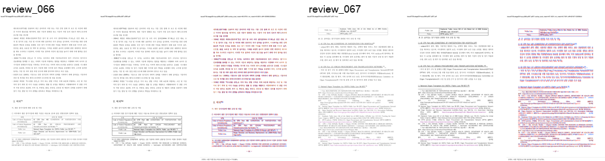

# Task #3738 Stage 29 visual sweep — p66–67 표 23 각주 fragment

## 기준과 범위

이번 결과는 code commits `e9ff9fb7e31df9c9e33ba6fafbdb129bb559f524`와
`41a5af904ed6a3c53d86a5e8afd2fd00630ad98f`의 exact native binary로, 표 23 RowBreak
fragment와 table-cell footnote 76–85의 physical owner만 판정한다. 전체 문서 page-map은
별도 잔여 계약이다.

- HWP SHA-256: `50094a3db2b2003b293c5cbf43014d001aa97929acb488cef0cb7ea0e16b3113`
- HWPX SHA-256: `8ae9dc95643d0902fcced2af73badd732aea86c1cc5b875ef7b1272bccba862c`
- 한컴 2020 기준 PDF SHA-256:
  `7879ffee6313575132187c44c0090cd2e62c32c12c29b7eabd989181acf27b3a`
- renderer: `target/review-pr3740-stage29/release-test/rhwp`, SHA-256
  `df04df6eb32fc3bebadbbc820fee4791ad6b25ed2029d9af98c21b7ccedbb0ab`

## focused regression 및 candidate detector

```text
CARGO_TARGET_DIR=target/review-pr3740-stage29 CARGO_INCREMENTAL=0 \
  cargo test --profile release-test \
  --test issue_3738_rowbreak_table_footnote_fragment -- --nocapture
```

**16/16 통과**했다. p66은 note 76 뒤에 번호가 있는 note 77 prefix를, p67은 번호 없는
note 77 tail 뒤 note 78–85를 보유한다. p66 table bottom과 p67 `pi=736` 본문 bottom은 각각
FootnoteArea separator 위에 있고, p67 footnote bottom도 footer 위에 있다. p25 그림과 p43
reset-tail regression도 같은 focused fixture에 포함되어 통과했다.

`python3 -m py_compile tools/fidelity_compare/fidelity_compare.py`와
`python3 -m unittest scripts/tests/test_fidelity_compare.py`는 **28/28 통과**했다. 새
`table-fragment-candidates.tsv`는 같은 source `(pi, ci)`가 인접 페이지에 나타나는 표와
table/footer/frame·하단 text-delta 위험을 triage한다. 이는 PDF의 정확한 row owner를 단정하지
않는 후보 ledger다.

## PDF direct owner 대조

```bash
RHWP_BIN=target/review-pr3740-stage29/release-test/rhwp \
  python3 tools/fidelity_compare/fidelity_compare.py 65 66 \
  --source 'samples/정책연구용역사업 중간진도보고서(살아있는 간장 기증자의 의학적 선별기준 연구).hwp' \
  --reference-pdf 'pdf/pr3740/hwp/정책연구용역사업 중간진도보고서(살아있는 간장 기증자의 의학적 선별기준 연구)-2020.pdf' \
  --label issue3738-stage29-p66-p67-separator-fixed --reference-grade '한컴 2020 기준 PDF' \
  --text-only --layout-ledger \
  --out-dir /private/tmp/rhwp-stage29-fidelity-p66-p67-separator-fixed-20260803
```

| signal | 수정 전 | 수정 후 | 판정 |
| --- | ---: | ---: | --- |
| p66 `reference_only` | 153 | 0 | note 77 prefix가 p66 owner로 복귀 |
| p67 `svg_only` | 153 | 0 | note 77 tail이 번호 없이 p67에 이어짐 |
| p66→67 Counter owner shift | 153자 | 0건 | whole-note 이월 제거 |
| p67 `body_footnote_lines` | 2 | 0 | 본문/FootnoteArea 침범 제거 |
| p66·p67 table/footer·frame·image | 0 | 0 | 새 physical overflow 없음 |

post ledger에는 p66→p67 `(pi=728, ci=0)` same-table fragment 한 건이 남는다. 두 page의
text delta가 모두 0이고 이는 table continuation 자체를 기록하는 후보이므로 잔여 결함으로
해석하지 않았다. native full render tree는 219쪽, 기준 PDF는 215쪽(+4)으로 전역 page-map
차이는 여전히 남는다.

## visual sweep 및 직접 판정

```bash
python3 scripts/visual_sweep.py \
  --key issue3738-stage29-hwp-p066-p067 \
  --hwp 'samples/정책연구용역사업 중간진도보고서(살아있는 간장 기증자의 의학적 선별기준 연구).hwp' \
  --pdf 'pdf/pr3740/hwp/정책연구용역사업 중간진도보고서(살아있는 간장 기증자의 의학적 선별기준 연구)-2020.pdf' \
  --pages 66-67 --dpi 144 \
  --rhwp-bin target/review-pr3740-stage29/release-test/rhwp \
  --out /private/tmp/rhwp-stage29-p66-p67-separator-sweep-20260803
```

requested/completed는 p66–67 **2/2**, SVG/render-tree export는 219/219, raster/review는 2/2,
visual flags는 0건이다. PNG를 직접 대조해 p66 하단에 note 76·번호 있는 77 prefix가 있고,
p67에는 번호 없는 77 tail과 78–85가 separator 아래에서 본문과 겹치지 않음을 확인했다. font
raster와 glyph hinting 차이 때문에 overlay pixel/ink score는 fidelity pass로 해석하지 않았다.







## 보존된 증적

복사 전 `git check-attr filter diff merge`와 `git lfs track`을 확인했다. PNG/TSV/JSON은
`filter/diff/merge=unspecified`이고 LFS pattern `pdf-large/**/*.pdf`와 일치하지 않아 일반 Git
증적으로 보관했다. 원본 HWP/HWPX/PDF는 canonical 경로에 이미 보관되어 중복 복사하지 않았다.

- [수정 전 text ledger](../pr/assets/pr_3740_issue3738_stage29_p66_table_note/before-text-report.tsv),
  [Counter owner ledger](../pr/assets/pr_3740_issue3738_stage29_p66_table_note/before-text-owner-shift-candidates.tsv),
  [ordered owner ledger](../pr/assets/pr_3740_issue3738_stage29_p66_table_note/before-text-owner-sequence-candidates.tsv),
  [layout ledger](../pr/assets/pr_3740_issue3738_stage29_p66_table_note/before-layout-candidates.tsv)
- [수정 후 provenance](../pr/assets/pr_3740_issue3738_stage29_p66_table_note/provenance.tsv),
  [text ledger](../pr/assets/pr_3740_issue3738_stage29_p66_table_note/text-report.tsv),
  [Counter owner ledger](../pr/assets/pr_3740_issue3738_stage29_p66_table_note/text-owner-shift-candidates.tsv),
  [ordered owner ledger](../pr/assets/pr_3740_issue3738_stage29_p66_table_note/text-owner-sequence-candidates.tsv),
  [layout ledger](../pr/assets/pr_3740_issue3738_stage29_p66_table_note/layout-candidates.tsv),
  [table fragment candidates](../pr/assets/pr_3740_issue3738_stage29_p66_table_note/table-fragment-candidates.tsv),
  [page-count ledger](../pr/assets/pr_3740_issue3738_stage29_p66_table_note/page-count-ledger.tsv),
  [run state](../pr/assets/pr_3740_issue3738_stage29_p66_table_note/fidelity-run-state.tsv)
- [sweep manifest](../pr/assets/pr_3740_issue3738_stage29_p66_table_note/manifest.json),
  [run manifest](../pr/assets/pr_3740_issue3738_stage29_p66_table_note/run_manifest.json),
  [metrics](../pr/assets/pr_3740_issue3738_stage29_p66_table_note/metrics.json),
  [flagged pages](../pr/assets/pr_3740_issue3738_stage29_p66_table_note/flagged_pages.json),
  [p66 metrics](../pr/assets/pr_3740_issue3738_stage29_p66_table_note/page_066.json),
  [p67 metrics](../pr/assets/pr_3740_issue3738_stage29_p66_table_note/page_067.json),
  [overlay metrics](../pr/assets/pr_3740_issue3738_stage29_p66_table_note/overlay_metrics.json)

핵심 SHA-256: post text `4723efeaf0505956b355d1e416f669d5904e0e1fb09b513f9f974963c3763200`,
post layout `77aa1bfacc15a31176c35102686fa8cdbbb570be74c811cceba6a6fec76f6d94`, table candidate
`1f1a4c732523d530f4446313ca185354748607a0be098dd41e9b19f553b20e41`, p66/p67 review PNG
`476b4cc54e3e885cb6bcd77eab94ead9cc9dcc4be789c3c0cc8cf433efa2520b` /
`c33cab719f64fa35a5709581fdc0f8ef9ec8a1e93043fd1d1c8d2f0a1d89b930`이다.

## 다음 Stage

Stage 30은 p66–67을 재이월하지 않는다. Stage 29의 나머지 unresolved ledger, 특히 p83–85
각주 flow부터 독립 source/PDF contract로 재조사한다.
