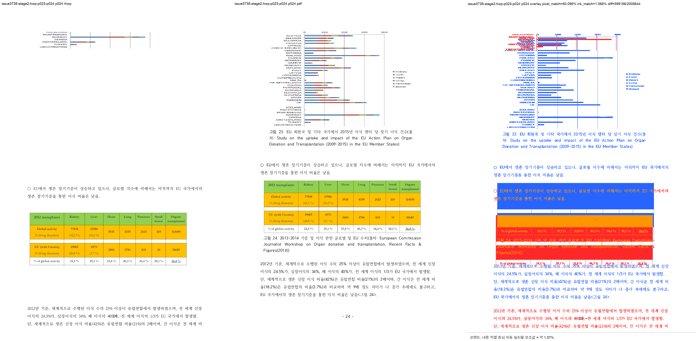

# Task #3738 Stage 2 — 그림 23 p23–p24 visual sweep

## 기준과 실행

보관된 개인정보 제거 HWP/HWPX 원본 및 각각의 한컴오피스 2020 기준 PDF를 사용했다. 기준 파일의
SHA-256과 보관 경로는 [`pdf/pr3740/README.md`](../../pdf/pr3740/README.md)에 있다. rhwp는 전용
`release-test` binary로 빌드했고, HWP와 HWPX 각각에 대해 144 DPI p23–p24 선택 sweep을 끝까지
실행했다. 선택 SVG/PDF raster는 모두 2/2이며 누락 페이지는 없다.

```bash
CARGO_TARGET_DIR=target/review-planet6897-20260802 CARGO_INCREMENTAL=0 \
  cargo build --profile release-test --bin rhwp

python3 scripts/task1274_visual_sweep.py \
  --key issue3738-stage2-hwp-p023-p024 \
  --hwp 'samples/정책연구용역사업 중간진도보고서(살아있는 간장 기증자의 의학적 선별기준 연구).hwp' \
  --pdf 'pdf/pr3740/hwp/정책연구용역사업 중간진도보고서(살아있는 간장 기증자의 의학적 선별기준 연구)-2020.pdf' \
  --pages 23-24 --dpi 144 \
  --rhwp-bin target/review-planet6897-20260802/release-test/rhwp \
  --out /private/tmp/rhwp-issue-3738-stage2-hwp-LzhM4x
```

HWPX도 입력, 기준 PDF, key와 output root만 바꾸어 동일하게 실행했다:
`/private/tmp/rhwp-issue-3738-stage2-hwpx-FeJJbt`.

## 페이지별 증적과 판정

| 입력 | 페이지 | 비교·overlay·보관 review | pixel / visual proxy | 자동 후보 | 사람 판정 |
| --- | ---: | --- | --- | --- | --- |
| HWP | 23 | [compare](/private/tmp/rhwp-issue-3738-stage2-hwp-LzhM4x/issue3738-stage2-hwp-p023-p024/compare/compare_023.png) · [overlay](/private/tmp/rhwp-issue-3738-stage2-hwp-LzhM4x/issue3738-stage2-hwp-p023-p024/overlay/overlay_023.png) · [review](../pr/assets/pr_3740_issue3738_stage2/hwp_p023_review.png) | 92.34291% / 6.64308% | 없음 | 그림 23은 p23에 조기 배치되지 않음 |
| HWP | 24 | [compare](/private/tmp/rhwp-issue-3738-stage2-hwp-LzhM4x/issue3738-stage2-hwp-p023-p024/compare/compare_024.png) · [overlay](/private/tmp/rhwp-issue-3738-stage2-hwp-LzhM4x/issue3738-stage2-hwp-p023-p024/overlay/overlay_024.png) · [review](../pr/assets/pr_3740_issue3738_stage2/hwp_p024_review.png) | 80.09836% / 1.06800% | `frame_overflow_pixels`, `question_marker_flow_drift` | **미해결** — 그림 23 node가 `y=-181.4px`에 남아 그림 전체·EU 문단·표 4가 기준과 다름 |
| HWPX | 23 | [compare](/private/tmp/rhwp-issue-3738-stage2-hwpx-FeJJbt/issue3738-stage2-hwpx-p023-p024/compare/compare_023.png) · [overlay](/private/tmp/rhwp-issue-3738-stage2-hwpx-FeJJbt/issue3738-stage2-hwpx-p023-p024/overlay/overlay_023.png) · [review](../pr/assets/pr_3740_issue3738_stage2/hwpx_p023_review.png) | 88.76176% / 3.65547% | 없음 | native HWP 보정과 별개인 기존 흐름 차이 |
| HWPX | 24 | [compare](/private/tmp/rhwp-issue-3738-stage2-hwpx-FeJJbt/issue3738-stage2-hwpx-p023-p024/compare/compare_024.png) · [overlay](/private/tmp/rhwp-issue-3738-stage2-hwpx-FeJJbt/issue3738-stage2-hwpx-p023-p024/overlay/overlay_024.png) · [review](../pr/assets/pr_3740_issue3738_stage2/hwpx_p024_review.png) | 83.12467% / 2.03139% | `question_marker_flow_drift` | **미해결** — HWPX의 p24 그림/본문/표 흐름은 별도 결함 |



HWP page 24 — 왼쪽 rhwp는 그림 23을 표 상단에 두려 하지만 image bbox가 page frame 위에 있어 일부만
남는다. 가운데 한컴 PDF는 그림 전체, 캡션, EU 문단, 표 4가 올바른 순서로 보인다.

## 결론

HWP p23의 페이지 소유권은 유지됐지만, Stage 2의 picture-offset 정규화 조건은 실제 셀 줄이 아니라
outer host 줄을 읽어야 하는데 셀 `vpos=0`을 읽어 발동하지 않았다. 따라서 이 sweep은 통과가 아니라
그 반증과 잔여 결함의 증적이다. HWP p24의 frame overflow와 HWPX p24의 flow drift가 남았으므로 다음
회차를 새 분석 단계로 시작한다.

`visual proxy`는 글꼴 raster와 anti-aliasing을 포함하는 보조 수치일 뿐 사람 판정 정확도가 아니다.
이 회차의 미완료 판정은 낮은 보조값만이 아니라, 보관 review와 render tree의 실제 `y=-181.4px` clipping을
함께 근거로 한다.
