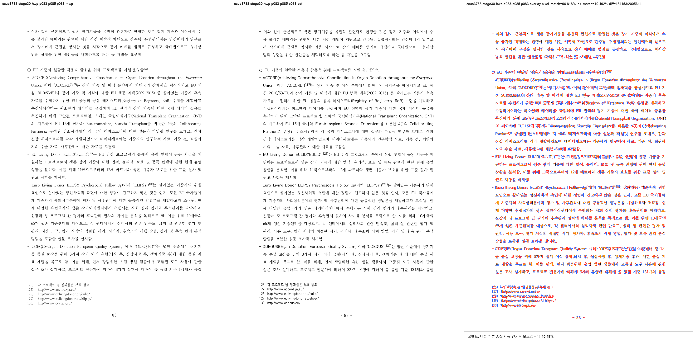
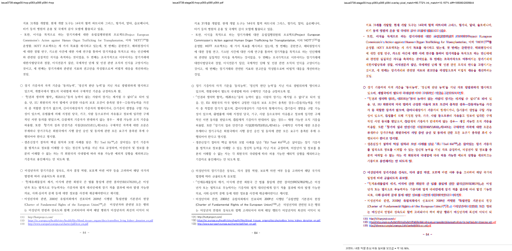
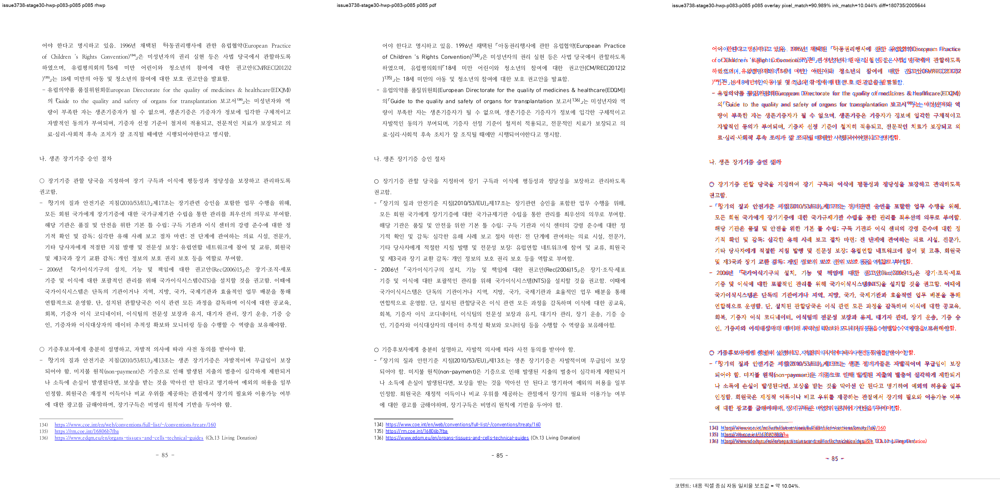
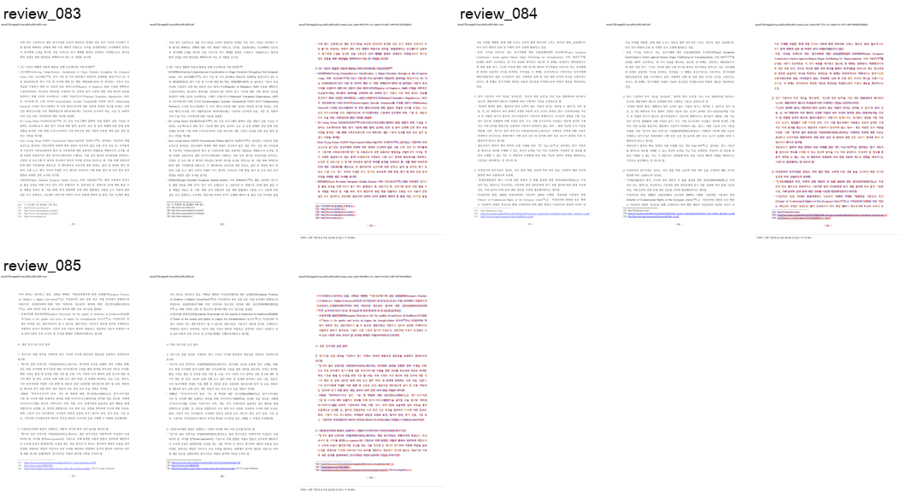

# Task #3738 Stage 30 visual sweep — p83–85 각주 flow 재판정

## 기준과 판정 범위

사용자 캡처는 p83 각주 수량, p84–85 본문/각주 흐름, p85 overlap을 지적했다. 이를 현재
`41a5af904ed6a3c53d86a5e8afd2fd00630ad98f` revision의 exact native binary로 한컴 2020
기준 PDF와 다시 비교했다. 결과가 정상이라고 해서 과거 화면의 binary/pkg 원인을 단정하지 않으며,
현재 source revision에서 재현되는 renderer 결함인지에만 답한다.

- HWP SHA-256: `50094a3db2b2003b293c5cbf43014d001aa97929acb488cef0cb7ea0e16b3113`
- HWPX SHA-256: `8ae9dc95643d0902fcced2af73badd732aea86c1cc5b875ef7b1272bccba862c`
- 한컴 2020 기준 PDF SHA-256:
  `7879ffee6313575132187c44c0090cd2e62c32c12c29b7eabd989181acf27b3a`
- renderer: `target/review-pr3740-stage29/release-test/rhwp`, SHA-256
  `df04df6eb32fc3bebadbbc820fee4791ad6b25ed2029d9af98c21b7ccedbb0ab`

## direct PDF owner 대조

```bash
RHWP_BIN=target/review-pr3740-stage29/release-test/rhwp \
python3 tools/fidelity_compare/fidelity_compare.py 82 84 \
  --source 'samples/정책연구용역사업 중간진도보고서(살아있는 간장 기증자의 의학적 선별기준 연구).hwp' \
  --reference-pdf 'pdf/pr3740/hwp/정책연구용역사업 중간진도보고서(살아있는 간장 기증자의 의학적 선별기준 연구)-2020.pdf' \
  --label issue3738-stage30-p83-p85 --reference-grade '한컴 2020 기준 PDF' \
  --text-only --layout-ledger \
  --out-dir /private/tmp/rhwp-stage30-fidelity-p83-p85-20260803
```

requested/completed는 p83–85 **3/3**이다. PDF text와 SVG text의 Counter, ordered owner sequence,
body/footnote/table/footer/frame candidates는 모두 0건이다. PDF와 SVG에서 확인한 footnote number는
다음과 같다.

| physical page | PDF | SVG | 판정 |
| --- | --- | --- | --- |
| 83 | 126–130 | 126–130 | 일치 |
| 84 | 131–133 | 131–133 | 일치 |
| 85 | 134–136 | 134–136 | 일치 |

전역 native render tree 219쪽과 PDF 215쪽(+4)은 이 세 페이지의 matching 판정과 별개로 남는다.

## visual sweep 및 직접 판정

```bash
python3 scripts/task1274_visual_sweep.py \
  --key issue3738-stage30-hwp-p083-p085 \
  --hwp 'samples/정책연구용역사업 중간진도보고서(살아있는 간장 기증자의 의학적 선별기준 연구).hwp' \
  --pdf 'pdf/pr3740/hwp/정책연구용역사업 중간진도보고서(살아있는 간장 기증자의 의학적 선별기준 연구)-2020.pdf' \
  --pages 83-85 --dpi 144 \
  --rhwp-bin target/review-pr3740-stage29/release-test/rhwp \
  --out /private/tmp/rhwp-stage30-p83-p85-sweep-20260803
```

SVG/render-tree export는 219/219, selected raster/review는 3/3, visual flags는 0건이다. review PNG를
직접 대조해 p83 note 126–130, p84 note 131–133, p85 note 134–136의 physical owner와 separator
아래 placement를 확인했고, p84→85 body reset tail도 PDF와 같은 owner에 있다. font raster·glyph
hinting 차이 때문에 overlay pixel/ink score는 fidelity pass로 사용하지 않았다.









## 보존된 증적

복사 전 `git check-attr filter diff merge`와 `git lfs track`을 확인했다. PNG/TSV/JSON은
`filter/diff/merge=unspecified`이며 LFS pattern `pdf-large/**/*.pdf`와 일치하지 않아 일반 Git
증적으로 보관했다. 원본 HWP/HWPX/PDF는 canonical 경로에 있으므로 중복 저장하지 않았다.

- [provenance](../pr/assets/pr_3740_issue3738_stage30_p83_p85_flow/provenance.tsv),
  [text ledger](../pr/assets/pr_3740_issue3738_stage30_p83_p85_flow/text-report.tsv),
  [Counter owner ledger](../pr/assets/pr_3740_issue3738_stage30_p83_p85_flow/text-owner-shift-candidates.tsv),
  [ordered owner ledger](../pr/assets/pr_3740_issue3738_stage30_p83_p85_flow/text-owner-sequence-candidates.tsv),
  [layout ledger](../pr/assets/pr_3740_issue3738_stage30_p83_p85_flow/layout-candidates.tsv),
  [table fragment candidates](../pr/assets/pr_3740_issue3738_stage30_p83_p85_flow/table-fragment-candidates.tsv),
  [page-count ledger](../pr/assets/pr_3740_issue3738_stage30_p83_p85_flow/page-count-ledger.tsv),
  [run state](../pr/assets/pr_3740_issue3738_stage30_p83_p85_flow/fidelity-run-state.tsv)
- [sweep manifest](../pr/assets/pr_3740_issue3738_stage30_p83_p85_flow/manifest.json),
  [run manifest](../pr/assets/pr_3740_issue3738_stage30_p83_p85_flow/run_manifest.json),
  [metrics](../pr/assets/pr_3740_issue3738_stage30_p83_p85_flow/metrics.json),
  [flagged pages](../pr/assets/pr_3740_issue3738_stage30_p83_p85_flow/flagged_pages.json),
  [p83 metrics](../pr/assets/pr_3740_issue3738_stage30_p83_p85_flow/page_083.json),
  [p84 metrics](../pr/assets/pr_3740_issue3738_stage30_p83_p85_flow/page_084.json),
  [p85 metrics](../pr/assets/pr_3740_issue3738_stage30_p83_p85_flow/page_085.json),
  [overlay metrics](../pr/assets/pr_3740_issue3738_stage30_p83_p85_flow/overlay_metrics.json)

핵심 SHA-256: text `3340e8543a7c44718d76b00adde74296cbb2effe334dd5bc4ad721e3fea0ce41`,
layout `20af4e49a7cc7ce89ccbc9a9f72e2be96bc044904bede499bce741e0a2202bdf`, p83/p84/p85 review PNG
`4fb2281ce0e931346d0037a3f0b5f1f78d58a7bdaf80827bec1a1f4d877d035b` /
`b066cabd7886c124b25376e90f98f65d609fa26cf9febb9ea355c22910180e27` /
`231c0c8f5dab0515e36aae2f29ed5575bf566ffac03a065c5e4e2bf1bac60b65`이다.

## 다음 Stage

Stage 31은 p83–85을 재이월하지 않는다. p90 표 27 continuation row owner를 별도 contract로
조사한다.
