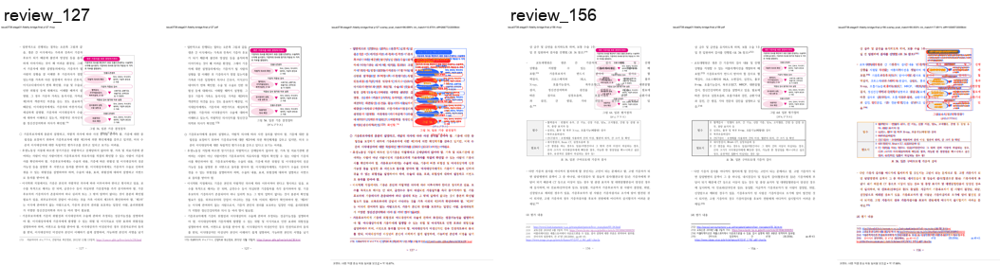
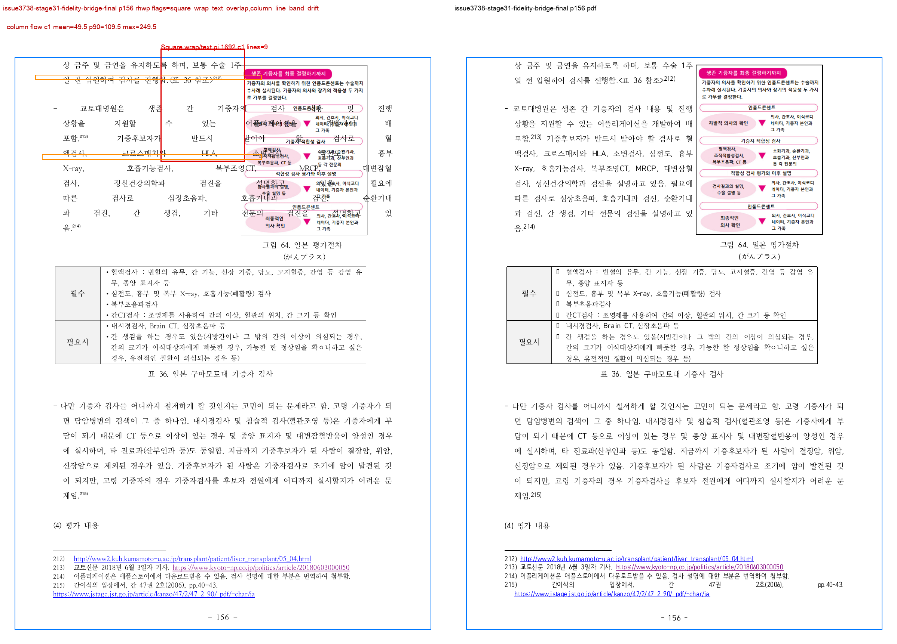

# Task #3738 Stage 31 visual sweep — fidelity 후보 연결과 전수 preflight

## 목적

사용자가 지적한 human p127의 그림 56 본문 침범은 PDF 문자 수나 일반 raster score만으로는
구분되지 않는 same-page physical-layout 결함이다. `fidelity_compare.py`에는 이미
`square_wrap_text_overlap` detector가 있었지만, visual sweep이 그 결과를 읽지 않아
`flagged=0`으로 끝날 수 있었다. 이 Stage는 detector의 판정 규칙을 새로 복제하지 않고
visual sweep이 canonical `fidelity_compare.square_wrap_text_overlap_candidates()`를 직접 호출하게
연결한다.

이 값은 PDF 정답 판정이 아니라 즉시 PDF review로 올릴 **후보**다. 따라서 후보 0만으로
전체 fidelity를 통과시킨다고 주장하지 않으며, text owner·표 fragment·page count는 full
fidelity ledger에서 계속 별도로 확인한다.

## 입력과 provenance

- HWP: `samples/정책연구용역사업 중간진도보고서(살아있는 간장 기증자의 의학적 선별기준 연구).hwp`
  (`50094a3db2b2003b293c5cbf43014d001aa97929acb488cef0cb7ea0e16b3113`)
- 같은 개인정보 제거 HWPX: `samples/정책연구용역사업 중간진도보고서(살아있는 간장 기증자의 의학적 선별기준 연구).hwpx`
  (`8ae9dc95643d0902fcced2af73badd732aea86c1cc5b875ef7b1272bccba862c`)
- 한컴 2020 기준 PDF: `pdf/pr3740/hwp/정책연구용역사업 중간진도보고서(살아있는 간장 기증자의 의학적 선별기준 연구)-2020.pdf`
  (`7879ffee6313575132187c44c0090cd2e62c32c12c29b7eabd989181acf27b3a`)
- bridge sweep binary: `target/review-pr3740-stage29/release-test/rhwp`
  (`8f06990423f679a87cad12b39e3e6e0d4e2557968d21929edaba4dc7a699cabd`)

전수 fidelity와 bridge sweep은 서로 다른 run/output directory이므로 아래 결과에서 합쳐진 단일
revision 증적으로 오인하지 않는다. 각 run의 manifest와 provenance를 함께 보관한다.

## 자동 검출 결과

| human 쪽 | canonical geometry 결과 | visual sweep 결과 | 판정 |
| --- | --- | --- | --- |
| 127 | 현재 `square_wrap_text_overlap=0` | 이 wrap flag는 0; 기존 `question_marker_flow_drift` review 후보만 남음 | p127의 이전 Square-wrap 결함은 detector 기준으로 재발하지 않음 |
| 156 | `pi=1692/ci=1`, `Square`, visible Body TextLine 9행 교차 | `square_wrap_text_overlap` 및 annotation 생성 | **P0 후보로 재개방**; PDF review·원인 분석 전에는 해결로 표기하지 않음 |

수정 전 p127의 보존 ledger는 `square_wrap_text_overlap=1`이며 그림 56 `pi=1355/ci=0`을
Body TextLine 13행이 교차했다. 이는 p127 유형이 detector 범위 안이었음을, 동시에 이전 sweep의
누락 원인이 detector 부재가 아니라 결과 연결 부재였음을 보여 준다.

full fidelity preflight는 한컴 PDF 215쪽을 모두 완료(`215/215`, `run_state=complete`)했으며,
SVG/render tree는 219쪽(`+4`)으로 기록됐다. 이 page-count difference와 표/text-owner 후보는
향후 개별 P0의 우선순위 원장으로 남기며, 이 Stage가 전역 page break를 해결했다고 주장하지 않는다.

## 실행

전수 후보 수집:

```bash
RHWP_BIN=target/review-pr3740-stage29/release-test/rhwp \
python3 tools/fidelity_compare/fidelity_compare.py 0 214 \
  --source 'samples/정책연구용역사업 중간진도보고서(살아있는 간장 기증자의 의학적 선별기준 연구).hwp' \
  --reference-pdf 'pdf/pr3740/hwp/정책연구용역사업 중간진도보고서(살아있는 간장 기증자의 의학적 선별기준 연구)-2020.pdf' \
  --label issue3738-stage30-full-fidelity --reference-grade '한컴 2020 기준 PDF' \
  --text-only --export-all-svg --layout-ledger \
  --out-dir /private/tmp/rhwp-stage30-full-fidelity-20260803
```

bridge 검증:

```bash
python3 scripts/visual_sweep.py \
  --key issue3738-stage31-fidelity-bridge \
  --hwp 'samples/정책연구용역사업 중간진도보고서(살아있는 간장 기증자의 의학적 선별기준 연구).hwp' \
  --pdf 'pdf/pr3740/hwp/정책연구용역사업 중간진도보고서(살아있는 간장 기증자의 의학적 선별기준 연구)-2020.pdf' \
  --pages 127,156 --dpi 144 \
  --rhwp-bin target/review-pr3740-stage29/release-test/rhwp \
  --out /private/tmp/rhwp-stage31-fidelity-bridge-20260803
```

`scripts/visual_sweep.py`는 현재 작업 트리의 rename된 운영 경로다. detector 함수는
`tools/fidelity_compare/fidelity_compare.py`에서 한 번만 정의하며, sweep은 이를 import해
동일한 wrap mode·크기·교차 line 기준을 쓴다. 빈 HWP5 guide TextLine은 visible paint가 없을 때
제외하는 Python regression도 추가해 p156의 빈 전폭 guide line 3행을 본문 침범으로 과계산하지 않는다.

## 회귀 검증

```text
python3 -m py_compile scripts/visual_sweep.py tools/fidelity_compare/fidelity_compare.py
python3 -m unittest scripts/tests/test_visual_sweep.py scripts/tests/test_fidelity_compare.py
git diff --check
```

50 Python tests가 통과했다. 누락·손상 render tree가 candidate 0으로 내려가지 않고 실패하는 경로와
Square/Tight/Through 세 wrap mode, 빈 TextRun과 함께 paint되는 footnote marker도 회귀로 고정했다.
renderer Rust code가 이 bridge 자체에서 변경된 것은 아니며, 사용자가
수동으로 확인한 WASM build는 재실행하지 않았다.

## 장기 증적

asset 복사 전 `git check-attr filter diff merge`와 `git lfs track`을 확인했다.
`mydocs/pr/assets/pr_3740_issue3738_stage31_fidelity_bridge/`는 모두 `unspecified`이고 LFS pattern은
`pdf-large/**/*.pdf`뿐이어서, 아래 JSON/TSV/PNG는 일반 Git 증적으로 보관한다.

- [full layout ledger](../pr/assets/pr_3740_issue3738_stage31_fidelity_bridge/full_layout_candidates.tsv),
  [page-count ledger](../pr/assets/pr_3740_issue3738_stage31_fidelity_bridge/full_page_count_ledger.tsv),
  [table fragment candidates](../pr/assets/pr_3740_issue3738_stage31_fidelity_bridge/full_table_fragment_candidates.tsv),
  [text-owner shift candidates](../pr/assets/pr_3740_issue3738_stage31_fidelity_bridge/full_text_owner_shift_candidates.tsv),
  [run state](../pr/assets/pr_3740_issue3738_stage31_fidelity_bridge/full_run_state.tsv)
- [p127 수정 전 layout ledger](../pr/assets/pr_3740_issue3738_stage31_fidelity_bridge/p127_pre_fix_layout_candidates.tsv),
  [bridge summary](../pr/assets/pr_3740_issue3738_stage31_fidelity_bridge/sweep_summary.json),
  [metrics](../pr/assets/pr_3740_issue3738_stage31_fidelity_bridge/sweep_metrics.json),
  [p127 page metrics](../pr/assets/pr_3740_issue3738_stage31_fidelity_bridge/sweep_page_127.json),
  [p156 page metrics](../pr/assets/pr_3740_issue3738_stage31_fidelity_bridge/sweep_page_156.json)





핵심 보존 asset SHA-256은 full layout ledger
`ef61752b1027ab7fa3e1933515ff5205e09aae433e9d4684878a3093099114d5`, page-count ledger
`e43fb5c0598929ce6434c9f44a2b30d80f78a531287d232749969f6d8defd766`, p127 수정 전 ledger
`f0a06a9eb5da16f7cbfb19f026953d5eb30130d98146b176cdc04acb309b74f7`, final bridge run manifest
`34ad659ea24bd63c1e2ebe78781d228862586fc56647df4bd776f13e8ad60d62`, p127 review
`29f8c17ddde5ac94c2874d6280bc507a669ea4359579429334507d76be979309`, p156 review
`a5b6ab4d1091776e7aee3d8ce6f3a88341e3fdaa73472c47ad5a65a914d72732`이다.

## 한계와 다음 단계

이 detector는 80px 이상 Square/Tight/Through image, image 폭의 절반 이상을 가로지르는 visible
Body TextLine 3행 이상을 후보화한다. 1–2행 침범, 좁은 교차, Body 밖 text, PDF와 위치만 달라진
경우와 표/각주/캡션 owner 결함은 이 flag로 놓칠 수 있다. p156을 다음 코드 Stage에서 PDF와
직접 대조해 원인을 분리하고, 표·각주/페이지 경계 계열은 full fidelity ledger의 독립 후보로
계속 처리한다.
