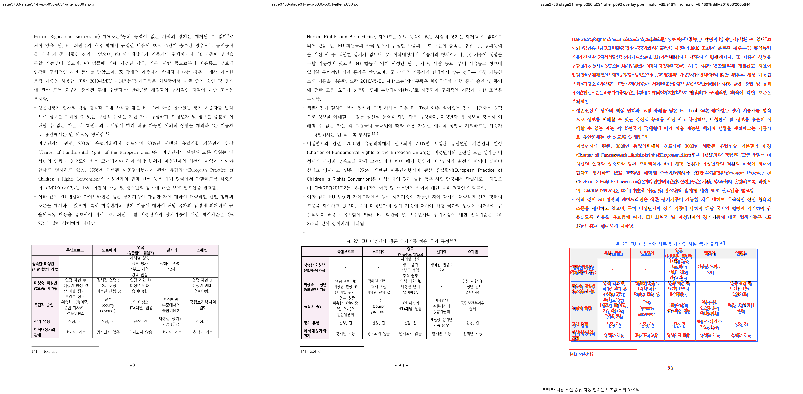
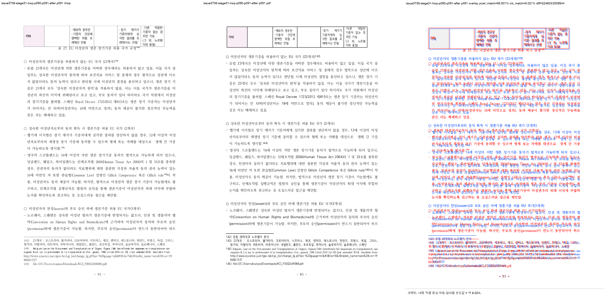
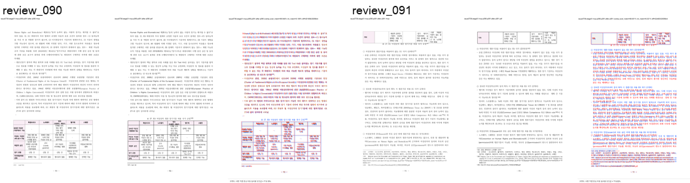

# Task #3738 Stage 31 visual sweep — p90 표 27 row owner

## 기준과 범위

code commit `58fef6180f22308e1b8e9ebdf5fdb897c979fd1a`의 exact native binary로 표 27의
physical row owner만 한컴 2020 기준 PDF와 대조했다. 이 결과는 PDF 215쪽과 native HWP
render-tree 219쪽(+4)의 전역 page-map이 해결됐다고 주장하지 않는다.

- HWP SHA-256: `50094a3db2b2003b293c5cbf43014d001aa97929acb488cef0cb7ea0e16b3113`
- HWPX SHA-256: `8ae9dc95643d0902fcced2af73badd732aea86c1cc5b875ef7b1272bccba862c`
- 한컴 2020 기준 PDF SHA-256:
  `7879ffee6313575132187c44c0090cd2e62c32c12c29b7eabd989181acf27b3a`
- renderer: `target/review-pr3740-stage31/release-test/rhwp`, SHA-256
  `be0eabf5af6f19d9bda344aa46648f65945c973e0678178031fb544ac1a4c2bd`

## focused regression 및 direct ledger

```text
CARGO_TARGET_DIR=target/review-pr3740-stage31 CARGO_INCREMENTAL=0 \
  cargo test --profile release-test \
  --test issue_3738_rowbreak_table_footnote_fragment -- --nocapture
```

**17/17 통과**했다. p90은 `이식대상자와 관계` row와 `형제만 가능`/`친척만 가능`을 보유하고,
p91은 relationship row를 다시 갖지 않으며 `기타` row에서 재개한다. pi=962 table bottom은
note 141 separator 위에 있고, native page count는 219로 유지된다.

```bash
RHWP_BIN=target/review-pr3740-stage31/release-test/rhwp \
python3 tools/fidelity_compare/fidelity_compare.py 89 90 \
  --source 'samples/정책연구용역사업 중간진도보고서(살아있는 간장 기증자의 의학적 선별기준 연구).hwp' \
  --reference-pdf 'pdf/pr3740/hwp/정책연구용역사업 중간진도보고서(살아있는 간장 기증자의 의학적 선별기준 연구)-2020.pdf' \
  --label issue3738-stage31-p90-p91-after --reference-grade '한컴 2020 기준 PDF' \
  --text-only --layout-ledger \
  --out-dir /private/tmp/rhwp-stage31-fidelity-p90-p91-after-20260803
```

baseline의 p90 `reference_only=61`/p91 `svg_only=54`와 비교하면 post ledger는 각각
26/20으로 줄었다. same `(pi=962, ci=0)` table fragment와 20-character Counter owner
candidate는 남지만, ordered owner sequence는 0건이고 이 candidate는 table continuation만으로
PDF row owner를 단정하지 않는다. 따라서 table row owner는 아래 PDF review로 판정했고, 남은
문자 Counter 후보를 이 Stage에서 전역 flow 결함으로 과장하지 않았다.

## visual sweep 및 직접 판정

```bash
python3 scripts/visual_sweep.py \
  --key issue3738-stage31-hwp-p090-p091-after \
  --hwp 'samples/정책연구용역사업 중간진도보고서(살아있는 간장 기증자의 의학적 선별기준 연구).hwp' \
  --pdf 'pdf/pr3740/hwp/정책연구용역사업 중간진도보고서(살아있는 간장 기증자의 의학적 선별기준 연구)-2020.pdf' \
  --pages 90-91 --dpi 144 \
  --rhwp-bin target/review-pr3740-stage31/release-test/rhwp \
  --out /private/tmp/rhwp-stage31-p90-p91-after-sweep-20260803
```

requested/completed는 p90–91 **2/2**, SVG/render-tree export는 219/219, selected raster/review는
2/2이며 visual flags는 0건이다. review PNG를 직접 대조해 PDF처럼 p90 표 27의 relationship
row가 note 141 separator 바로 위에 있고, p91에는 `기타` row만 이어지며 table/footer/page-number
overlap이 없음을 확인했다. font raster·glyph hinting 차이 때문에 overlay pixel/ink score는 fidelity
pass로 사용하지 않았다.







## 보존된 증적

복사 전 `git check-attr filter diff merge`와 `git lfs track`을 확인했다. PNG/TSV/JSON은
`filter/diff/merge=unspecified`이며 LFS pattern `pdf-large/**/*.pdf`와 일치하지 않아 일반 Git
증적으로 보관했다. 원본 HWP/HWPX/PDF는 canonical 경로에 있으므로 중복 저장하지 않았다.

- [provenance](../pr/assets/pr_3740_issue3738_stage31_p90_table_owner/provenance.tsv),
  [text ledger](../pr/assets/pr_3740_issue3738_stage31_p90_table_owner/text-report.tsv),
  [Counter owner ledger](../pr/assets/pr_3740_issue3738_stage31_p90_table_owner/text-owner-shift-candidates.tsv),
  [ordered owner ledger](../pr/assets/pr_3740_issue3738_stage31_p90_table_owner/text-owner-sequence-candidates.tsv),
  [layout ledger](../pr/assets/pr_3740_issue3738_stage31_p90_table_owner/layout-candidates.tsv),
  [table fragment candidates](../pr/assets/pr_3740_issue3738_stage31_p90_table_owner/table-fragment-candidates.tsv),
  [page-count ledger](../pr/assets/pr_3740_issue3738_stage31_p90_table_owner/page-count-ledger.tsv),
  [run state](../pr/assets/pr_3740_issue3738_stage31_p90_table_owner/run-state.tsv)
- [sweep summary](../pr/assets/pr_3740_issue3738_stage31_p90_table_owner/sweep_summary.json),
  [run manifest](../pr/assets/pr_3740_issue3738_stage31_p90_table_owner/run_manifest.json),
  [metrics](../pr/assets/pr_3740_issue3738_stage31_p90_table_owner/metrics.json),
  [flagged pages](../pr/assets/pr_3740_issue3738_stage31_p90_table_owner/flagged_pages.json),
  [p90 metrics](../pr/assets/pr_3740_issue3738_stage31_p90_table_owner/page_090.json),
  [p91 metrics](../pr/assets/pr_3740_issue3738_stage31_p90_table_owner/page_091.json)

핵심 SHA-256: text `82d22b5870cad37db2073d02901376470ab34d99f398d2a283fb58060e0ffca0`,
layout `1f2652823990d393d9cabfab1380fdb9218a485de57a39167447319e2e893a5c`, table candidate
`8cd388463654c57cf9877ec53428a10309c58f220c275dfeed06f605a6e2984f`, p90/p91 review PNG
`9c87ce5d66f3fe74532b74740be8ba286f3fc28e802fd3ab873bfdc3bc9e9858` /
`0f78d6b01fae2343002b0c204a54d52e5c91a96bfb4f3041c092f0d2c52b656a`이다.

## 다음 Stage

Stage 32는 p90 표 27 row owner를 재이월하지 않는다. p94 표 28의 마지막 `불특정기증` row owner를
별도 source-height contract로 조사한다.
