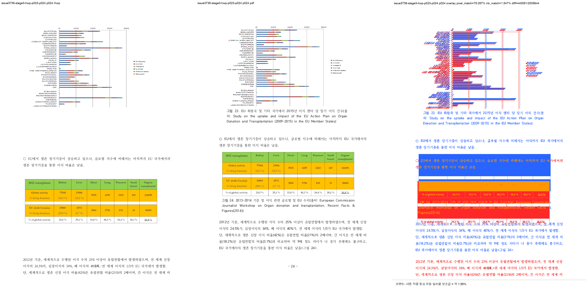

# Task #3738 Stage 3 — 그림 23 outer-host anchor 보정 visual sweep

## 기준과 실행

보관된 개인정보 제거 HWP/HWPX 원본과 각각의 한컴오피스 2020 기준 PDF를 사용했다. 파일 hash와
보관 위치는 [`pdf/pr3740/README.md`](../../pdf/pr3740/README.md)에 있다. 전용 `release-test`
binary에 대해 HWP와 HWPX 각각 p23–p24, 144 DPI sweep을 끝까지 실행했고 선택 SVG/PDF raster는
각각 2/2, 누락은 없다.

```bash
CARGO_TARGET_DIR=target/review-planet6897-20260802 CARGO_INCREMENTAL=0 \
  cargo test native_hwp5_relocated_empty_rowbreak_picture_uses_outer_host_vpos --lib --quiet
CARGO_TARGET_DIR=target/review-planet6897-20260802 CARGO_INCREMENTAL=0 \
  cargo build --profile release-test --bin rhwp
```

HWP output root: `/private/tmp/rhwp-issue-3738-stage3b-hwp-DaznPN`<br>
HWPX output root: `/private/tmp/rhwp-issue-3738-stage3-hwpx-MetjfB`

## 페이지별 증적과 판정

| 입력 | 페이지 | 비교·overlay·보관 review | pixel / visual proxy | 자동 후보 | 사람 판정 |
| --- | ---: | --- | --- | --- | --- |
| HWP | 23 | [compare](/private/tmp/rhwp-issue-3738-stage3b-hwp-DaznPN/issue3738-stage3-hwp-p023-p024/compare/compare_023.png) · [overlay](/private/tmp/rhwp-issue-3738-stage3b-hwp-DaznPN/issue3738-stage3-hwp-p023-p024/overlay/overlay_023.png) · [review](../pr/assets/pr_3740_issue3738_stage3/hwp_p023_review.png) | 92.34291% / 6.64308% | 없음 | 그림 23은 p23에 조기 배치되지 않음 |
| HWP | 24 | [compare](/private/tmp/rhwp-issue-3738-stage3b-hwp-DaznPN/issue3738-stage3-hwp-p023-p024/compare/compare_024.png) · [overlay](/private/tmp/rhwp-issue-3738-stage3b-hwp-DaznPN/issue3738-stage3-hwp-p023-p024/overlay/overlay_024.png) · [review](../pr/assets/pr_3740_issue3738_stage3/hwp_p024_review.png) | 78.05737% / 1.54674% | `frame_overflow_pixels`, `question_marker_flow_drift` | **부분 해소** — Image bbox가 `y=-181.4`→`92.5px`로 복원됐으나 stale table height가 후속 흐름을 아래로 밂 |
| HWPX | 23 | [compare](/private/tmp/rhwp-issue-3738-stage3-hwpx-MetjfB/issue3738-stage3-hwpx-p023-p024/compare/compare_023.png) · [overlay](/private/tmp/rhwp-issue-3738-stage3-hwpx-MetjfB/issue3738-stage3-hwpx-p023-p024/overlay/overlay_023.png) · [review](../pr/assets/pr_3740_issue3738_stage3/hwpx_p023_review.png) | 88.76176% / 3.65547% | 없음 | native HWP branch의 영향 없음 |
| HWPX | 24 | [compare](/private/tmp/rhwp-issue-3738-stage3-hwpx-MetjfB/issue3738-stage3-hwpx-p023-p024/compare/compare_024.png) · [overlay](/private/tmp/rhwp-issue-3738-stage3-hwpx-MetjfB/issue3738-stage3-hwpx-p023-p024/overlay/overlay_024.png) · [review](../pr/assets/pr_3740_issue3738_stage3/hwpx_p024_review.png) | 83.12467% / 2.03139% | `question_marker_flow_drift` | **미해결** — 별도 HWPX 흐름 결함 유지 |



HWP page 24 — 그림 23의 전체 graph와 caption은 기준 PDF의 page-local top으로 복원됐다. 그러나 rhwp의
outer table bbox는 `y=90.6, h=490.4px`인 반면 그림/캡션이 차지하는 실제 높이 뒤에도 여분을 소비하여,
EU 문단과 표 4가 기준보다 아래에 놓인다.

## 결론

Stage 3의 outer-host anchor 전달은 그림 clipping을 실제로 해소했다. 하지만 p24의 table flow height는
별도 계약이며 frame overflow와 question flow drift가 남았다. 따라서 이번 회차도 통과가 아니며,
다음 analysis에서 이월된 empty RowBreak table의 stale cell/table height를 별도 원인으로 조사한다.
HWPX는 이 native HWP5 한정 보정의 대상이 아니므로 기존 residual을 독립적으로 유지한다.

`visual proxy`는 글꼴 raster와 anti-aliasing 차이를 포함하는 보조값이다. 이 문서의 부분 해소 판정은
수치가 아니라 review PNG와 HWP render tree Image bbox `y=92.5px`를 주 근거로 한다.
