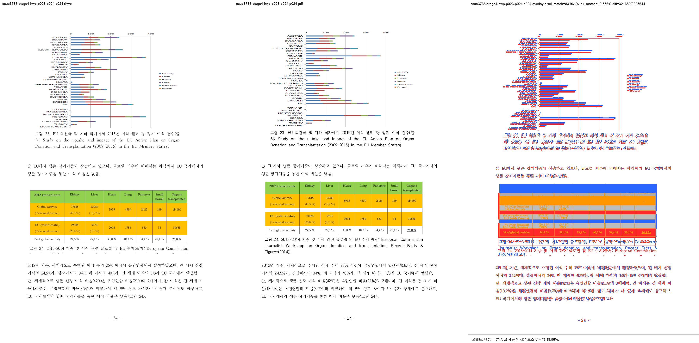

# Task #3738 Stage 4 — 그림 23 caption·다음 flow anchor visual sweep

## 기준 자료와 보관

개인정보를 제거한 같은 문서의 HWP·HWPX 원본과, 각 입력에서 한컴오피스 2020으로 만든 기준 PDF를
사용했다. 원본 두 개와 기준 PDF 두 개의 경로·SHA-256·Git/LFS 판정은
[증적 보관 목록](../../pdf/pr3740/README.md)에 고정돼 있다. 이 회차의 HWP/HWPX p23–p24 review
PNG 네 장도 아래 표의 저장 링크로 일반 Git에 보관한다. LFS 속성은 각 PNG에 설정되지 않았다.

```bash
CARGO_TARGET_DIR=target/review-planet6897-20260802 CARGO_INCREMENTAL=0 \
  cargo test relocated_hwp5_picture_caption_uses_next_saved_flow_anchor --lib --quiet
CARGO_TARGET_DIR=target/review-planet6897-20260802 CARGO_INCREMENTAL=0 \
  cargo build --profile release-test --bin rhwp
```

첫 명령은 `1 passed; 0 failed; 3038 filtered out`, 두 번째 명령은 `release-test` binary build 성공으로
끝났다. 이 회차는 targeted 회귀·release build·선택 2쪽 visual sweep만 수행했으며, 전체 integration
test 또는 전체 문서 raster sweep을 성공 근거로 사용하지 않았다.

- HWP output root: `/private/tmp/rhwp-issue-3738-stage4-hwp-IilyIw`
- HWPX output root: `/private/tmp/rhwp-issue-3738-stage4-hwpx-Nwoe4P`

두 입력 모두 SVG 전체 출력 뒤 선택 p23–p24의 SVG/PDF raster가 2/2 완료됐다.

## 페이지별 증적과 판정

| 입력 | 페이지 | 비교·overlay·보관 review | pixel / visual proxy | 자동 후보 | 사람 판정 |
| --- | ---: | --- | --- | --- | --- |
| HWP | 23 | [compare](/private/tmp/rhwp-issue-3738-stage4-hwp-IilyIw/issue3738-stage4-hwp-p023-p024/compare/compare_023.png) · [overlay](/private/tmp/rhwp-issue-3738-stage4-hwp-IilyIw/issue3738-stage4-hwp-p023-p024/overlay/overlay_023.png) · [review](../pr/assets/pr_3740_issue3738_stage4/hwp_p023_review.png) | 91.93910% / 6.67633% | 없음 | 그림 23이 p23에 조기 배치되지 않음 |
| HWP | 24 | [compare](/private/tmp/rhwp-issue-3738-stage4-hwp-IilyIw/issue3738-stage4-hwp-p023-p024/compare/compare_024.png) · [overlay](/private/tmp/rhwp-issue-3738-stage4-hwp-IilyIw/issue3738-stage4-hwp-p023-p024/overlay/overlay_024.png) · [review](../pr/assets/pr_3740_issue3738_stage4/hwp_p024_review.png) | 83.96126% / 19.55607% | `question_marker_flow_drift` | graph·3줄 caption·EU 문단·표 4와 후속 본문이 기준의 순서와 page-local 위치로 복원됨 |
| HWPX | 23 | [compare](/private/tmp/rhwp-issue-3738-stage4-hwpx-Nwoe4P/issue3738-stage4-hwpx-p023-p024/compare/compare_023.png) · [overlay](/private/tmp/rhwp-issue-3738-stage4-hwpx-Nwoe4P/issue3738-stage4-hwpx-p023-p024/overlay/overlay_023.png) · [review](../pr/assets/pr_3740_issue3738_stage4/hwpx_p023_review.png) | 88.52010% / 3.68694% | 없음 | 자동 후보는 없지만 기준 p23과 page-content/flow가 일치하지 않아 해결 판정 아님 |
| HWPX | 24 | [compare](/private/tmp/rhwp-issue-3738-stage4-hwpx-Nwoe4P/issue3738-stage4-hwpx-p023-p024/compare/compare_024.png) · [overlay](/private/tmp/rhwp-issue-3738-stage4-hwpx-Nwoe4P/issue3738-stage4-hwpx-p023-p024/overlay/overlay_024.png) · [review](../pr/assets/pr_3740_issue3738_stage4/hwpx_p024_review.png) | 82.92010% / 2.09241% | `question_marker_flow_drift` | 기준의 그림 23 대신 그림 21/22 및 선행 문단이 나타나며 미해결 |



HWP p24 render tree에서 caption 세 줄은 y=`434.4`, `455.7`, `477.1px`, 다음 `○ EU에서 …` 문단은
y=`545.7px`에 놓였다. 기준 PDF의 같은 문단 y=`406.3pt`(약 `541.7px`)와 약 4px 차이다. Stage 3에서
남아 있던 `frame_overflow_pixels`는 이 페이지에서 더 이상 보고되지 않는다. p24의
`question_marker_flow_drift`는 이 페이지에 정확히 짝지을 번호 표식이 부족해 발생한 자동 후보이므로,
그림 23 체인의 판정에는 review PNG·render tree의 내용 및 순서를 우선했다.

`pixel / visual proxy`는 글꼴 raster·anti-aliasing 차이를 포함하는 보조 수치이며, 특히 낮은 ink proxy를
정확도나 해결 근거로 해석하지 않는다. 이 문서의 HWP 판정은 위 보관 PNG와 좌표·순서 대조를 주 근거로
한다.

## 결론

이번 보정은 native HWP5의 좁은 형상에서만 셀 내부 non-inline 그림의 Bottom caption을 배치하고,
같은 형상일 때만 table paint geometry를 바꾸지 않은 채 다음 저장 `LINE_SEG` anchor로 outgoing flow
cursor를 재설정한다. 그 결과 HWP의 그림 23 p23–p24 체인은 이 회차 범위에서 해소됐다.

그러나 HWPX는 원본과 기준 PDF가 보관돼 있음에도 p23–p24의 페이지 소유와 흐름이 별도로 어긋난다.
이 native HWP5 한정 보정으로 해결됐다고 표현하지 않으며, Stage 4 커밋 후 Stage 5에서 HWPX 저장
layout/anchor 경로를 새 문제로 분석한다.
