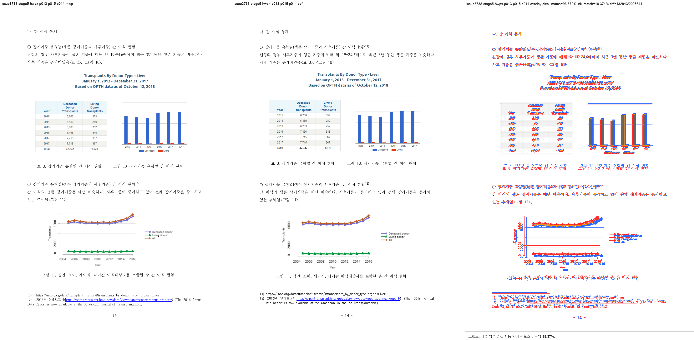

# Task #3738 Stage 5 — HWPX 그림 11 page drift visual sweep

## 기준·보관·검증 범위

개인정보 제거 원본 HWP·HWPX와 각각의 한컴오피스 2020 기준 PDF는
[증적 보관 목록](../../pdf/pr3740/README.md)에 SHA-256과 함께 보관한다. 이 회차의 HWPX review
PNG 다섯 장도 일반 Git 추적 대상이며 LFS 속성은 없다.

```bash
CARGO_TARGET_DIR=target/review-planet6897-20260802 CARGO_INCREMENTAL=0 \
  cargo build --profile release-test --bin rhwp
```

빌드한 binary에서 `dump-pages`를 다시 실행해 그림 11 table p273의 배치 index를 확인한 뒤,
HWPX 기준 PDF와 두 visual sweep을 완료했다. 전체 integration test나 전체 raster sweep은 이 회차의
근거로 사용하지 않았다.

- 최초 분기 output root: `/private/tmp/rhwp-issue-3738-stage5-hwpx-first-i2UYL0`
- 그림 23 output root: `/private/tmp/rhwp-issue-3738-stage5-hwpx-figure23-vg7tjx`
- 두 sweep 모두 전체 SVG/render tree를 생성했고, 선택 SVG/PDF raster는 각각 3/3 및 2/2 완료했다.

## 페이지별 증적과 판정

| 범위 | 페이지 | 비교·overlay·보관 review | pixel / visual proxy | 자동 후보 | 사람 판정 |
| --- | ---: | --- | --- | --- | --- |
| 최초 분기 | 13 | [compare](/private/tmp/rhwp-issue-3738-stage5-hwpx-first-i2UYL0/issue3738-stage5-hwpx-p013-p015/compare/compare_013.png) · [overlay](/private/tmp/rhwp-issue-3738-stage5-hwpx-first-i2UYL0/issue3738-stage5-hwpx-p013-p015/overlay/overlay_013.png) · [review](../pr/assets/pr_3740_issue3738_stage5/hwpx_p013_review.png) | 92.32900% / 19.68249% | 없음 | 기준 순서 유지 |
| 최초 분기 | 14 | [compare](/private/tmp/rhwp-issue-3738-stage5-hwpx-first-i2UYL0/issue3738-stage5-hwpx-p013-p015/compare/compare_014.png) · [overlay](/private/tmp/rhwp-issue-3738-stage5-hwpx-first-i2UYL0/issue3738-stage5-hwpx-p013-p015/overlay/overlay_014.png) · [review](../pr/assets/pr_3740_issue3738_stage5/hwpx_p014_review.png) | 93.37156% / 18.37378% | 없음 | 그림 11이 기준과 같은 쪽에 배치됨 |
| 최초 분기 | 15 | [compare](/private/tmp/rhwp-issue-3738-stage5-hwpx-first-i2UYL0/issue3738-stage5-hwpx-p013-p015/compare/compare_015.png) · [overlay](/private/tmp/rhwp-issue-3738-stage5-hwpx-first-i2UYL0/issue3738-stage5-hwpx-p013-p015/overlay/overlay_015.png) · [review](../pr/assets/pr_3740_issue3738_stage5/hwpx_p015_review.png) | 95.33003% / 22.86032% | 없음 | 그림 12 이후 흐름이 한 쪽 늦게 밀리지 않음 |
| 그림 23 | 23 | [compare](/private/tmp/rhwp-issue-3738-stage5-hwpx-figure23-vg7tjx/issue3738-stage5-hwpx-p023-p024/compare/compare_023.png) · [overlay](/private/tmp/rhwp-issue-3738-stage5-hwpx-figure23-vg7tjx/issue3738-stage5-hwpx-p023-p024/overlay/overlay_023.png) · [review](../pr/assets/pr_3740_issue3738_stage5/hwpx_p023_review.png) | 91.50966% / 6.70947% | 없음 | **미해결** — p344 table이 아직 이 페이지에 예약됨 |
| 그림 23 | 24 | [compare](/private/tmp/rhwp-issue-3738-stage5-hwpx-figure23-vg7tjx/issue3738-stage5-hwpx-p023-p024/compare/compare_024.png) · [overlay](/private/tmp/rhwp-issue-3738-stage5-hwpx-figure23-vg7tjx/issue3738-stage5-hwpx-p023-p024/overlay/overlay_024.png) · [review](../pr/assets/pr_3740_issue3738_stage5/hwpx_p024_review.png) | 77.66892% / 1.01399% | `question_marker_flow_drift` | **미해결** — 기준의 그림 23 graph/caption이 이 페이지에 없음 |



## 구조 확인과 결론

수정 뒤 `dump-pages`에서 p273은 HWPX renderer index 13에, p279와 후속 문단은 index 14에
배치됐다. 이는 HWP 및 기준 PDF의 그림 11–12 페이지 소유와 일치한다. p13–p15 visual sweep에서도
frame overflow·content-bottom drift·line/order overlap 후보는 없었다.

그러나 p344(그림 23)의 HWPX table은 여전히 index 22에 예약된다. render tree는 table bbox를
`y=548.9px`, 내부 image bbox를 `y=276.9px`로 기록한다. 즉 image가 자기 table 위로 이탈해 p23
내용과 충돌하고, 기준 PDF가 그림 23을 두는 p24에는 graph/caption이 없다. HWP는 같은 p344를 index
23에 배치하고 image `y=92.5px`로 렌더한다.

따라서 Stage 5는 그림 11에서 시작된 HWPX page drift를 해소했지만, 그림 23의 **next-vpos rewind
RowBreak** 형상은 미해결이다. 이 결과를 완료로 표현하지 않는다. 잔여 문제는 Stage 5 커밋 뒤 Stage 6에서
별도 분석한다.

`pixel / visual proxy`는 글꼴 raster·anti-aliasing을 포함하는 보조 수치다. p13–p15의 부분 해소는
보관 review PNG, page ownership과 render tree를 근거로 하며, p23–p24의 낮은 수치는 visual evidence와
같은 방향의 실패 증거로 기록했다.
