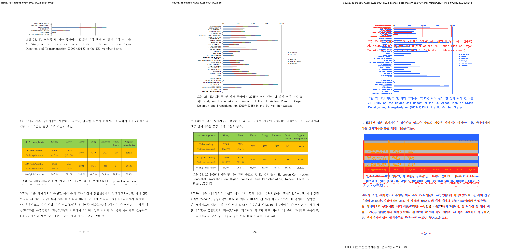

# Task #3738 Stage 6 — HWPX 그림 23 page ownership visual sweep

## 기준·보관·검증 범위

개인정보 제거 원본 HWP·HWPX와 각각의 한컴오피스 2020 기준 PDF는
[증적 보관 목록](../../pdf/pr3740/README.md)에 SHA-256과 함께 보관한다. 이 회차의 HWPX review PNG
다섯 장도 일반 Git 추적 대상이며 LFS 속성은 없다.

```bash
CARGO_TARGET_DIR=target/review-planet6897-20260802 CARGO_INCREMENTAL=0 \
  cargo test stored_layout_relocated_empty_rowbreak_picture --lib --quiet
CARGO_TARGET_DIR=target/review-planet6897-20260802 CARGO_INCREMENTAL=0 \
  cargo build --profile release-test --bin rhwp
```

빌드한 binary로 HWPX 기준 PDF와 p23–p24 및 p13–p15를 각각 144 DPI visual sweep했다. 전체
integration test와 전체 raster sweep은 이 Stage의 근거로 사용하지 않았다.

- 그림 23 output root: `/private/tmp/rhwp-issue-3738-stage6-hwpx-figure23`
- 그림 11 회귀 output root: `/private/tmp/rhwp-issue-3738-stage6-hwpx-first`
- 두 sweep 모두 224 SVG/render tree 페이지를 생성했고, 선택 raster는 각각 2/2 및 3/3 완료했다.

## 페이지별 증적과 판정

| 범위 | 페이지 | 비교·overlay·보관 review | pixel / visual proxy | 자동 후보 | 사람 판정 |
| --- | ---: | --- | --- | --- | --- |
| 그림 11 회귀 | 13 | [compare](/private/tmp/rhwp-issue-3738-stage6-hwpx-first/issue3738-stage6-hwpx-p013-p015/compare/compare_013.png) · [overlay](/private/tmp/rhwp-issue-3738-stage6-hwpx-first/issue3738-stage6-hwpx-p013-p015/overlay/overlay_013.png) · [review](../pr/assets/pr_3740_issue3738_stage6/hwpx_p013_review.png) | 92.32900% / 19.68249% | 없음 | 그림 11 회귀 없음 |
| 그림 11 회귀 | 14 | [compare](/private/tmp/rhwp-issue-3738-stage6-hwpx-first/issue3738-stage6-hwpx-p013-p015/compare/compare_014.png) · [overlay](/private/tmp/rhwp-issue-3738-stage6-hwpx-first/issue3738-stage6-hwpx-p013-p015/overlay/overlay_014.png) · [review](../pr/assets/pr_3740_issue3738_stage6/hwpx_p014_review.png) | 93.37156% / 18.37378% | 없음 | 그림 11이 기준과 같은 쪽에 유지 |
| 그림 11 회귀 | 15 | [compare](/private/tmp/rhwp-issue-3738-stage6-hwpx-first/issue3738-stage6-hwpx-p013-p015/compare/compare_015.png) · [overlay](/private/tmp/rhwp-issue-3738-stage6-hwpx-first/issue3738-stage6-hwpx-p013-p015/overlay/overlay_015.png) · [review](../pr/assets/pr_3740_issue3738_stage6/hwpx_p015_review.png) | 95.33003% / 22.86032% | 없음 | 이후 흐름 회귀 없음 |
| 그림 23 | 23 | [compare](/private/tmp/rhwp-issue-3738-stage6-hwpx-figure23/issue3738-stage6-hwpx-p023-p024/compare/compare_023.png) · [overlay](/private/tmp/rhwp-issue-3738-stage6-hwpx-figure23/issue3738-stage6-hwpx-p023-p024/overlay/overlay_023.png) · [review](../pr/assets/pr_3740_issue3738_stage6/hwpx_p023_review.png) | 91.93955% / 6.68152% | 없음 | p344 table이 이 페이지에서 사라짐 |
| 그림 23 | 24 | [compare](/private/tmp/rhwp-issue-3738-stage6-hwpx-figure23/issue3738-stage6-hwpx-p023-p024/compare/compare_024.png) · [overlay](/private/tmp/rhwp-issue-3738-stage6-hwpx-figure23/issue3738-stage6-hwpx-p023-p024/overlay/overlay_024.png) · [review](../pr/assets/pr_3740_issue3738_stage6/hwpx_p024_review.png) | 85.97722% / 21.11437% | `question_marker_flow_drift` | **미해결** — image 음수 offset으로 graph가 clip됨 |



## 구조 확인과 결론

p344는 수정 뒤 renderer p24의 `Table pi=344`, `bbox y=90.6px`로 이동했다. 이는 Stage 6의
next-vpos rewind defer가 제대로 발동한 증거이고, p23에서는 p344 table이 사라졌다. 반면 같은 p24
tree에서 `Image bbox y=-181.4px`, caption 첫 줄 `y=160.5px`이므로 fresh-page table 배치는 됐어도
page-boundary 그림 offset reset은 HWPX에 적용되지 않았다.

따라서 이 Stage는 page ownership만 해소했다. 그림 23 raster가 기준 PDF의 full graph와 같지 않고
`question_marker_flow_drift` 후보도 남으므로 완료로 표현하지 않는다. 다음 Stage는 HWPX에서 reset
predicate가 기각되는 source field를 분석한다.

`pixel / visual proxy`는 글꼴 raster·anti-aliasing을 포함하는 보조 수치다. p13–p15 무회귀와 p344
page ownership은 review PNG 및 render tree를 근거로 하며, p24의 residual은 낮은 overlay 수치·render tree·
review PNG가 같은 방향으로 뒷받침한다.
