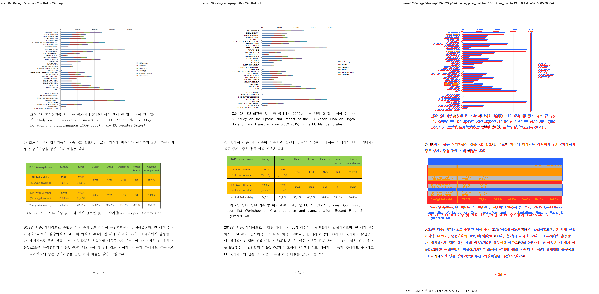

# Task #3738 Stage 7 — HWPX 그림 23 offset reset visual sweep

## 기준·보관·검증 범위

개인정보 제거 원본 HWP·HWPX와 각각의 한컴오피스 2020 기준 PDF는
[증적 보관 목록](../../pdf/pr3740/README.md)에 SHA-256과 함께 보관한다. 이 회차의 HWPX review PNG
다섯 장도 일반 Git 추적 대상이며 LFS 속성은 없다.

```bash
CARGO_TARGET_DIR=target/review-planet6897-20260802 CARGO_INCREMENTAL=0 \
  cargo build --profile release-test --bin rhwp
CARGO_TARGET_DIR=target/review-planet6897-20260802 CARGO_INCREMENTAL=0 \
  cargo test stored_layout_relocated --lib
```

빌드한 binary로 HWPX 기준 PDF와 p23–p24 및 p13–p15를 각각 144 DPI visual sweep했다. 전체
integration test와 전체 raster sweep은 이 Stage의 근거로 사용하지 않았다.

- 그림 23 output root: `/private/tmp/rhwp-issue-3738-stage7-hwpx-figure23`
- 그림 11 회귀 output root: `/private/tmp/rhwp-issue-3738-stage7-hwpx-first`
- 두 sweep 모두 224 SVG/render tree 페이지를 생성했고, 선택 raster는 각각 2/2 및 3/3 완료했다.

## 페이지별 증적과 판정

| 범위 | 페이지 | 비교·overlay·보관 review | pixel / visual proxy | 자동 후보 | 사람 판정 |
| --- | ---: | --- | --- | --- | --- |
| 그림 11 회귀 | 13 | [compare](/private/tmp/rhwp-issue-3738-stage7-hwpx-first/issue3738-stage7-hwpx-p013-p015/compare/compare_013.png) · [overlay](/private/tmp/rhwp-issue-3738-stage7-hwpx-first/issue3738-stage7-hwpx-p013-p015/overlay/overlay_013.png) · [review](../pr/assets/pr_3740_issue3738_stage7/hwpx_p013_review.png) | 92.32900% / 19.68249% | 없음 | 그림 11 회귀 없음 |
| 그림 11 회귀 | 14 | [compare](/private/tmp/rhwp-issue-3738-stage7-hwpx-first/issue3738-stage7-hwpx-p013-p015/compare/compare_014.png) · [overlay](/private/tmp/rhwp-issue-3738-stage7-hwpx-first/issue3738-stage7-hwpx-p013-p015/overlay/overlay_014.png) · [review](../pr/assets/pr_3740_issue3738_stage7/hwpx_p014_review.png) | 93.37156% / 18.37378% | 없음 | 그림 11이 기준과 같은 쪽에 유지 |
| 그림 11 회귀 | 15 | [compare](/private/tmp/rhwp-issue-3738-stage7-hwpx-first/issue3738-stage7-hwpx-p013-p015/compare/compare_015.png) · [overlay](/private/tmp/rhwp-issue-3738-stage7-hwpx-first/issue3738-stage7-hwpx-p013-p015/overlay/overlay_015.png) · [review](../pr/assets/pr_3740_issue3738_stage7/hwpx_p015_review.png) | 95.33003% / 22.86032% | 없음 | 이후 흐름 회귀 없음 |
| 그림 23 | 23 | [compare](/private/tmp/rhwp-issue-3738-stage7-hwpx-figure23/issue3738-stage7-hwpx-p023-p024/compare/compare_023.png) · [overlay](/private/tmp/rhwp-issue-3738-stage7-hwpx-figure23/issue3738-stage7-hwpx-p023-p024/overlay/overlay_023.png) · [review](../pr/assets/pr_3740_issue3738_stage7/hwpx_p023_review.png) | 91.93955% / 6.68152% | 없음 | p344 table 없음 — 기준 page ownership 일치 |
| 그림 23 | 24 | [compare](/private/tmp/rhwp-issue-3738-stage7-hwpx-figure23/issue3738-stage7-hwpx-p023-p024/compare/compare_024.png) · [overlay](/private/tmp/rhwp-issue-3738-stage7-hwpx-figure23/issue3738-stage7-hwpx-p023-p024/overlay/overlay_024.png) · [review](../pr/assets/pr_3740_issue3738_stage7/hwpx_p024_review.png) | 83.96126% / 19.55607% | `question_marker_flow_drift` | 그림 23 full graph·caption·후속 flow 복원 |



## 구조 확인과 결론

p344는 renderer p24 `Table pi=344`, `bbox y=90.6px`에 있고, 내부 `Image bbox y=92.5px` 및 Bottom
caption 3줄은 `434.4/455.7/477.1px`다. p23에는 p344 table이 없다. 이는 기준 PDF의 그림 23 page
ownership과 page-local geometry에 맞는다. p345 flow도 caption 이후에 재개된다.

p24의 `question_marker_flow_drift`는 일반 문서의 `○` bullet을 시험 문항 marker heuristic이 오인한
후보로, review PNG와 render tree상 그림 23 흐름 결함은 아니다. 글꼴 raster와 chart color를 포함한
낮은 proxy는 완료 판정의 단독 근거로 쓰지 않았다. 이 Stage가 겨냥한 HWPX 그림 23 잔여 결함은 해소됐다.
