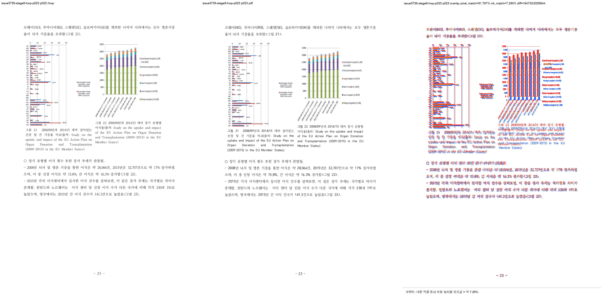

# Task #3738 Stage 8 — HWP p23 그림 21 caption visual sweep

## 기준·보관·실행 범위

개인정보 제거 HWP와 한컴오피스 2020 기준 PDF는
[증적 보관 목록](../../pdf/pr3740/README.md)에 SHA-256과 함께 일반 Git 대상으로 보관한다. 이
Stage의 p23 compare·overlay·review PNG도 일반 Git 추적 대상이며 LFS 범위가 아니다.

```bash
CARGO_TARGET_DIR=target/review-planet6897-20260802 CARGO_INCREMENTAL=0 \
  cargo build --profile release-test --bin rhwp
CARGO_TARGET_DIR=target/review-planet6897-20260802 CARGO_INCREMENTAL=0 \
  cargo test --profile release-test --test issue_3738_hwp_caption_cell_alignment

python3 scripts/visual_sweep.py \
  --key issue3738-stage8-hwp-p023 \
  --hwp 'samples/정책연구용역사업 중간진도보고서(살아있는 간장 기증자의 의학적 선별기준 연구).hwp' \
  --pdf 'pdf/pr3740/hwp/정책연구용역사업 중간진도보고서(살아있는 간장 기증자의 의학적 선별기준 연구)-2020.pdf' \
  --pages 23 --dpi 144 \
  --rhwp-bin target/review-planet6897-20260802/release-test/rhwp
```

focused regression은 1 passed했다. sweep은 rhwp SVG/render tree 225쪽을 모두 생성하고, 선택한 p23
raster 1/1을 완료했다. 임시 output root는
`/private/tmp/rhwp-issue-3738-stage8-caption-sweep.y2xkCW/issue3738-stage8-hwp-p023`다.

## 페이지별 증적과 판정

| 페이지 | 비교·overlay·보관 review | 자동 지표 | 직접 좌표·사람 판정 |
| --- | --- | --- | --- |
| 23 | [compare](../pr/assets/pr_3740_issue3738_stage8/hwp_p023_compare.png) · [overlay](../pr/assets/pr_3740_issue3738_stage8/hwp_p023_overlay.png) · [review](../pr/assets/pr_3740_issue3738_stage8/hwp_p023_review.png) | pixel match 91.78653%, ink proxy 7.28983%, 자동 후보 없음 | 그림 21 image `198.4 → 148.3px`; caption 첫 줄 `544.7 → 494.7px`; PDF `371.37pt = 495.16px`, 차이 0.46px. caption과 다음 bullet의 겹침 없음. |



글꼴 raster와 차트 색상 차이 때문에 pixel/ink proxy는 p23 그림 배치의 단독 완료 근거로 쓰지 않았다.
한컴 PDF bbox와 rhwp render tree의 직접 좌표, 그리고 review PNG의 caption–본문 비중첩을 판정 근거로
사용했다.

## 범위 제한

이 sweep은 그림 21의 cell-center caption 보정만 검증한다. 전체 문서 쪽수는 HWP 225/HWPX 224인 반면
두 PDF는 215쪽이다. p66–68의 p728 RowBreak table-footnote 최초 분기는 아직 남아 있으며, 다음 Stage의
별도 분석·수정·visual sweep 대상이다.
