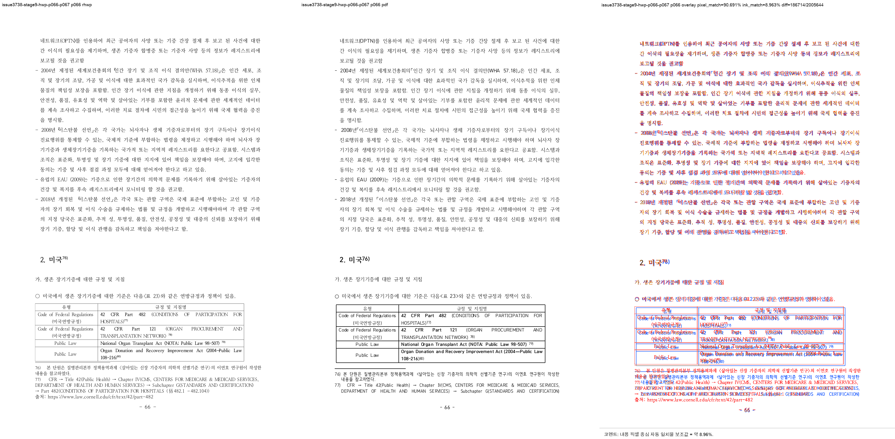
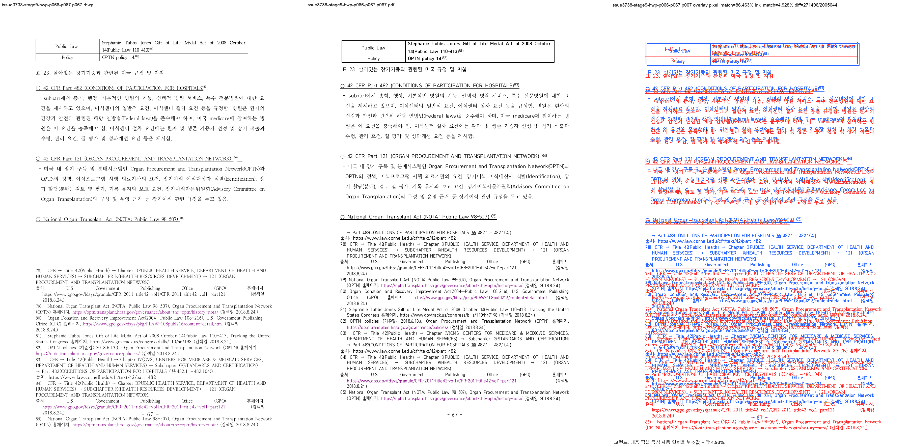

# Task #3738 Stage 9 — HWP p66–p67 RowBreak table-footnote visual sweep

## 기준·증적·실행

입력 HWP와 개인정보 제거 동등 HWPX, 한컴오피스 2020 기준 PDF의 해시·보관 위치는
[증적 보관 목록](../../pdf/pr3740/README.md)에 있다. 이 Stage의 PNG 여섯 장은 일반 Git 대상이며,
`git check-attr filter` 결과 LFS 대상이 아니다.

```bash
CARGO_TARGET_DIR=target/review-planet6897-20260802 CARGO_INCREMENTAL=0 \
  cargo build --profile release-test --bin rhwp
CARGO_TARGET_DIR=target/review-planet6897-20260802 CARGO_INCREMENTAL=0 \
  cargo test --profile release-test --test issue_3738_rowbreak_table_footnote_fragment

python3 scripts/task1274_visual_sweep.py \
  --key issue3738-stage9-hwp-p066-p067 \
  --hwp 'samples/정책연구용역사업 중간진도보고서(살아있는 간장 기증자의 의학적 선별기준 연구).hwp' \
  --pdf 'pdf/pr3740/hwp/정책연구용역사업 중간진도보고서(살아있는 간장 기증자의 의학적 선별기준 연구)-2020.pdf' \
  --pages 66-67 --dpi 144 \
  --rhwp-bin target/review-planet6897-20260802/release-test/rhwp
```

focused test는 1 passed했다. Sweep은 SVG/render tree 224쪽을 생성하고, 선택 raster p66–p67을 2/2
완료했다. 최종 임시 산출물은
`/private/tmp/rhwp-stage9-visual-margin.YEXFAR/issue3738-stage9-hwp-p066-p067`이다.

## 페이지별 대조

| 페이지 | PNG 증적 | 자동 지표 | 사람 검토 판정 |
| --- | --- | --- | --- |
| 66 | [compare](../pr/assets/pr_3740_issue3738_stage9/hwp_p066_compare.png) · [overlay](../pr/assets/pr_3740_issue3738_stage9/hwp_p066_overlay.png) · [review](../pr/assets/pr_3740_issue3738_stage9/hwp_p066_review.png) | pixel 90.69057%, ink proxy 8.96263%, 자동 structural 후보 없음 | 표 23의 0–4행(Organ Donation까지)과 각주 76·77이 PDF와 같은 p66에 있다. 수정 전에는 표 전체가 다음 쪽으로 이월됐다. |
| 67 | [compare](../pr/assets/pr_3740_issue3738_stage9/hwp_p067_compare.png) · [overlay](../pr/assets/pr_3740_issue3738_stage9/hwp_p067_overlay.png) · [review](../pr/assets/pr_3740_issue3738_stage9/hwp_p067_review.png) | pixel 86.46340%, ink proxy 4.92772%, `frame_overflow_pixels` 35px 후보 | Stephanie/Policy의 5–6행에서 시작하는 table fragment ownership은 맞지만, 각주 영역 하단 overflow 후보가 남았다. 완료 판정으로 쓰지 않는다. |



코멘트: 내용 픽셀 중심 자동 일치율 보조값 = 약 8.96%.
높을수록 좋음: 기준 PDF와 rhwp PNG가 더 비슷함
낮을수록 나쁨/검토 필요: 잉크 위치나 형태 차이가 큼
단, 사람 판정 정확도가 아니라 내용 픽셀 중심 자동 일치율 보조값입니다.



코멘트: 내용 픽셀 중심 자동 일치율 보조값 = 약 4.93%.
높을수록 좋음: 기준 PDF와 rhwp PNG가 더 비슷함
낮을수록 나쁨/검토 필요: 잉크 위치나 형태 차이가 큼
단, 사람 판정 정확도가 아니라 내용 픽셀 중심 자동 일치율 보조값입니다.

글꼴 raster 차이 때문에 pixel/ink proxy는 p66 table ownership의 단독 완료 근거가 아니다. p66의
비교 판정은 PDF와 rhwp의 행/각주 귀속 및 focused text regression을 함께 사용했다. p67 후보와 전체
HWP 224/HWPX 224/PDF 215의 9쪽 차이는 다음 Stage에서 계속 조사한다.
